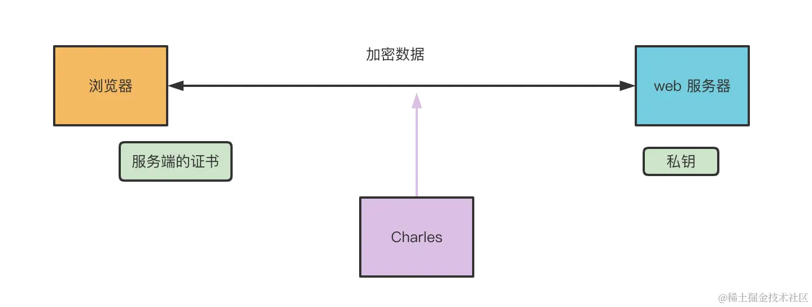

charles

https://juejin.cn/book/7070324244772716556/section/7071922682895269899?scrollMenuIndex=1

1. 证书问题
   中间人拿到的数据自然都是被加密过的，也就是下图的那些乱码
   
   

   那抓包工具怎么能拿到明文的数据呢？自己用服务端的证书和服务端对接不就行了？
   
   Charles 自己用服务端的证书来和服务端通信，然后给浏览器一个自己的证书，这样就能解密传输的内容，拿到明文数据了。

   点击 Proxy 的 SSL Proxy Setting：
   
   

   - 替换前的证书：
     
   - 替换后的证书：
     

   这是因为系统有一个存放所有根证书的地方，要那里存在并且被信任的证书才是安全的。
   点击 help > SSL Proxying > Install Charles Root Certificate，安装到系统的钥匙串中：
   
   改为始终信任
   
   这时候浏览器里就会标记安全了
   并且在 charles 里就会看到明文的 https 请求和响应内容：

2. 断点功能
   现在能够抓 https 包了，但是还不够，现在只能看，很多情况下我们是希望能修改一下请求和响应内容的，这时候就要用断点功能了：
   右键请求，勾选 breakpoints.

   这样我们就可以断点调试 https 请求了。
   移动端怎么调试呢？

   其实是一样的，只不过移动端也要把 Charles 证书安装到自己的系统中，需要点击安装 charles 证书到移动设备：

3. SwitchyOmega
   chrome 还有一个浏览器插件可以更细粒度的控制代理，叫做 SwitchyOmega
   你可以配置若干个代理服务器，比如 charles 的代理服务器：
   
   这个可以在 Charles 的 Proxy > Proxy Setting 里配置：
   
   然后就可以配置什么 url 用什么代理，或者不用代理直接连接：
   
   当你有多个代理服务器，或者想控制有的页面走代理有的不走的时候，就可以用这个插件来控制了。
   要让你配置的规则生效，这里要选择 auto switch，也就是根据规则自动切换：
   
   

   - 直接连接：不走代理
   - 系统代理：用系统级别的代理配置
   - proxy：这个是我们配置的那个代理服务器，可以指定网页走这个代理
   - auto switch：根据规则自动切换代理
     

4. 总结
   用 Charles 调试 https 请求是常见的需求，它需要安装 Charles 的证书到本地系统，然后信任，之后就可以抓到明文数据了。
   原理就是 Charles 会使用服务器的证书来和服务器通信，然后发一个自己的证书给浏览器。
   Charles 还有断点调试功能，可以修改请求和响应的数据。
   移动端 https 调试也是同样的原理，只不过需要配置下代理和证书。
   `如果想切换代理服务器或者设置有的页面不走代理，可以用 Chrome 插件 SwitchyOmega 来控制。`
   会断点调试 https 请求还是很有意义的，比如改改 header、改改 body，看看会有啥效果，使用场景有很多。

---

Charles 功能介绍

1. no caching
   可以让 http 请求禁用缓存，在 Tools > No Caching 里开启：
   当开启之后，你会发现 header 会带上 cache-control: no-cache：
   
   浏览器的强制刷新也是这么实现的。
   除了全部请求禁用缓存外，还可以单独指定某些 url 禁用缓存.
2. block cookies
   禁用 cookie 和 set-cookie 的 header：
   请求还是会带上 cookie，这是因为还没到 charles 那层。
   同样的请求，到 charles 看下，就会发现没有 cookie 了：
3. map remote
   charles 可以把请求转发给另一个 url，用 Tools > map remote 的功能：
4. map local
   用本地的文件作为该请求的响应内容
   **map local 功能在移动端开发的时候还是挺常用的，比如把请求的 js、css 等换成本地刚打包出来的，就可以在线上环境调试本地代码。**
5. mirror
   mirror 可以把响应内容保存在本地
   这个内容是不能修改的，每次刷新都会覆盖，这也是 mirror 镜像的含义
6. rewrite
   除了转发请求外，自然也支持对请求做修改，也就是 rewrite 功能。
   支持修改的包括 header、host、path、url、query，response status、body，也就是所有的内容都可以改：
7. block list
   模拟请求失败的时候，可以用这个功能
8. allow list
9. ssl proxying
10. breakpoints
11. DNS Spoofing
    DNS 欺骗
    比如我配置了 www.guangguangtest2.com 的域名到 127.0.0.1 的映射，之后就可以浏览器访问这个域名了：
    注意 charles 只有 http、https 请求会走 charles 代理
    所以 curl 可以走代理，但是 ping 不行

    Ping 是一种用于测试网络连通性的命令行工具，它基于 `ICMP（Internet Control Message Protocol，互联网控制消息协议）协议`工作。其原理是向目标主机发送 ICMP 回显请求（Echo Request）报文，目标主机在收到请求后，会回复 ICMP 回显应答（Echo Reply）报文。通过计算请求发送和应答接收的时间差，Ping **可以测量两台主机之间的延迟**，并根据应答报文的返回情况来判断网络连通性和数据包丢失情况。

    Curl 是一个用于在命令行界面下与服务器进行数据传输的工具，支持多种协议，包括 HTTP、HTTPS、FTP 等。其原理是通过指定协议，向服务器发送请求（如 GET、POST 请求），并接收服务器的响应数据。Curl 可以自定义请求的各种参数和头信息，支持数据的上传和下载，常用于测试和调试网络请求、接口调用以及模拟客户端行为。

12. Client Process
    展示发请求的进程名
13. Compose
    compose new 创建一个新的请求，compose 修改已有的请求
14. repeat
15. compose
16. throttle
17. highlight rules
18. External Proxy
    访问国外的网站需要科学上网，会起一个代理服务器，charles 抓包也要跑一个代理服务器。
    但是我们网页只能指定代理服务器，那`如何同时又能科学上网，又能 charles 抓包呢？`
    在 Proxy > External Proxy Settings 设置转发的代理服务器，这样 `charles 抓包之后会再转发给别的代理服务器。`

---

## 线上报错如何直接调试本地源码？
