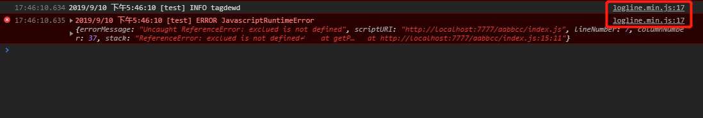

---

## 针对线上混淆代码与堆栈的调试方法:Chrome 调试关联本地 sourcemap 文件

[link](https://tingsven.com/2019/09/11/Chrome-Devtool-Mapping-Sourcemap.html)

准备：
本地有对应线上混淆 JavaScript 文件的 sourcemap 文件

---

## Sourcemap 入门

sourcemap 的作用是记录打包和压缩混淆过程，根据这些记录就能很方便的将混淆打包过的代码进行还原。
在控制台的 Sources 栏目下，可以看到构建后的代码、sourcemap 路径地址以及根据 sourcemap 解析之后的原始代码。

是怎么做到显示原始代码的呢？
共分为 3 步，打包 —— 关联 —— 解析。

- 第 1 步：打包，webpack 打包构建的时候将打包过程、压缩方式以特定的形式记录存储起来，并保存为 xxx.js.map 文件。
- 第 2 步：关联，sourcemap 和打包文件的关联形式就是将下面这行注释追加到 xxx.js 文件的最后一行。
  sourceMappingURL 可以是相对路径，也可以是完整的网络请求链接，相对路径的时候默认为页面域名
  除了直接将 sourceMappingURL 打包在 js 代码里面，还可临时手动添加。
  可以在源码区域 右键 —— Add source map 手动添加 sourcemap 文件（仅支持 http:// 或 https 的路径，亲测 file:// 路径的不行，若需要添加本地的文件，可以在本地使用`本地服务`（如：http-server）启动一个临时静态服务器）。
  **注意：不论是网络链接还是本地路径，xxx.js.map 的加载记录都无法在 network 栏下面查看到。**
  **若想查看 .map 文件的请求，可以点击控制台右上角的“...” —— More Tools —— Developer Resource 查看。**
  
- 第 3 步：解析，当打开 chrome 控制台的时候，如果发现 js 文件的最后一行有上面这个 sourceMappingURL，chrome 浏览器会 自动加载 此文件并自动解析。
  解析后的文件为原始代码文件，会出现在 source —— Authored 下面（第一张图所示），可以直接针对此目录下的文件进行断点调试。
  整个 sourcemap 解析还原过程 chrome 都帮忙做了，我们需要做的就一件事，就是在 js 文件最后一行 或者 以手动添加的方式加上 sourcemap 路径即可。

## 如何生成 sourcemap

参考 magic-string
