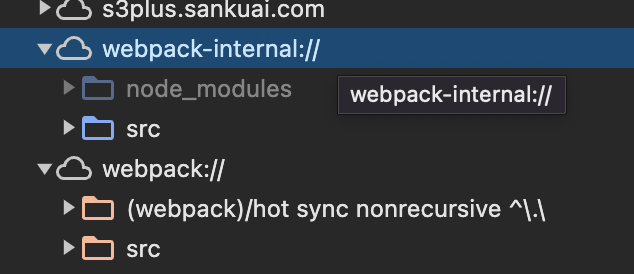

https://juejin.cn/post/6969748500938489892#heading-18
https://juejin.cn/post/6963076475020902436
https://juejin.cn/post/7299477531640561727#heading-9
https://community.eolink.com/d/32234-sourcemap-100

## vlq 算法

VLQ（Variable-Length Quantity，变长数量）算法是一种使用一个或多个字节来表示一个较大数字的编码方式，主要特点是变长。它广泛应用于 MIDI 文件和一些编码方案中，如 Base64 编码和 Source Map 中的映射。

VLQ 的编码规则如下：

1. 每个字节的最高位（第 8 位）用来表示是否还有后续字节。如果该位为 1，表示后面还有字节；如果该位为 0，表示这是最后一个字节。
2. 剩下的 7 位用来表示数字的实际值。

通过这种方式，VLQ 可以表示从小到大的任意数字，而且对于小数字，编码后的长度也小。

例如，对于数字`A`：

- 如果`A`小于 128（即可以用 7 位表示的数字），它将直接用一个字节表示，最高位为 0。
- 如果`A`大于等于 128，那么它将被分成 7 位一组来表示，每组作为一个字节的低 7 位，除了最后一组外，每个字节的最高位都设置为 1，以表示后续还有字节。

VLQ 编码的一个关键优点是它可以有效地编码变化范围很大的数值，对于小数值，编码后非常紧凑，而对于大数值，通过增加字节长度来表示，这使得 VLQ 特别适合需要编码各种大小数值的场景，如动态数据压缩、高效的数据传输等。

## soucemap

webpack 的 devtools 配置 sourmap： eval、source-map、cheap、module 和 inline 五种字段的组合

- eval：使用 eval 打包源文件模块，`在文件末尾添加 SourceURL`。构建速度非常快。只能定位到行
- source-map：生成完整 Source。可以定位到具体的行和列，非常适合生产环境中的错误定位。
- cheap：Source Map 不包含列信息，只包含行信息。页面 debugger 展示源码是 es5 的代码，因为已经被 babal 转义了。cheap-module 解决了这一问题，包含 loader 的 Source Map
- module：在生成 Source Map 时，会添加 loader 的 Source Map 信息
- inline：将.map 作为 DataURI 嵌入，不单独生成.map 文件

配置项最佳实践

- 开发环境: 快（eval），信息全（module），不那么在意代码列信息(cheap)
  所以开发环境比较推荐配置：`devtool: cheap-module-eval-source-map` (如果要 debug 生成 sourcemap，用 cheap-module-source-map)
  这种时候，会有 webpack-internal
  https://github.com/webpack/webpack/issues/5186#issuecomment-312801144
  
- 生产环境：并不希望任何人都可以在浏览器直接看到我们未编译的源码，但是生成 sourcemap 文件以提供给错误收集工具比如 sentry `devtool: hidden-source-map`

---

```js
//dist/main-145900df.js.map
{
  "version": 3,
  "file": "main-145900df.js",
  "mappings": "CAAA,WACE,IAAK,IAAIA,
  EAAI,EAAGA,EAAI,EAAGA,IACrBC,QAAQC,IAAI,KAGhBC",
  "sources": ["webpack://source-map-webpack-demo/./src/index.js"],
  "sourcesContent": ["function a() {\n  for (let i = 0; i < 3; i++) {\n    console.log('s');\n  }\n}\na();"],
  "names": ["i", "console", "log", "a"],
  "sourceRoot": ""
}
```

- version：目前 source map 标准的版本为 3；
  sourceMap 协议正是为了解决此问题诞生的协议，最初的 map 文件非常大，V2 版本引入 base64 编码等算法，体积减小 20%~30%，V3 版本又引入 VLQ 算法，体积进一步压缩 50%，目前我们使用的正是 V3 版本，也是 magic-string 所构建的版本
- sources：源文件地址列表；
- sourcesContent：源文件的内容，一个可选的源文件内容列表；(ts 中需要开启 inlinesources 选项)
- file：生成的文件名；
- mappings：一个字符串，通过 VLQ 编码表示源文件和生成文件之间的映射关系
- names：转换前的所有变量名和属性名；
- sourceRoot：源文件目录地址，可以用于重新定位服务器上的源文件。

## mappings

为了尽可能减少存储空间但同时要达到记录原始位置和目标位置映射关系的目的，mappings 字段按照了一些特殊的规则来生成。

【行对应】很好理解，即一个分号为一行，因为压缩后基本上都是一行了，所以这个没啥有用信息；
【位置对应】可以理解为分词，每个逗号对应转换后源码的一个位置；
【分词信息】是关键，如 AAAA 代表该位置转换前的源码位置，以 BASE64VLQ 编码表示；

1. 生成文件中的一行作为一组，用“；”隔开。
2. 连续的字母共同表示一个位置信息，用逗号分隔每个位置信息。
   比如说 console.log(a) 就由 console 、log 及 a 三部分组成，所以存在两个逗号。
3. 一个位置信息由 1、4 或 5 个可变长度的字段组成。
   `[ 生成文件的列, [源文件索引, 源文件行号, 源文件列号, [名称索引]] ]`

   1. // generatedColumn, [sourceIndex, originalLine, orignalColumn, [nameIndex]]
   2. 第一位，表示这个位置在转换后的代码第几列，使用的是相对于上一个的相对位置，除非这是这个字段的第一次出现。
   3. 第二位（可选），表示所在的文件是属于 sources 属性中的第几个文件，这个字段使用的是相对位置。
   4. 第三位（可选），表示对应转换前代码的第几行，这个字段使用的是相对位置。
   5. 第四位（可选），表示对应转换前代码的第几列，这个字段使用的是相对位置。
   6. 第五位（可选），表示属于 names 属性中的第几个变量，这个字段使用的是相对位置。

4. mappings 字段的生成原理
   https://blog.csdn.net/qq_37193522/article/details/121674615

   1. 保存差分
      将映射点中每个数字替换成当前映射点和上一个映射点相应位置的差(不存在的位置用 0 表示)
      mappings: [ [ [1, 0, 2, 5, 1], [2, 0, 3, 6, 0] ], [ [5, 0, 2, 3, 0] ]]
      =>
      mappings: [ [ [1, 0, 2, 5, 1], [1, 0, 1, 1, 1] ], [ [3, 0, -1, -3, 0] ]]
   2. 合并数字
      将 mappings 中出现的所有数字写成一行，不同映射点使用,(逗号)隔开，不同的行使用;(分号)隔开。
      => 1 0 2 5 1 , 1 0 1 1 1 ; 3, 0 , -1, -3, 0
   3. 编码数字(数组)
      将数值通过 base64vlq 编码转换成字母。
      https://www.murzwin.com/base64vlq.html 加密解密
      [实现](base64vlq.ts)
   4. 合并结果

   ```js
   {
     "version": 3,
     "file": "converted.js.map",
     "sources": [
       "source.js"
     ],
     "sourcesContent": [
       "myName = lumozx"
     ],
     "mappings": "MAAA,YAAM,GAAG",
     "names": [],
   }

   复原之后是[6,0,0,0], [12,0,0,6], [3,0,0,3]。

   [6,0,0,0]意味着，产物第0行的第6列开始的字符串，对应sources第0个索引，源码第0行，第0列开始字符串。也就是产物thisIsMyName对应源码myName。（结束索引由后面一组数字提供）
   [12,0,0,6]意味着，产物第0行的第12 + 6列开始的字符串，对应sources第0个索引，源码第0行，第0 + 6列开始字符串。也就是产物=对应源码=。（注意=左右是有空格的）
   [3,0,0,3]意味着，产物第0行的第12 + 6 + 3列开始的字符串，对应sources第0个索引，源码第0行，第3 + 0 + 6列开始字符串。也就是产物alice;对应源码lumozx。
   ```

### 思路

我们希望解决坐标信息占用空间过大的问题，主要在于两点：

- 编译后文件列号过大问题：因为会编译成一行，可以想象靠后的元素纵坐标是很大的
  **记录差分，而不是实际坐标(csr)**
- 数据结构占据空间问题：数组自然比字符串更耗费空间
  **压缩`mapping`**
  sourcemap 通过`Base64 VLQ`编码进行了缩小.map 文件的体积的处理
  Base64-VLQ 编码见名知意，其实就是 VLQ 编码方式和 base64 编码的“一套组合”，它能去除分隔符主要在于 VLQ 编码方式【变多】的特性，关键点就一句：用二进制表示，进行分组后每组最高位表示连续性，如果是 1，代表这组字节后面的一组字节也属于同一个数；如果是 0，表示该数值到这就结束了

  1. base64
     - 是什么：二进制转 ascii 码，每 6 位转换成一个字符，不足 6 位的在后面补 0
     - 为什么：网络传输、文本处理只能使用 32-126 这 95 个可打印字符
     - 怎么办：既然 ASCII 码表中存在不可打印字符，那我们就定义一个新码表，其范围固定在可打印字符内
     - 扩展-修补规则：URL 安全的 Base64 编码: 标准的 Base64 并不适合直接放在 URL 里传输，因为 URL 编码器会把标准 Base64 中的「/」和「+」字符变为形如「%XX」的形式，为解决此问题，可采用一种**用于 URL 的改进 Base64**编码，具体也很简单，加密时先执行三条规则再转`base64`即可（解密反之）
     ```
     不在末尾填充=号
     + 用 *替换
     / 用 -替换
     ```
  2. VLQ 编码
     - 是什么：VLQ 是 Variable-length quantity 的缩写，基于 7bit 组的变长编码，利用每个字节的首个 bit 来暗示是否有后续字节
     - 为什么：缩减多数字组成的元素所占据的空间，绝对值更小的整数占据更小的空间
     - 怎么办：将数字转化为二进制，然后规定通过**二进制始末位具有标识数字的起始的特殊含义从而节省分隔符所占的空间**：8 个 bit 一组，最高位 01 表示是否连续，其余 7 位表示数值，不足 7 位的高位补 0
     - VLQ 与自然数的相互转换:
       https://cloud.tencent.com/developer/article/1637794
  3. Base-VLQ 编码
     VLQ 编码方式和 base64 编码
     在 Base64 VLQ 中，因为要和 base64 相对应，所以修改 vlq7 位一组的设定，改为 5 位一组，加上设定为最高位的连续位正好六位。
     - 是什么：对数字进行 VLQ 编码处理后，使用 base64 字符表示 VLQ 编码的结果
     - 为什么：VLQ 转化后的二进制应该通过可打印字符去表示
     - 怎么办，见 https://github.com/Rich-Harris/vlq
