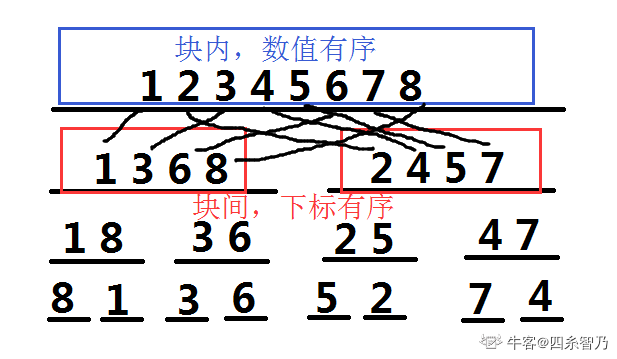

CDQ 分治擅长处理“偏序约束关系”，所以想要使用 CDQ 分治的话最核心的部分就是找约束关系或者将问题的限制条件转化为这种偏序约束条件。
看某一次的归并过程，一次归并在归并树中涉及到了三个节点：当前节点，左子树，右子树。
然后易知，在归并过程中，处于同一个节点块内的元素总是数值有序的。同时，来自左子树块中的元素的下标，总是小于来自右子树块内元素的下标。
如果只考虑来自左子树的块内元素与来自右子树块内元素的偏序问题。发现在本次归并排序的过程中又恰好同时被满足了。
假设某种偏序约束条件是对 a,b 两种属性进行约束的话。CDQ 分治首先需要做的是按照属性 a 排序，然后做关于属性 b 的归并排序。
