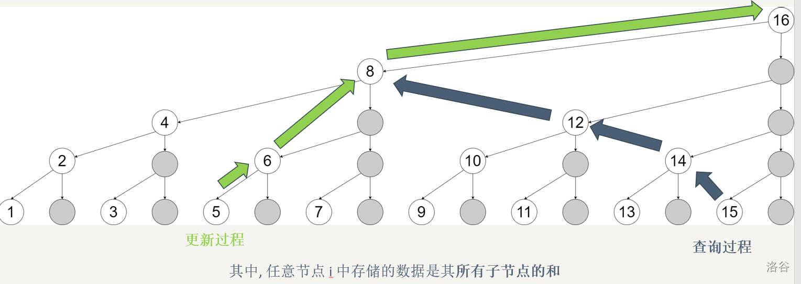

> “任意区间拆成 logn 个节点”这就是线段树本身的思想

树套树，线段树分治到最后都是拆区间

- 线段树标记永久化
  https://www.luogu.com.cn/blog/514820/biao-ji-yong-jiu-hua
  标记永久化就是字面上，**不 pushdown/pushUp 、只停留在原地的思路**
  通常在你 pushup 和 pushdown 不能有效复合，会导致复杂度爆炸；但在每次在路径上运行查询却可以保证复杂度正确的时候，必须要用
  树套树本身就是一种标记永久化
  “任意区间拆成 logn 个节点”这就是线段树本身的思想
  日本竞赛圈叫做 `双対セグ木`

  不下推标记，仅在查询时计算标记的贡献。常见于区间加 + 查询区间和/最值中，因为加法可以累积，即查询时额外储存从根节点到当前区间表示节点的标记和，再加上该区间所存储的值就是当前值。
  如果是区间赋值，那么可以在**标记中额外维护时间戳**，查询时找到时间戳最大的那一次修改的权值即为当前值。适用于可追溯数据结构。
  https://www.luogu.com.cn/problem/SP11470

  https://www.cnblogs.com/alex-wei/p/segment_tree_yyds.html
  对于区间修改的题目，虽然可以通过下推标记维护信息，但是每次下推标记时，**如果没有左右儿子，那么就要新建节点，空间开销过大。**
  不妨不下推标记，仅在查询时计算标记的贡献。
  常见于**区间加 + 查询区间和/最值**中，因为加法可以累积，即查询时额外储存从根节点到当前区间表示节点的标记和，再加上该区间所存储的值就是当前值。
  如果是区间赋值，那么可以在**标记中额外维护时间戳**，查询时找到时间戳最大的那一次修改的权值即为当前值。

---

树状数组拆前缀/后缀区间
https://www.cnblogs.com/alex-wei/p/BIT_advanced.html

