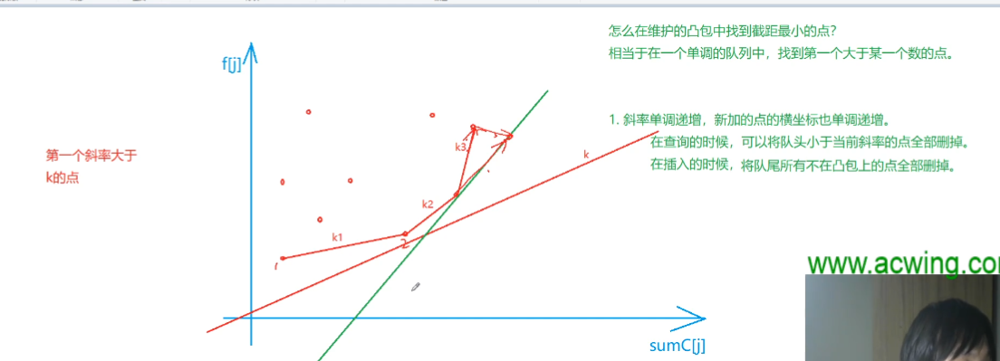
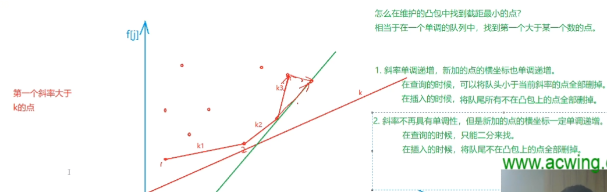

做斜率优化题不需要想着什么凸包。把式子化好就行了

这类题的特点是`连续分组` 且 dp 转移式有 `ij 交叉项`

1.  335. 特别行动队-分组

        - 提取 ij 交叉项,变形为
           `dp[j]+y(j)`=`k(i)*x(j)`+`dp[i]+b(i)`
           (左边只和 j 有关)=(右边ij交叉项+只和 i 关)

        - 其中直线方程中i视为常数,j视为变量:
          自变量为`x(j)`
          斜率为`k(i)`
          截距为`dp[i]+b(i)`
          因变量为`dp[j]+y(j)`

        - `由于 k(i)<0 斜率为负数`
          `要让 dp[i]最大 所以截距也要最大`
          `所以维护一个上凸壳`

2.  334. K 匿名序列

        - 由于可能除数为0，所以我们用叉乘来维护
        - 注意转移时 i−j≥k 因此更新答案时需要判断

---

**表达式中两种斜率的处理方法**

- 随着横坐标单增,斜率也单增 => 单调队列维护凸包上相邻两点的斜率,不在凸包上的点全删

  1. 维护队列最值 O(n)
  2. 维护凸包

- 随着横坐标单增,斜率不单增 => 二分出凸包斜率上第一个 `k1<k<k2` 的位置
  1. 二分查询队平衡树中第一个`k1<k<k2`的点 O(nlogn)
  2. `平衡树`维护凸包

---

deprecated: 使用`MongeShortestPath`代替斜率优化.
