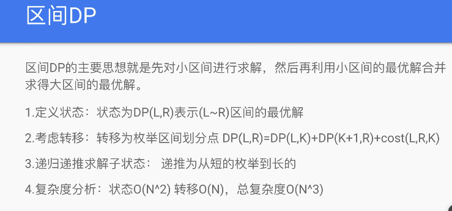

**Update:区间 dp 统一用 dfs 写法**

<!-- 这类题目一般1 <= s.length <= 100 -->
<!-- 时间复杂度O(n^3) -->



通常都是返回 dp[0][n]，而不是其他常见的 dp[-1][-1]
令状态 $f(i,j)$ 表示将下标位置 $i$ 到 $j$ 的所有元素合并能获得的价值的最大值，那么 `$dp(i,j)=max{dp(i,k)+dp(k+1,j)+cost(i,j)}` 为将这两组元素合并起来的代价

拆分区间寻找更优解
`664. 奇怪的打印机.py`
`546. 移除盒子.py`
`1000. 合并石头的最低成本.py `

dfs 写法

```Python
@lru_cache(None)
def dfs(l, r,*otherStates):
  if left > right:
    return 0
  res = float('inf')
  for i in range(l, r + 1):
    # 向内收缩区间
    res = min(res, i + max(dfs(l, i - 1), dfs(i + 1, r)))
  return res
```
