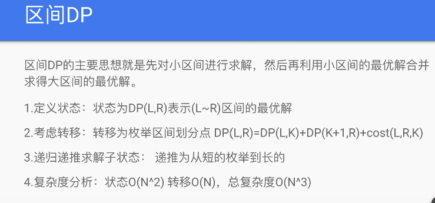

<!-- 这类题目一般1 <= s.length <= 100 -->
<!-- 时间复杂度O(n^3) -->



通常都是返回 dp[0][n]，而不是其他常见的 dp[-1][-1]
令状态 $f(i,j)$ 表示将下标位置 $i$ 到 $j$ 的所有元素合并能获得的价值的最大值，那么 `$dp(i,j)=max{dp(i,k)+dp(k+1,j)+cost(i,j)}` 为将这两组元素合并起来的代价

模板：
遍历区间长度 l
确定左端点 i 和右端点 j=i+l
然后对区间笛卡尔积 k

```Python
def helper(self, ns: List[int]) :
    N = len(ns)
    dp = [[0] * N for _ in range(N+1)]
    for l in range(N): # 长度从小到大
        for i in range(N-l): # 以 i 为 开头  // i+l要小于n
            j = i + l           # 以 j 为 终点
            for k in range(i,j): # 以 k 为分割点，进行分治
                dp[i,j] = max/min(dp[i,j], dp[i,k] + dp[k+1, j] + cost)
```

注意 js 里 l 要从 1 开始 (使 j-1>=0)

```JS
  const dp = Array.from({ length: n + 1 }, () => Array(n).fill(0))
  for (let i = 0; i < n; i++) {
    dp[i][i] = nums[i]
  }

  for (let l = 1; l < n; l++) {
    for (let i = 0; i < n - l; i++) {
      const j = i + l
      for (let k = i; k < j; k++) {
        dp[i,j] = min(dp[i,j], dp[i,k] + dp[k+1, j] + cost)
      }
    }
  }

  return dp[0][dp[0].length - 1]
```

拆分区间寻找更优解
`664. 奇怪的打印机.py`
`546. 移除盒子.py`
`1000. 合并石头的最低成本.py `

dfs 写法

```Python
@lru_cache(None)
def dfs(l, r,*otherStates):
  if left > right:
    return 0
  res = float('inf')
  for i in range(l, r + 1):
    # 向内收缩区间
    res = min(res, i + max(dfs(l, i - 1), dfs(i + 1, r)))
  return res
```
