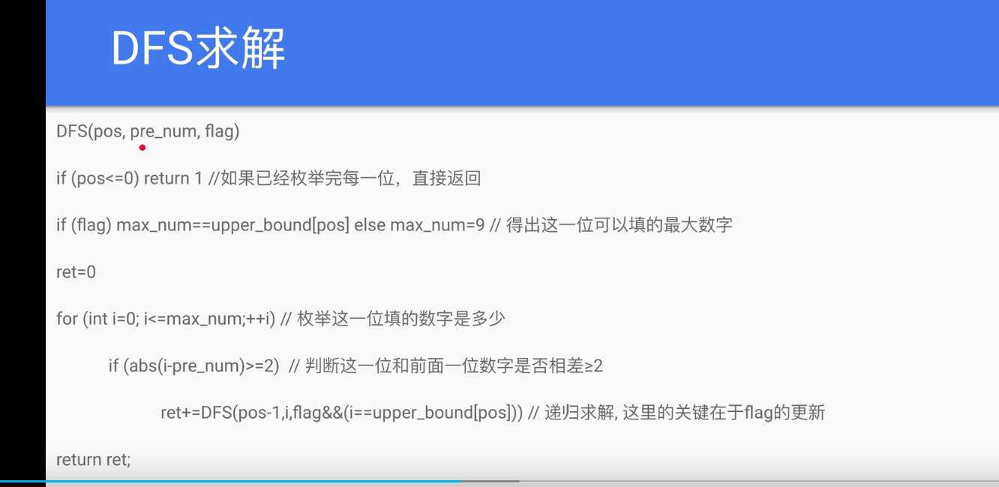

`res[L,R]=res[1,R]-res[1,L-1]`
数字大小维度
数字大小->数位字典序

**windy 数**
不含前导零且相邻两个数字之差至少为 2 的正整数被称为 windy 数
5 36 192 是 windy 数 10 21 不是

dfs 求解:

1. 现在枚举到了哪一位 `curPos`
2. 前面一位的数字是多少 `preNum`
3. 这一位可以填哪些数(布尔值等) `flag`
   

dfs(curPos,preNum,flag)
dfs**注意@lru_cache**

**RoundNumber**
  
dp[pos][zeros][ones]

**好字符串的数目**

dp[pos][len]

总结模板

