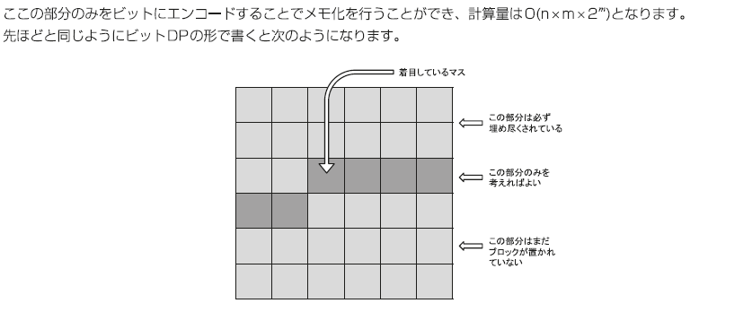

dfs 状态定义方法

# dfs(row,col,cState) 轮廓线 DP，一个格子一个格子地 dp

之前 COL(+k?) 个格子的安排方式是 cState 用元组记录比较好(轮廓线 DP)

[1659. 最大化网格幸福感 2](1659.%20%E6%9C%80%E5%A4%A7%E5%8C%96%E7%BD%91%E6%A0%BC%E5%B9%B8%E7%A6%8F%E6%84%9F2.py)
[LCP 04. 覆盖](LCP%2004.%20%E8%A6%86%E7%9B%96.py)

# dp(row, preState,curState) 一般的行间状态转移状压 dp，一行一行地 dp
