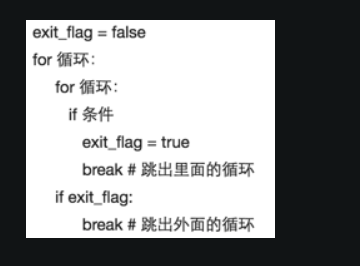

python 里用 flag
js 里可以直接 break loop


```Python
  # 是否每个位置都被覆盖了
  is_all_visited = True
  # 未被覆盖的第一个位置
  cur_row = -1
  cur_col = -1

  for r in range(row):
      for c in range(col):
          if not visited[r][c]:
              is_all_visited = False
              cur_row = r
              cur_col = c
              break
      if not is_all_visited:
          break
```
