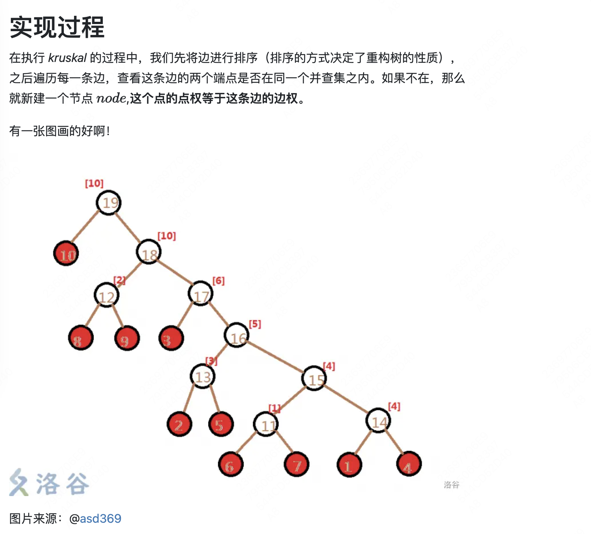

# 从树的角度分析并查集的合并过程

`Kruskal重构树（ProcessOfMergingTree)`
定义：第 i 次操作 a_i 和 b_i 分属于两个不同子树，那么 Kruskal 会新建一个结点 u，然后让 a_i 所在子树的根和 b_i 所在子树的根分别连向 u，作为 u 的两个儿子。

- 每个点对应子树里都是边长小于等于其的点权的联通块
- 每个节点的权值肯定大于等于其子树中任意一个点的权值，因为构造最小生成树的时候越大的边出现的越晚，对应建立的点深度也越浅

https://www.luogu.com.cn/blog/user9012/ke-lu-si-ka-er-zhong-gou-shu-lve-xie

---

https://atcoder.jp/contests/agc002/tasks/agc002_d

https://www.mathenachia.blog/agc002d-usereditorial/#toc1

解法:

1. 整体二分
2. 部分可持久化并查集
3. 操作分块+重构(或者二进制分组)
4. disjoint set union (DSU) のマージ過程を表す木

---

Kruskal 重构树 与 并查集生成树(森林)本质一样

---

https://www.luogu.com.cn/blog/LawrenceSivan/kruskal-zhong-gou-shu-zong-jie

1. 如果原图不连通，那么 Kruskal 重构树就是一棵森林，每个连通块都是一棵树。
2. 如果一开始按照边权升序排序，那么建出的 Kruskal 重构树就是一个`大根堆`，反之就是小根堆。
3. 若一开始按照边权升序排序，那么 `lca(u,v) 的权值`代表了原图中 `u 到 v 路径上最大边权的最小值`。反之就是最小边权的最大值。(关键性质，用于处理路径最大值最小/最小值最大的问题)
   [P1967 [NOIP2013 提高组] 货车运输](https://www.luogu.com.cn/problem/P1967)

4. Kruskal 重构树中的叶子结点必定是原图中的节点，其余的节点都是原图的一条边。
5. Kruskal 重构树建好以后会比原图多出 n−1 个节点（如果原图联通的话）
6. `从 u 出发只经过边权不超过 x 的边能到达的节点`:只需要`倍增`找到边权升序的 Kruskal 重构树中找到`深度最小的，点权不超过 x 的节点`，那么这个节点的子树即为所求。
   [P4197 Peaks](https://www.luogu.com.cn/problem/P4197)
   [P7834 [ONTAK2010] Peaks 加强版](https://www.luogu.com.cn/problem/P7834)

- 一般用倍增维护 Kruskal 重构树 LCA.如果需要对树进行修改，就需要用 LCT 维护 Kruskal 重构树。
