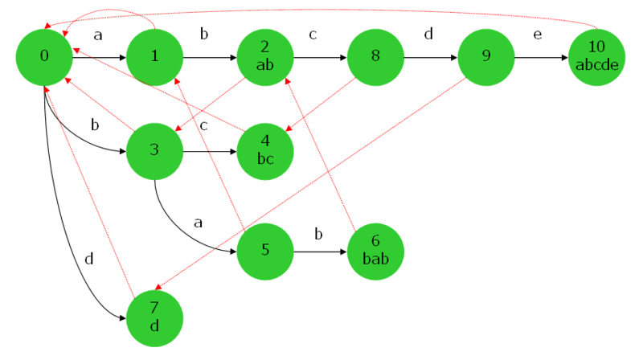

**多模式匹配(一个文本串加若干模式串)**
AC 自动机:trie+失配指针

(https://oi-wiki.org/string/ac-automaton/)

AC 自动机是 以 Trie 的结构为基础，结合失配指针建立的。(和 KMP 没有关系)

简单来说，建立一个 AC 自动机有两个步骤：

1. 基础的 Trie 结构：将所有的模式串构成一棵 Trie。
2. 对 `Trie 树上所有的结点构造失配指针`。
   然后就可以利用它进行多模式匹配了。
   如果一个点 i 的 fail 指针指向 j,那么 root 到 j 的字符串是 root 到 i 的字符串的**最长后缀**。

- 给定 k 个单词和一段包含 n 个字符的文章，求有多少个单词在文章里出现过。

https://zhuanlan.zhihu.com/p/137584630
如果要匹配汉字 需要把主串和所有模式串中涉及的字符 Unicode 离散化

> 参考
>
> - [AC 自动机详解&演示](https://www.bilibili.com/video/BV1iV411B73u?spm_id_from=333.337.search-card.all.click&vd_source=e825037ab0c37711b6120bbbdabda89e)
> - [AC 自动机](https://www.luogu.com.cn/blog/juruohyfhaha/ac-zi-dong-ji)
> - [[算法]轻松掌握 ac 自动机](https://www.bilibili.com/video/BV1uJ411Y7Eg?p=4)

---

update

https://naoya-2.hatenadiary.org/entry/20090405/aho_corasick
Trie 是很多个字符串组成的树,AC 自动机是 Trie 的子类，用于匹配

字典树本质上也是 DFA，但是因为是树所以也可以看作一个字符占据一个节点

基于双数组字典树的 AC 自动机
https://blog.csdn.net/huoji555/article/details/105435014

---

https://zhuanlan.zhihu.com/p/408665473

1. 构建 trie 树
2. bfs 构建 fail 表
3. 模式匹配
   从目标串从头逐个开始，在 ac 自动机中进行匹配，匹配上的则计数，若未匹配上则跳转失配位置进行尝试匹配，直到全部匹配完成。
