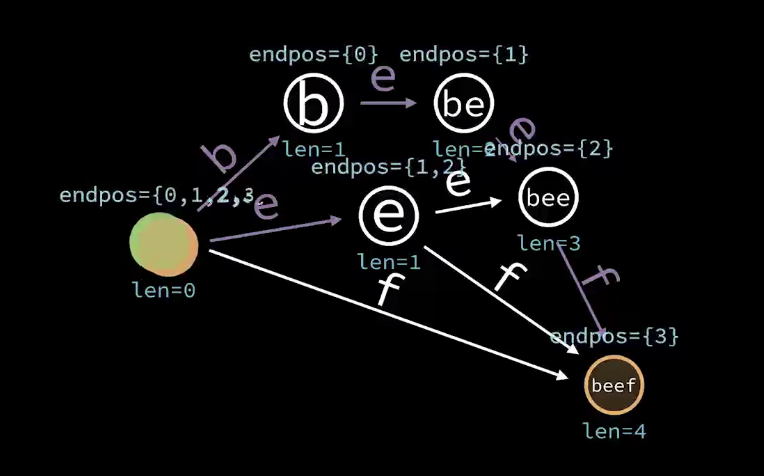

**多模式匹配(一个文本串加若干模式串)**
AC 自动机:trie+失配指针

(https://oi-wiki.org/string/ac-automaton/)

AC 自动机是 以 Trie 的结构为基础，结合失配指针建立的。(和 KMP 没有关系)

简单来说，建立一个 AC 自动机有两个步骤：

1. 基础的 Trie 结构：将所有的模式串构成一棵 Trie。
2. 对 `Trie 树上所有的结点构造失配指针`。
   然后就可以利用它进行多模式匹配了。
   如果一个点 i 的 fail 指针指向 j,那么 root 到 j 的字符串是 root 到 i 的字符串的**最长后缀**。

- 给定 k 个单词和一段包含 n 个字符的文章，求有多少个单词在文章里出现过。

https://zhuanlan.zhihu.com/p/137584630
如果要匹配汉字 需要把主串和所有模式串中涉及的字符 Unicode 离散化

> 参考
>
> - [AC 自动机详解&演示](https://www.bilibili.com/video/BV1iV411B73u?spm_id_from=333.337.search-card.all.click&vd_source=e825037ab0c37711b6120bbbdabda89e)
> - [AC 自动机](https://www.luogu.com.cn/blog/juruohyfhaha/ac-zi-dong-ji)
> - [[算法]轻松掌握 ac 自动机](https://www.bilibili.com/video/BV1uJ411Y7Eg?p=4)

---

update

https://naoya-2.hatenadiary.org/entry/20090405/aho_corasick
Trie 是很多个字符串组成的树,AC 自动机是 Trie 的子类，用于匹配

字典树本质上也是 DFA，但是因为是树所以也可以看作一个字符占据一个节点

基于双数组字典树的 AC 自动机
https://zhuanlan.zhihu.com/p/125640152
https://blog.csdn.net/huoji555/article/details/105435014
https://zhuanlan.zhihu.com/p/185832624
https://github.com/hankcs/AhoCorasickDoubleArrayTrie

---

https://zhuanlan.zhihu.com/p/408665473
AC 自动机是 Trie 上的自动机

1. 构建 trie 树, ac 自动机**继承**自 trie 树
2. bfs 构建 fail 表
3. 模式匹配
   从目标串从头逐个开始，在 ac 自动机中进行匹配，匹配上的则计数，若未匹配上则跳转失配位置进行尝试匹配，直到全部匹配完成。

---

[OI 自动机大炒饭](https://www.bilibili.com/video/BV1uV4y1W7cB)

|            | 输入串                    | 输入串后缀           |
| ---------- | ------------------------- | -------------------- |
| 字典串     | 字典树                    | kmp 自动机/ac 自动机 |
| 字典串后缀 | 后缀自动机/广义后缀自动机 | ??                   |

- 字典树
  每个状态表示字典中某个模式串的前缀
- kmp 自动机(离线构建)：
  kmp 自动机中，每个状态代表最长的等于模式串某个前缀的`输入串的后缀`.
  
- ac 自动机(离线构建)：
  ac 自动机中，每个状态代表最长的等于某个模式串某个前缀的`输入串的后缀`.
  每个状态最初默认转移到起始状态
  每个状态要继承其失配链接的转移
- 后缀自动机(在线构建)：
  只接受某个模式串所有后缀的 DFA.
  简单想法是将所有后缀插入字典树中，但是状态是 O(n^2)的.

  1. 第一种想法：合并状态
     发现有些状态可以合并(DFA 最小化).
     **把树变成 DAG 可以大幅减少自动机中的状态数.**
     哪些状态可以合并？：两个状态的转移方式一样，就可以合并(input 和 nextState 相同)。
     合并后的自动机是某个模式串的后缀自动机，是一个接受模式串所有后缀状态数最少的自动机。
     但是通过合并状态构造的 SAM 复杂度是有问题的.

  注意到每个状态代表**模式串某个后缀的某个前缀**，也就是模式串的某个子串.
  合并了的子串转移方式一样，也就是说这些子串在模式串中的`结束位置`一样.

  2. 第二种想法：重新定义状态
     那么可以重新定义状态：每个状态代表一些`结束位置集合(endPos)相同`的子串.也就是 endPos 等价类
     
     
     
     对于任意两个状态 A 和 B，如果状态 A 的结束位置集合是状态 B 的结束位置集合的子集，那么对状态 A 的变化会影响到 B

     每个状态的深度表示该状态代表的子串的长度，深度越大，代表的子串越长.
     **对每个状态 A，我们找到自动机中最深的状态 B，使得 B 的代表串是 A 的代表串的真后缀(即最长真后缀).**
     此时 A 的结束位置集合是状态 B 的子集，A 会影响到 B，进而影响到 A 的其他后缀.
     此时的后缀链接就是 A->B.

- 广义后缀自动机(在线构建)：
  只接受某些模式串所有后缀的 DFA.
  每个状态代表一些在任意模式串中 endpos 都相同的子串.
  

---

**KMP 自动机里的失配链接与后缀自动机里的后缀链接，状态 A->B 都满足 B 的代表串是 A 的代表串的最长真后缀**
区别在于影响方向相反：
ac 自动机是 suffixLink[u] -> u
后缀自动机是 u -> suffixLink[u]

---

如果我们既知道前缀信息（trie），又知道后缀信息（fail），就可以做字符串匹配：
前缀的后缀就是子串，只要遍历到所有前缀，对每个前缀做「后缀匹配」，就完成了字符串匹配（统计子串出现次数）
