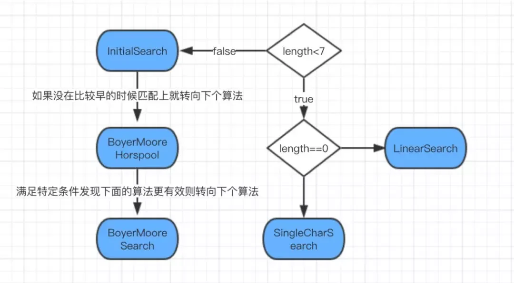

字符串匹配问题
又称模式匹配（pattern matching）。该问题可以概括为「给定字符串 S 和 T，在主串 S 中寻找子串 T 」。`字符 T 称为模式串 (pattern)`。

暴力法处理自然文本性能好,但是有可能退化
字符串的**前缀**是指不包含最后一个字符的所有以第一个字符开头的连续子串。
**后缀**是指不包含第一个字符的所有以最后一个字符结尾的连续子串。

**KMP 算法**
KMP 的经典思想就是:「当出现字符串不匹配时，可以记录一部分之前已经匹配的文本内容，利用这些信息避免从头再去做匹配。」
记录的数组叫 lps/next 数组

**Manacher(马拉车)** 的思想也是避免"匹配"失败后的下标回退

**BM 算法**
KMP 和 Boyer-Moore 算法都需要预先计算处理来获得辅助数组，需要一定的时间和空间
Boyer-Moore 算法平均要比 KMP 快 3-5 倍，
在实际的工业生产中，比如 GNU grep,
还有各种文本编辑器的查找功能（Ctrl+F）大多用的 BM（Boyer-Moore）算法

**马拉车算法**
例子:aaaba

| 序号     | 0   | 1   | 2   | 3   | 4   | 5   | 6   | 7   | 8   | 9   | 10  |
| -------- | --- | --- | --- | --- | --- | --- | --- | --- | --- | --- | --- |
| 数组     | #   | a   | #   | a   | #   | a   | #   | b   | #   | a   | #   |
| 回文半径 | 1   | 2   | 3   | 4   | 3   | 2   | 1   | 4   | 1   | 2   | 1   |

性质:

1. 最大半径减 1 等于最长回文串的长度
2. 最长回文字符的起始位置是中间位置减去半径在除以 2

## js 中 indexOf() 的实现

[对应的 v8 引擎源码实现源码地址](<[https://link](https://www.infoq.cn/link?target=https%3A%2F%2Fgithub.com%2Fv8%2Fv8%2Fblob%2Fmaster%2Fsrc%2Fstring-search.h)>)
src/string-search.h 文件中一共定义了五种搜索算法：
1.SingleCharSearch
2.LinearSearch
3.InitialSearch
4.BoyerMooreHorspoolSearch
5.BoyerMooreSearch
具体使用哪种，是在初始化 StringSearch 时根据 pattern 长度定义的。

长字符使用 `BM 算法`搜索
Boyer-Moore 算法平均要比 KMP 快 3-5 倍，在实际的工业生产中，比如 GNU grep,还有各种文本编辑器的查找功能（Ctrl+F）大多用的 BM（Boyer-Moore）算法。

`注意 java 里的 indexOf 是暴力搜索`

---

惩罚函数与序列匹配问题(fft 加速通配符匹配)
https://taodaling.github.io/blog/2019/06/14/%E5%BA%8F%E5%88%97%E9%97%AE%E9%A2%98/
用惩罚函数的方式，我们可以非常灵活的定义惩罚函数，从而计算所有匹配子串。

浅谈 FFT 在字符串匹配中的应用
https://www.luogu.com.cn/article/rp0rk9nd
