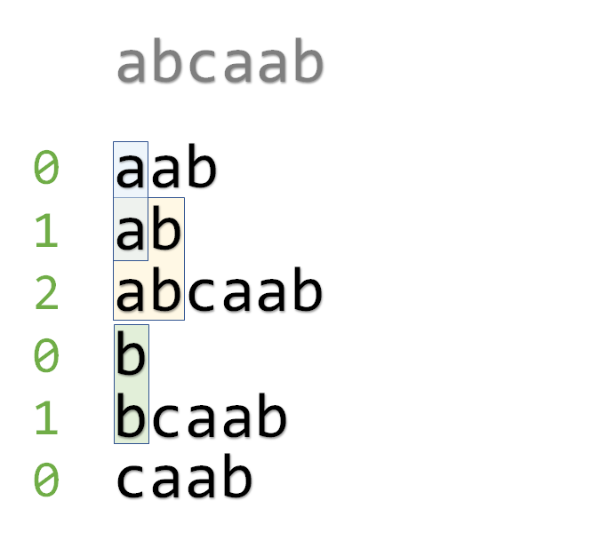

https://zhuanlan.zhihu.com/p/408261126
多数后缀数组题目主要还是考察 Height 数组的性质
后缀数组（Suffix Array, SA）是解决很多与字符串相关的问题的有力工具。它实际上就是把字符串的所有**后缀按字典序排序**后得到的数组。
**子串就是后缀的前缀**
**按后缀排序的顺序枚举后缀**

- sa 让我们可以`按字典序遍历所有本质不同的子串`
  只需要遍历 sa[i] 的前缀，但是跳过前 height[i] 个 之前一定已经被遍历过了
  相邻两个子串的 LCP 就是重复的子数组数

- 又比如，我们可以求两个子串的 LCP。显然，设两个子串分别为 s= s[l1..r1]和 s= s[l2..r2]，
  则它们的最长公共前缀为 `min(s1, s2 ,lcp( sa[i], sa[2]))`。所以我们只需要求两个后缀的 LCP，
  而很容易发现这正是，`min (height[k])`。
  这是一个 RMQ 问题，用线段树/ST 表可以解决。

其他的应用

- 出现至少 k 次的子串的最大长度
  出现至少 k 次意味着后缀排序后有至少`连续 k 个后缀的 LCP 是这个子串`。
  所以，求出每相邻 k-1 个 height 的最小值，再求这些最小值的最大值就是答案。
- 高度数组中的最大值对应的就是最长的重复子串
- 所有高度之和就是相同子串的个数。(每一对相同子串在高度数组产生 1 贡献)
- 后缀数组求最长的没有重复字符的子串

---

子串是什么？
后缀数组、后缀树、后缀自动机的 DAG：子串是后缀的前缀
后缀自动机的 fail 树、AC 自动机：子串是前缀的后缀
