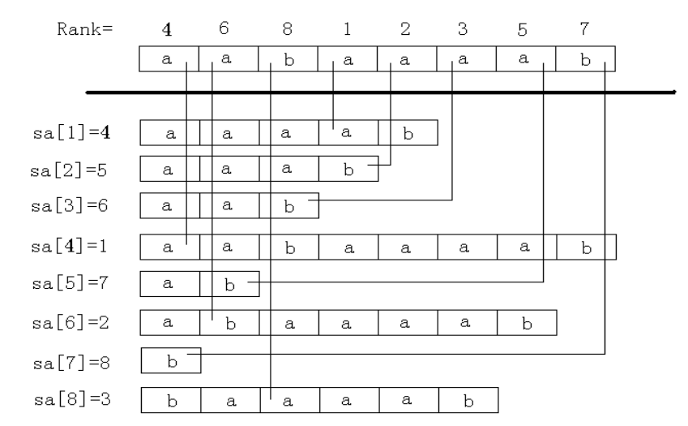

后缀数组（Suffix Array）主要是两个数组：SA 和 RK
SA[i] 表示将所有后缀(n 个)排序后第 i 小的后缀是第几个后缀
RK[i] 表示第 i 个后缀 的排名
Height[i] 来记录排名为 i 的非空后缀与排名为 i−1 的非空后缀的最长公共前缀的长度

应用

- 从字符串首尾取字符最小化字典序
- height 数组
  height 数组的定义
  H[i]=LCP(SA[i],SA[i-1])
  即`第 i 名的后缀与它前一名的后缀的最长公共前缀`
