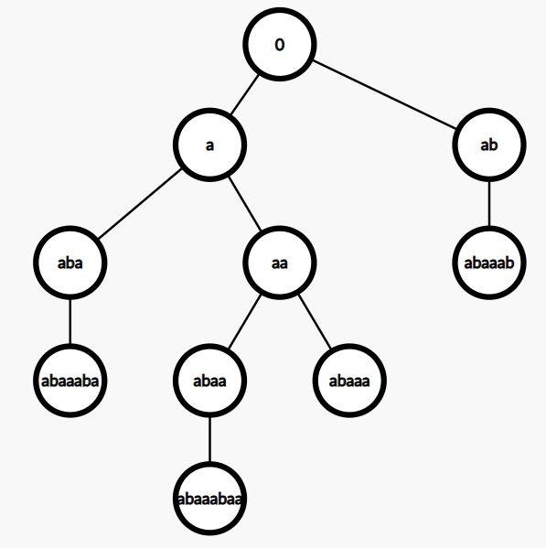

https://nyaannyaan.github.io/library/string/suffix-automaton.hpp
https://baobaobear.github.io/post/20200220-sam/
https://w.atwiki.jp/uwicoder/pages/2842.html

https://ouuan.github.io/post/%E5%90%8E%E7%BC%80%E8%87%AA%E5%8A%A8%E6%9C%BAsam%E5%AD%A6%E4%B9%A0%E7%AC%94%E8%AE%B0/
https://etaoinwu.com/blog/%E6%84%9F%E6%80%A7%E7%90%86%E8%A7%A3-sam/
—个确定有限状态自动机(DFA)由以下五部分构成:

1. 字符集(∑)，该自动机只能输入这些字符。
2. 状态集合(Q)。如果把一个 DFA 看成一张有向图，那么 DFA 中的状态就相当于图上的顶点。
3. 起始状态(start)， start ∈Q，是一个特殊的状态。起始状态一般用 s 表示，为了避免混淆，本文中使用 start。
4. 接受状态集合(F)， F ∈Q，是一堆特殊的状态。
5. 转移函数(6)，6 是一个接受两个参数返回一个值的函数，其中第一个参数和返回值都是一个状态，第二个参数是字符集中的一个字符。如果把一个 DFA 看成一张有向图，那么 DFA 中的转移函数就相当于顶点间的边，而每条边上都有一个字符。

SAM 上的每一个状态去表示一个集合等价类，转移函数也相应地更改为对应的等价类
这样的 SAM，从起始状态到某个状态可能有多条路径，每条路径都对应一个字符串，那么我们称这个状态 对应 着这些字符串。

TODO 没理解

---

ac 自动机是加了索引的 trie 树；后缀自动机是包含所有子串的**最小 DAG**(DFA 最小化)。

ac 自动机常用于多模字符串匹配；后缀自动机几乎能用于所有与子串相关的问题，特别是与线段树配合使用后，是个超级大杀器。
推荐龙书，其实有关字符串处理的部分在设计编译器的时候用的最多，把上下文无关法那几章整明白，字符串的算法都能很快上手。

---

https://ddosvoid.github.io/2021/01/03/%E5%90%8E%E7%BC%80%E8%87%AA%E5%8A%A8%E6%9C%BA/#more

---

https://www.bilibili.com/video/BV1ED4y1U7aU
直观上，字符串的 SAM 可以理解为给定字符串的 所有子串 的压缩形式。
值得注意的事实是，SAM 将所有的这些信息以高度压缩的形式储存。
对于一个长度为 n 的字符串，它的空间复杂度仅为 O(n)。
此外，构造 SAM 的时间复杂度仅为 O(n)。准确地说，一个 SAM 最多有 2n-1 个节点和 3n-4 条转移边。

suffixLink 可以形成一棵树，有的地方叫 parent 树

