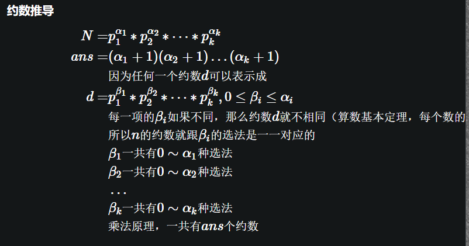
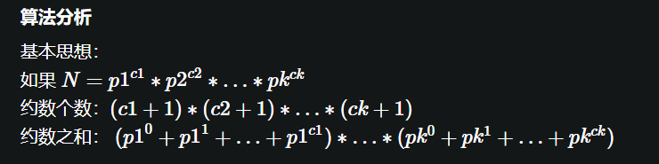

约数个数，考虑每个质因子的贡献


约数之和


`思路就是看每个 factor`

`0-2e9 约数最多的数有多少个呢? 1600 近似 n 开立方`

求一个数的约数肯定根号 n ，难
但是求多少个数是一个数的倍数简单

```Python
for factor in range(1, MAX):
    if not counter[factor]:
        continue
    for multi in range(factor, MAX, factor):
        multiCounter[multi] += counter[factor]

```
