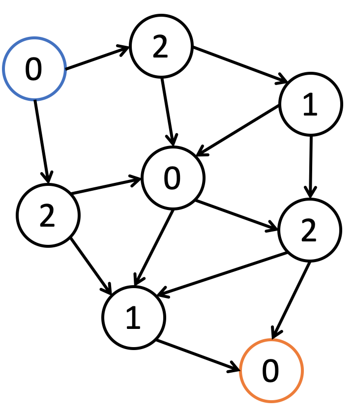

https://zhuanlan.zhihu.com/p/20611132
https://www.creativ.xyz/grundy-number-1065/


游戏最后玩家无法行动 grundy 数为 0
**Grundy 数の定義は『可能な遷移先の Grundy 数の mex（そこに含まれない 0 以上の整数の最小値）』**

`Grundy 数が 1 以上の状態からは、その値未満の任意の非負整数に変化させられる。`
`Grundy 数が 0 の状態からは 1 以上の状態にしか変化させられない`
即`败态只能变成胜态，胜态可以（但不一定）变成败态。`

**NIM 定理**

- 当异或和值为零时，无论你怎么取，异或和值一定变为非零，
  对手以牙还牙，使异或和值变为零，如此循环，直至对手取完。故此时先手必败（处于必败态）。
- 当异或和值非零时，总能在某一堆中选取若干个石头，使得异或和值为零（可以自己找几个例子算算），
  则必胜态总能转移到必败态。

**Sprague-Grundy 定理(SG 定理)**：

若一个游戏满足以下条件:

1. 双人、回合制;
2. 信息完全公开(perfect information) ;
3. 无随机因素(deterministic) ;
4. 必然在有限步内结束，且每步的走法数有限(finite) ;
5. 没有平局;
6. 双方可采取的行动及胜利目标都相同(`impartial`) ;
7. 这个胜利目标是自己亲手达成终局状态，或者说走最后一步者为胜(normal play) ;

则游戏中的`每个状态可以按如下规则赋予一个非负整数`，称为 Sprague-Grundy 数:
**★ SG(A) = mex{SG(B)|A→B}**
(式中 A、B 代表状态，A→B 代表 A 状态经一步行动可以到达 B 状态，mex 表示一个集合所不包含的最小非负整数)。
SG 数有如下性质:

1. SG 数为 0 的状态，后手必胜;SG 数为正的状态，先手必胜;
2. 若一个母状态可以拆分成多个相互独立的子状态，`则母状态的 SG 数等于各个子状态的 SG 数的异或。`
   利用 Sprague-Grundy 定理，可以将记忆化搜索的程序优化成如下形式：

```Python
mem = {}
def SG(A):                      # 求状态A的SG数
    if A not in mem:
        S = sub_states(A)       # sub_states(A)将A尽可能细致地拆分成子状态
        if len(S) > 1:          # A可以拆分，用子状态的异或求其SG数
            mem[A] = reduce(operator.xor, [SG(B) for B in S])
        else:                   # A不可拆分，根据定义求其SG数
            mem[A] = mex(set(SG(B) for B in next_states(A)))
                                # next_states(A)返回A的所有次态
                                # 注意这条语句蕴含了“终局态的SG数为0”
    return mem[A]
```

**策梅洛定理**
给定一个初始状态，先手玩家是否有必胜策略？
若一个游戏满足如下条件：

1. 双人、回合制；
2. 信息完全公开（perfect information）；
3. 无随机因素（deterministic）；
4. 必然在有限步内结束；
5. 没有平局；
   则游戏中的任何一个状态，要么先手有必胜策略，要么后手有必胜策略
   根据策梅洛定理，可以很容易地使用记忆化搜索算法判断一个状态是胜态还是败态：

```Python
mem = {}
def win(A):                     # 判断状态A是否为胜态
    if A not in mem:
        if is_final(A):         # 若A为终局态
            mem[A] = rule(A)    # 根据游戏规则判断A的胜负
        else:                   # 若A为非终局态，则根据策梅洛定理判断其胜负
            mem[A] = not all(win(B) for B in next_states(A))
                                # next_states(A)返回A的所有次态
    return mem[A]
```
