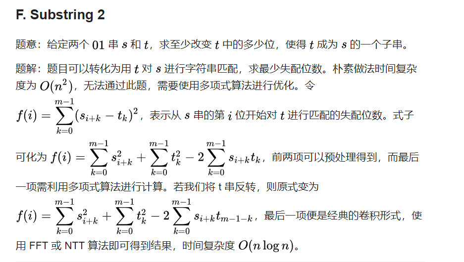

一维卷积的形式
`Ci = ∑j=0...i a[j]*b[i-j]`

- 一维卷积
  F. Substring 2
  

- 二维卷积:
  A=[1,2,3] 表示选 1/2/3 个球的方案数
  B=[4,5,6] 表示选 1/2/3 个球的方案数
  C=[1,3,5] 表示选 1/2/3 个球的方案数

  现在问一共选 5 个球 问多少种方案
  求 `convolve(convolution(A,B),C)[5]` 即可
  fft 求卷积 nlogn

  ​
