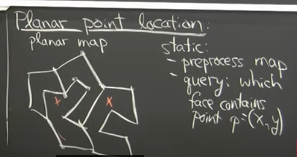
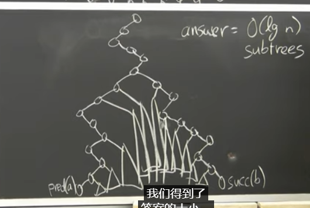
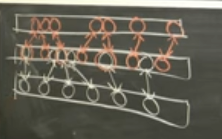

https://github.dev/EndlessCheng/codeforces-go/tree/master/copypasta

---

https://www.youtube.com/watch?v=NMxLL3D5qd8
Geometry DS

- planar point location problem (定位)
  
  applications: GUI, GPS ...
- sweep line
- orthogonal range searching problem (正交范围搜索)
- Range Trees O((logn)^(d-2) +k) 时间复杂度查询, 空间复杂度 O(n(logn)^(d-1))
  
- 替罪羊树处理动态问题->重构
  https://riteme.site/blog/2016-4-6/scapegoat.html
- fractional cascading (分数级联/分散层叠)
  https://ei1333.github.io/library/structure/segment-tree/segment-tree-fractional-cascading.hpp

  > 实际上分数级联没那么快(常数大)
  > https://kopricky.github.io/code/SegmentTrees/orthogonal_range_report.html > https://kopricky.github.io/code/SegmentTrees/merge_segtree.html

  
  `O(logn+k)`
  Fractional Cascading 的核心概念是将多个已排序的数组分层，其中第 $i$ 层包含了所有已排序数组的前 $2^i$ 个元素。例如，对于三个已排序的数组 ${2,4,7}$，${1,3,4}$，${1,4,8}$，第 0 层是它们的头元素 ${1,1,2}$，第一层是头两个元素 ${1,1,2,2,3,4}$，第二层是头四个元素 ${1,1,1,1,2,2,3,3,4,4,7,8}$。
  Fractional Cascading 使用二分查找算法进行查找，但是相对于对每个已排序数组都进行一次二分查找，它只对第 $0$ 层进行一次二分查找，然后通过类似指针跳跃的方式将二分查找传递到上一层，从而在每层中减少一半的查找。

  Fractional Cascading 的主要优势在于它可以快速地在多个已排序的数组中进行查找，并且不需要为每个数组都进行一次二分查找。这使得 Fractional Cascading 可以用于各种应用程序，例如地图匹配和 GIS 系统中的空间查询等。

- 3D 矩形查询
  `O(logn)`

- kinetic DS : moving data

---

多边形的三角剖分
德劳内三角剖分
https://zhuanlan.zhihu.com/p/459884570

// todo https://oi-wiki.org/geometry/triangulation/
// https://cp-algorithms.com/geometry/delaunay.html
// http://poj.org/problem?id=2986

**Delaunay 三角剖分满足：一个三角形（或边）的外接圆范围内（边界除外），不包含点集 P 中的任何顶点**。
