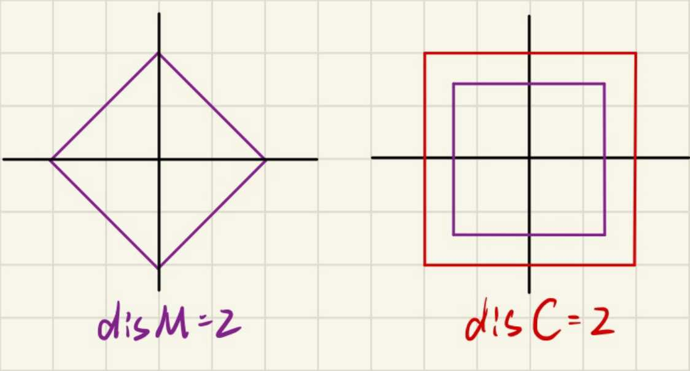

https://carrynotkarry.com/share/distances/#:~:text=%E5%88%87%E6%AF%94%E9%9B%AA%E5%A4%AB%E8%B7%9D%E7%A6%BB%20%E7%9B%B4%E8%A7%82%E7%90%86%E8%A7%A3%E5%B0%B1%E6%98%AF%E5%9B%BD%E9%99%85%E8%B1%A1%E6%A3%8B%E9%87%8C%E9%9D%A2%E7%9A%84%20%E5%9B%BD%E7%8E%8B%20%EF%BC%8C%E4%B9%9F%E5%B0%B1%E6%98%AF%E5%8F%AA%E8%83%BD%E5%BE%80%E5%9B%9B%E9%9D%A2%E5%85%AB%E6%96%B9%E7%9A%84%20%E5%85%AB%E4%B8%AA%E6%96%B9%E5%90%91%20%E7%A7%BB%E5%8A%A8%20%E4%B8%80%E4%B8%AA%20%E5%8D%95%E4%BD%8D%E3%80%82,x2%E2%88%A3%2C%E2%88%A3y1%20%E2%88%92%20y2%E2%88%A3%7D%20%E5%A6%82%E5%9B%BE%E5%B0%B1%E6%98%AF%E5%88%87%E6%AF%94%E9%9B%AA%E5%A4%AB%E8%B7%9D%E7%A6%BB%20%E4%B8%80%E5%BC%A0%E5%9B%BE%E6%80%BB%E7%BB%93%20%E7%BA%A2%E8%89%B2%EF%BC%9A%E6%AC%A7%E6%8B%89%E8%B7%9D%E7%A6%BB%3B%20%E9%BB%84%E8%89%B2%EF%BC%9A%E6%9B%BC%E5%93%88%E9%A1%BF%E8%B7%9D%E7%A6%BB%3B%20%E7%BB%BF%E8%89%B2%EF%BC%9A%E5%88%87%E6%AF%94%E9%9B%AA%E5%A4%AB%E8%B7%9D%E7%A6%BB

**曼哈顿距离** abs(x1-x2) + abs(y1-y2)
到原点的曼哈顿距离相同的点，他们分布在`同一横纵截距且截距相同的直线上(斜着45度的正方形)`。

**切比雪夫距离** max(abs(x1-x2), abs(y1-y2))
到原点的切比雪夫距离相同的点，他们分布在`以原点为中心的正方形边界上`。

## 曼哈顿距离转切比雪夫距离（45° 旋转）

`(x,y) -> (y+x, y-x)`

应用:

- 求平面最远曼哈顿距离
- 到(a,b)第 k 近的曼哈顿距离 => 二分,转化为计算矩形中点的个数

## 切比雪夫距离转曼哈顿距离（45° 旋转）

`(x,y) -> (y+x, y-x)`

应用:

- 找到一个到所有点距离之和最小的点(中位数)
