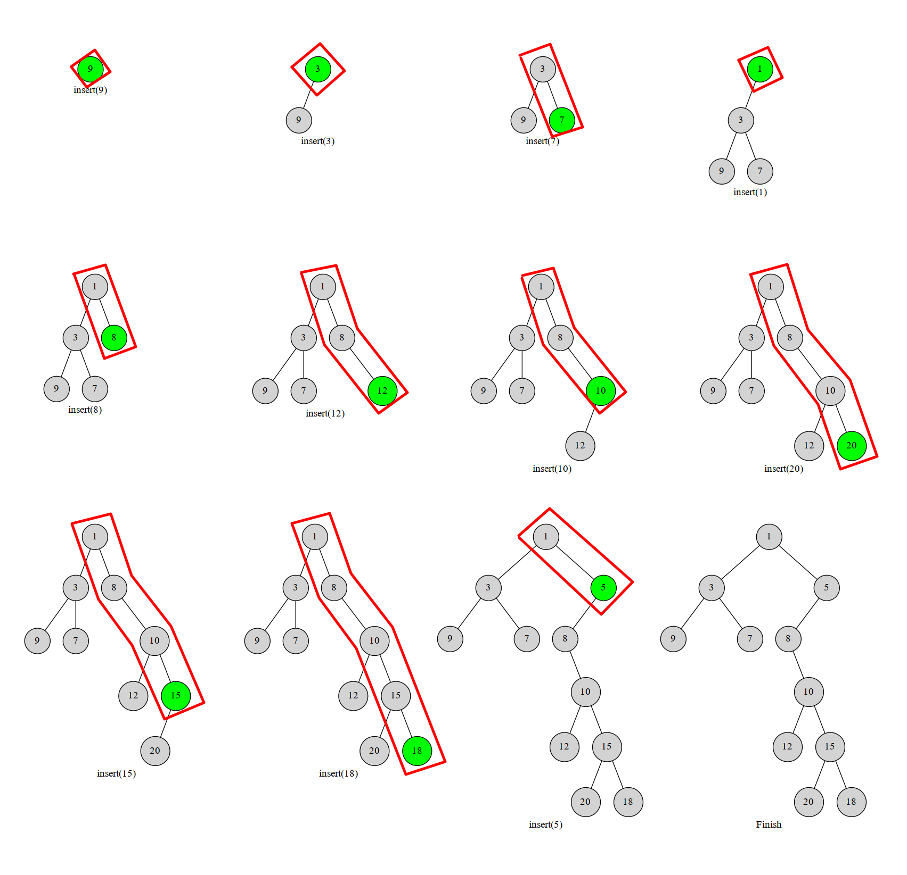

## 笛卡尔树

结点维护两个数：

- key：值，满足二叉搜索树的性质(左小右大)
- weihgt：权值,满足堆的性质(父小于子)
  很多时候，插入一个数组 nums 时，
  **把数组元素值当作 weight ，而把数组下标当作 key(下标总是按插入顺序单增的)**

## 普通笛卡尔树的建树方法建立 BST

- 传统 O(nlogn)建立 BST 的方法：
  `找到前驱和后继，新节点一定会被插入为较深的那一个的孩子`
  [1902\_求出给定插入顺序的 BST 的深度](../../../../../../../../../E:/test/js/%E7%AE%97%E6%B3%95/js/js-algorithm/4_set/%E6%9C%89%E5%BA%8F%E9%9B%86%E5%90%88/1902_%E6%B1%82%E5%87%BA%E7%BB%99%E5%AE%9A%E6%8F%92%E5%85%A5%E9%A1%BA%E5%BA%8F%E7%9A%84BST%E7%9A%84%E6%B7%B1%E5%BA%A6-sortedDict.py)
- 笛卡尔树 O(n)建立 BST
  **用单增的单调栈维护右链(插入的位置)**
  下标已经单调递增了，所以新插入的点只能是已前面点的右儿子、前面点只能是它的左儿子
  

## 结论

- Treap 是权值随机的笛卡尔树，所以在建树的时候可以单调栈来 O(n) 建树。
- 如果笛卡尔树的 (key,weight) 键值对确定，且 key 互不相同，weight 互不相同，**那么这个笛卡尔树的结构是唯一的**
- 笛卡尔树的先序遍历是遍历 key,key 对应(树的生成序列)插入的顺序
  即**笛卡尔树的先序遍历是在输出 BST 对应节点的插入的顺序,树节点值表示插入的顺序**
  `如果要输出BST最后的插入值，需要交换 key 和 weight，此时树节点表示的是插入的值`
  [BST 插入序列字典序最小](../../../../../../../../../E:/test/js/%E7%AE%97%E6%B3%95/js/js-algorithm/1_stack/%E5%8D%95%E8%B0%83%E6%A0%88/%E7%AC%9B%E5%8D%A1%E5%B0%94%E6%A0%91/%E6%A0%91%E7%9A%84%E5%BA%8F.py)
  [给定插入顺序，求最后的 BST](../../../../../../../../../E:/test/js/%E7%AE%97%E6%B3%95/js/js-algorithm/1_stack/%E5%8D%95%E8%B0%83%E6%A0%88/%E7%AC%9B%E5%8D%A1%E5%B0%94%E6%A0%91/1902.%20%E7%BB%99%E5%AE%9A%E4%BA%8C%E5%8F%89%E6%90%9C%E7%B4%A2%E6%A0%91%E7%9A%84%E6%8F%92%E5%85%A5%E9%A1%BA%E5%BA%8F%E6%B1%82%E6%B7%B1%E5%BA%A6.py)
