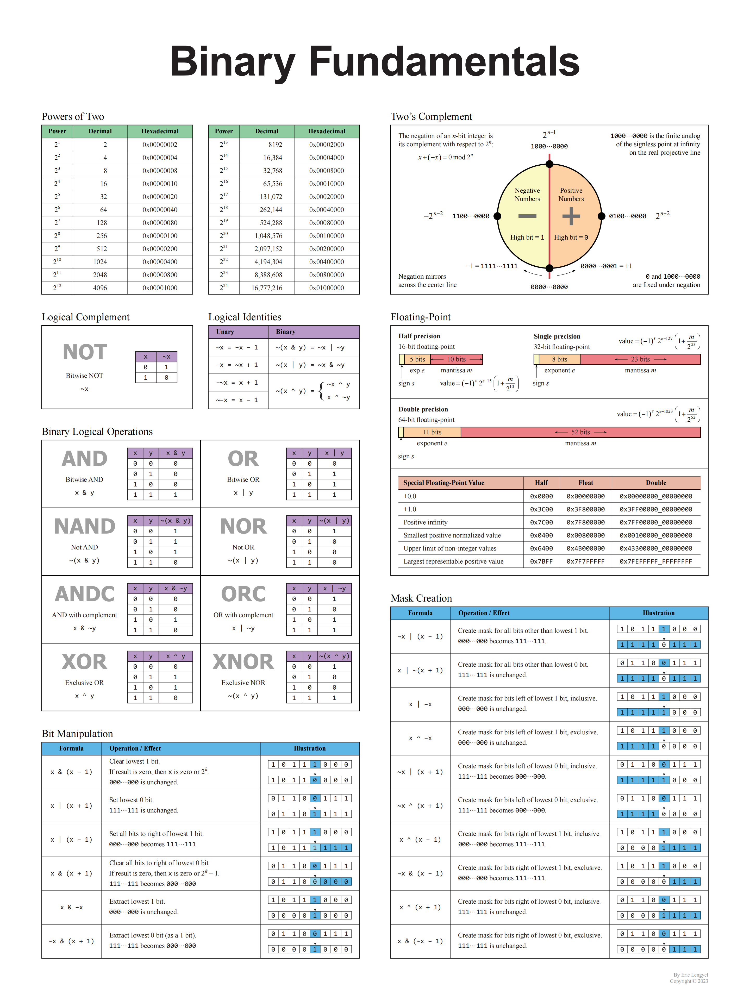

JS 对于整数的位运算仅支持 32 位有符号整数
在 JavaScript 内部，数值都是以 64 位浮点数的形式储存，但是做位运算的时候，是以 **32 位**(大于这个数有溢出可能，例如~~和取余运算符%不能用于超过 2147483647 和
-2147483648 的数)带符号的整数进行运算的，并且返回值也是一个 32 位带符号的整数
超过 32 位的整数会被截断，而小数部分则会被直接舍弃。
**python 的 int 是不会溢出的，达到界限后会自己处理**

```JS
>> 与 >>> 的区别
有符号右移,算术右移>>
向右被移出的位被丢弃，拷贝最左侧的位以填充左侧 符号位没有被改变
无符号右移,逻辑右移>>>
向右被移出的位被丢弃，左侧用0填充。因为符号位变成了 0，所以结果总是非负的。
通过逻辑移位，我们最终会得到0，因为我们不断地将数位0 移入最高位。通过算术移位，我们最终会得到1，因为我们不断地将数位1 移入最高位。一串1 构成的（有符号）整数表示-1。
```

对于 JS，ES 规范在之前很多版本都是没有无符号整形的， 转化为无符号，可以用一个 trickn >>> 0

无符号右移（ >>> ） 整体右移，左边空出位补零或补 1（负数补 1，正数补 0），右边位舍弃（-4 >>> 1 = 2147483646）（4 >>> 1 = 2）
带符号右移（ >> ）不管正数还是负数都左边位都补 0
（-4 >> 1 = -2）（4 >> 1 = 2）

**n&(n-1)等价于去掉有符号整数整数 n 的二进制补码中最右边的一个 1，无论 n 为正、为负或为 0 .**
https://zhuanlan.zhihu.com/p/82539155

**几个数字**
奇数位全 1 -> 0101.... 表示为 0x55555555
偶数位全 1 -> 1010.... 表示为 0xaaaaaaaa
2^31-1 表示为 0x7fffffff 即 2147483647

**二进制补码与负数**
计算机通常以**二进制补码**的表示形式存储整数。 正数表示为自身，而负数表示为其绝对值的二进制补码（其符号位为 1，表示负值）。N 位数（N 是数字的位数，不包括符号位）的二进制补码是相对于 2^N 的数字的补码。

| 数字 | 正值 | 负值 |
| ---- | ---- | ---- |
| 7    | 0111 |
| -1   |      | 1111 |
| 6    | 0110 |
| -2   |      | 1110 |
| -7   |      | 1001 |
| 1    | 0001 |      |
| -6   |      | 1010 |
| 2    | 0010 |      |

x & -x ：得到最低位的 1 :代表除最后一位 1 保留，其他位全部为 0 负数：补码加 1，只有
x & (x-1)：清零最低位的 1 :代表将最后一位 1 变成 0
x & ((1 << n) - 1)：将 x 最高位至第 n 位(含)清零
x&-x 表示取最低位右侧的数

计算机存储数的时候存储的是补码，正数的补码是其本身，而`负数的补码是其反码加 1`.因此，00110110 加一个负号以后就变成了 10110110（姑且认为最高位是符号位），其反码为 11001001，补码为 11001010。这个跟原来的数按位与后就是 00000010

---


