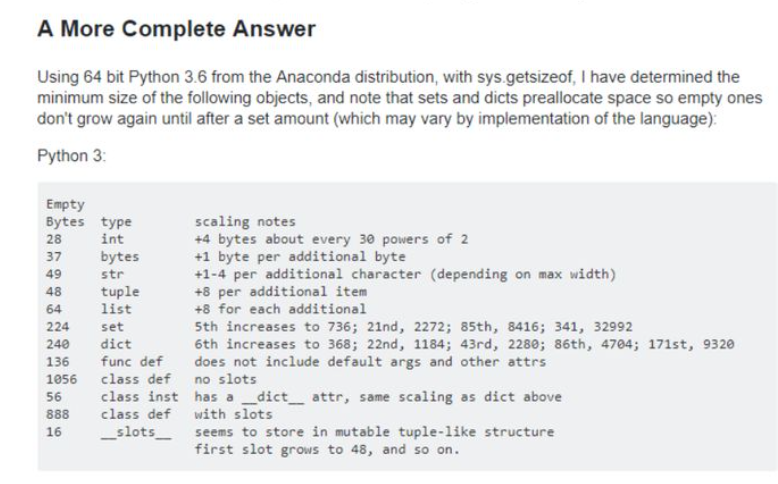

在 python2.7 中，表示整数的有 int 和 long 两个类型。int 类型和 C++的 int 类似，都是一个固定位数的数；long 则是一个理论上可以存储无限大数的数据类型。当你的数大到可能溢出时，python 就会机智的帮你转换成 long，这样就避免了溢出。而 python3 之后整数只有一个可以放任意大数的 int 了。可是无论哪种，都是采用了特殊的方法实现了不会溢出的大整数。
整数溢出的本质就是空间不够无法完整存放数据，因此对付溢出的思路就是加空间，1Byte hold 不住上 2Byte，2Byte 不行再加。python 中的大整数就是用了这个原理，把一个格外大的数拆分成若干个 byte，然后把每个 byte 存下来。然后再针对多字整型实现一套操作，放在用户面前的就是一个用起来很省心的绝对没有溢出的 good int 了。但相应的，由于每次运算要处理多个 byte，效率下降是必然的了
**Python3 的 int 装箱了一个大整数数据结构**
python 的内置整数是包装对象，其具有无限精度
C++中的 int 是基本类型
python 中 int 占几个字节？
最低消费：28 字节
int 类型 每 `2**30` 增加 4 个字节
https://stackoverflow.com/questions/449560/how-do-i-determine-the-size-of-an-object-in-python

