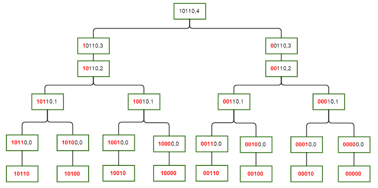

`如果要查询某个状态的所有子集的贡献，就要用 sosdp(高维前缀和)查询`

- https://blog.csdn.net/weixin_38686780/article/details/100109753
- https://issue-is-vegetable.blog.csdn.net/article/details/112488108?spm=1001.2101.3001.6661.1&utm_medium=distribute.pc_relevant_t0.none-task-blog-2%7Edefault%7ECTRLIST%7ERate-1.pc_relevant_antiscanv2&depth_1-utm_source=distribute.pc_relevant_t0.none-task-blog-2%7Edefault%7ECTRLIST%7ERate-1.pc_relevant_antiscanv2&utm_relevant_index=1
- https://blog.csdn.net/weixin_30249203/article/details/97527552?spm=1001.2101.3001.6661.1&utm_medium=distribute.pc_relevant_t0.none-task-blog-2%7Edefault%7ECTRLIST%7ERate-1.pc_relevant_paycolumn_v3&depth_1-utm_source=distribute.pc_relevant_t0.none-task-blog-2%7Edefault%7ECTRLIST%7ERate-1.pc_relevant_paycolumn_v3&utm_relevant_index=1
  
  全称是 Sum over Subsets dynamic programmingSum over Subsets dynamic programming, 意思就是子集和 dp

```py
# memory optimized, super easy to code.
# dp[state]记录所有子集的和(高维前缀和) 而不是这一个状态的和

# n = ceil(log2(1e5))
# upper = 1 << n
# preSum = [0] * upper

for i in range(upper):
    sosdp[i] = ...  # 初始化每个元素的贡献
for i in range(n):
    for state in range(upper):
        if (state >> i) & 1:
            sosdp[state] += sosdp[state ^ (1 << i)]  # 贡献求子集前缀和
            # sosdp[state ^ (1 << i)] += sosdp[state] # 贡献求超集前缀和
# print(preSum[5])

##############################################################
@lru_cache(None)
def sosdp(state: int) -> int:
    """state真子集的贡献"""
    if state == 0:
        return 1
    res = 0
    for i in range(20):
        if (state >> i) & 1:
            res += sosdp(state ^ (1 << i))
    return res
```

将时间复杂度从枚举子集的子集的`O(3^n)`优化到了 `O(n*2^n)`
可以`O(n*2^n)`算出 n 位每个 mask 值所包含子集的二进制码下标的贡献
比如 f[5]=a[0]+a[1]+a[4]+a[5]这种的，101 包含了 000,001,100,101
以 5(101)为例，状压记录的是(100, 1)这两个状态，而 sosdp 记录的是(101, 100, 1, 0)这四个状态，也可以说是他的子集。即 sosdp[mask]存的是 所有的 a[i]，其中 i&mask == i
核心思想就是从低位枚举到高位，

f[mask][i]表示 mask 码低 i 位子集的贡献
如果 mask 的第 i 位是 1，那么 f[mask][i]=f[mask][i-1]+f[mask^(1<<i)][i-1]，很巧妙地以第 i 位的 01 作为子集划分
如果 mask 的第 i 位是 0，那么 f[mask][i]=f[mask][i-1]

- 二维前缀和与高维前缀和

```C++
这是用容斥来做的
for(int i=1;i<=n;i++)
{
	for(int j=1;j<=m;j++) f[i][j]=f[i-1][j]+f[i][j-1]-f[i-1][j-1]+a[i][j];
}

但我们还可以依次对行和列进行前缀和，即：
for(int i=1;i<=n;i++) for(int j=1;j<=m;j++) f[i][j]=f[i-1][j]+a[i][j];
for(int i=1;i<=n;i++) for(int j=1;j<=m;j++) f[i][j]=f[i][j-1]+a[i][j];
看起来好像带常数，但这是可以仅通过加入若干层枚举轻松拓展到更高维的，而容斥每加一维都并不好推。
因此，不妨以这个思路，将集合的元素个数用维来代替，那就每次处理某一维的前缀和即可。
```
