# 聊聊编译原理（一） - 词法分析

https://www.nosuchfield.com/2017/07/16/Talk-about-compilation-principles-1/

> 编译器（Compiler），是一种计算机程序，它会将用某种编程语言写成的源代码（原始语言），转换成另一种编程语言（目标语言）。—— 维基百科

把实现编译器过程中所用到的策略与方法总结起来，这就是编译原理，其主要包含了编译器的构造与优化。

一般来说编译器的内部包含了如下的工作步骤：
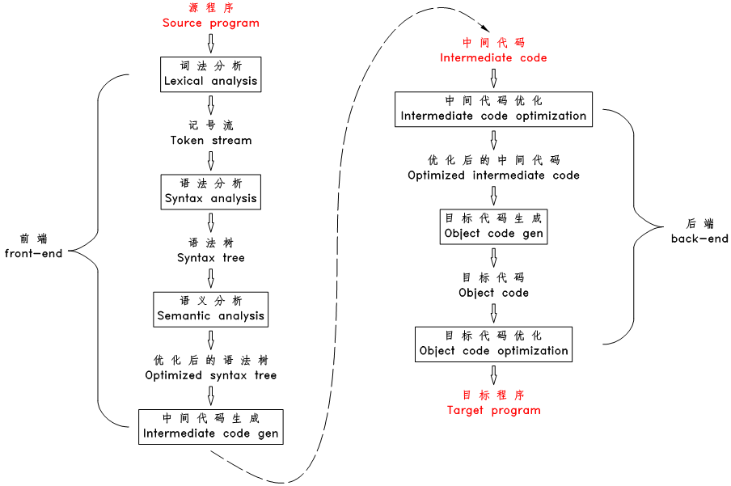

- 编译器前端：

1. 词法分析；

把输入的程序源代码字符流转化为记号（Token）流

词法分析的实现主要有两种方式：

- 使用词法分析器生成器（JavaCC、Lex、Flex 等）-> 根据给定的规则把输入构建成 Token 并输出
- 手工编码构造词法分析器(手写词法分析器)

分词扫描的方法有**直接扫描法**和**正则表达式匹配扫描法**。直接扫描法不容易扩展，只适用于语法简单的语言。目前一般的编译器都是采用基于正则表达式匹配的分词扫描法。
词法分析阶段会用到以下几个数学工具：

- **正则表达式（Regular Expression, RE）**
  正则表达式可以用来表示源程序中的 token ，如：

  ```
  整数 ： [0-9]+
  小数 ： [0-9]+\.[0-9]*
  字符串 ： \”[^\”]*\”
  标识符 ： [_a-zA-Z][_a-zA-Z0-9]*
  关键字 if ： if
  ```

  `一般来说，在实际项目里，token 的解析使用正则表达式而不是手动的创建 DFA 和 NFA`
  正则表达式的实现原理：有限状态自动机。

- 非确定性有限状态自动机（NFA）
  NFA 的特点是，在某些状态的某些输入下，不能做一个确定的转换，这里分成两种情况：

  - 同一个输入字符，可以转换到不同的状态。
  - 接受空字符 ε，也就是不读入字符就跳转到另一个状态上。
    ε 边的存在也是为了更方便地把一个正则表达式转换成 ε-NFA。

- 确定性有限状态自动机（DFA）
  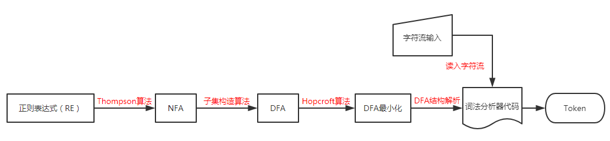
  正则表达式 ->(Thompson 构造算法)-> NFA ->(子集构造算法)-> DFA ->(Hopcroft 算法)-> DFA 最小化 -> (DFA 结构解析)-> 词法分析器代码&读入字符流(利用二维数组对 DFA 结构进行描述,左侧表示当前状态，上方表示输入，框中表示转移结果,可以 bitset 节省空间) -> Token
  https://blog.51cto.com/lilongsy/5454692
  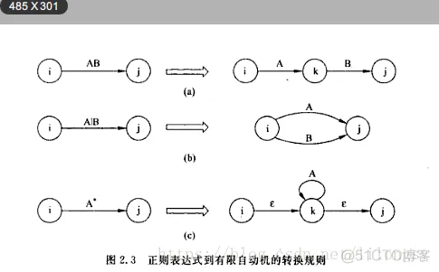
  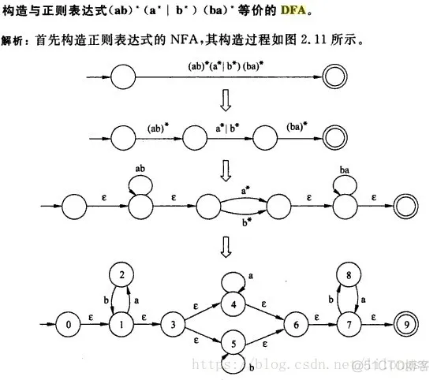
  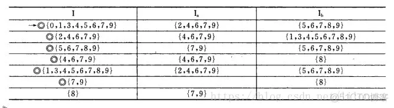
  第一列第一行 I 的意思是从 NFA 的起始节点经过任意个 ε 所能到达的结点集合。Ia 表示从该集合开始经过一个 a 所能到达的集合，经过一个 a 的意思是可以略过前后的 ε。同样 Ib 也就是经过一个 b，可以略过前后任意个 ε。
  至于第二行以及后面的 I 是怎么确定的。我参考了一些题目才明白，原来就是看上面的 Ia 和 Ib 哪个还没出现在 I 列，就拿下来进行运算，该列对应的 Ia 和 Ib 就是前面我说的那样推导。
  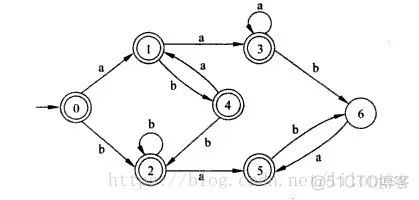
  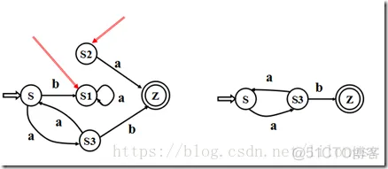

1. 语法分析；
   解析 tokens，生成 ast
2. 语义分析；
   遍历 ast，生成指令列表
   例如：
   ```
   PUSH 1
   PUSH 2
   PLUS
   PUSH 3
   PUSH 4
   MINUS
   MULTIPLY
   ```
3. 生成中间表示（intermediate representation，IR）；
   IR 的目的在于保证编译器的跨平台，对于不同的平台，它们的 IR 表示是一样的，区别只在于代码生成和优化阶段。
   **将指令列表序列化为字节码**
   首先我们对指令进行编码，每一个指令都使用一个字节进行编码，具体编码如下：
   ```
   PUSH       0x00
   PLUS       0x01
   MINUS      0x02
   MULTIPLY   0x03
   DIVIDE     0x04
   ```
   最终把源码编译成了字节码。现在只需要把字节码写入到一个文件中，整个编译就完成了。

---

- 编译器后端：

1. 代码生成；
2. 优化；

---

正则表达式可视化
https://regexper.com/#%28.%29

# 聊聊编译原理（二） - 语法分析

https://www.nosuchfield.com/2017/07/30/Talk-about-compilation-principles-2/
正则表达式毕竟太简单了，无法来表示程序语言这样复杂级别的句子集合。
为了表示程序语言的句子集合，需要采用表达能力更强大的工具 —— 上下文无关语法（context-free grammar） 。

我们在语法分析中使用一种比 RE 表达能力更强的工具 —— 上下文无关文法(CFG)，来描述语言的语法规则
在上下文无关文法中，终结符不可能出现在产生式的左边（可以在产生式左边出现终结符的文法叫做上下文有关文法）。**上下文无关文法就是说这个文法中所有的产生式左边只有一个非终结符**.
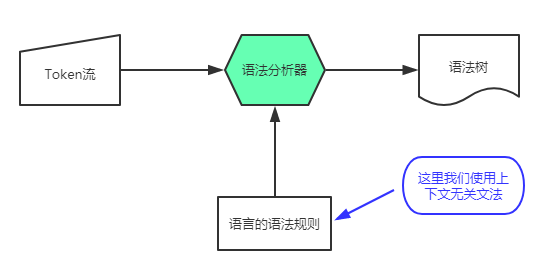
CFG 是一个四元组 G = (N, T, P, S)，其实就是一个有向图，其中：

- N 是非终结符的集合；（N 代表 Nonterminal）：可以继续扩展的符号
- T 是终结符的集合； （T 代表 Terminal）：无法再产生新的符号
- P 是一条产生式规则； （P 代表 Production）：由语句 N -> α 组成，其中 N 是一个非终结符，α 是一个符号串，α 可以是终结符也可以是非终结符
- S 是（唯一的）开始符号； （S 代表 Start）

上下文无关文法可以采用递归的形式推导，比正则表达式的表达能力要强大的多。
描述 CFG 的语法，例如巴科斯范式（Backus-Naur Form，BNF）

分析方法简介
给定文法 G 和句子 s，回答 s 是否能够从 G 推导出来，这是在**语法分析器**内部所要实现的功能
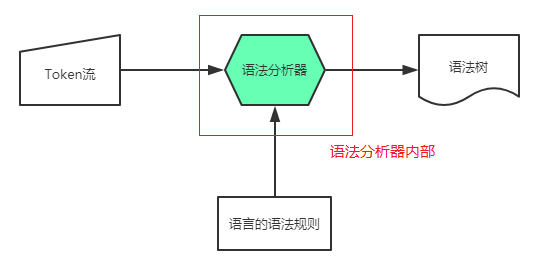
https://pandolia.net/tinyc/ch9_context_free_grammar.html

- 自顶向下分析算法
  本质是不断的使用产生式规则来发现符合这个句子的语法。
  无法继续匹配时，回退
  加了记忆化后复杂度为 O(长度\*产生式)
- `递归下降分析算法`(本质也是一种自顶向下分析算法)
  对每一个非终结符构造一个分析函数
  用前看符号指导产生式规则的选择
  简单来说，就是遇到非终结符就调用函数，遇到终结符就比较

```

S –> AB
A –> aA | ε
B –> b | bB

```

- 因为 S 的产生式是非终结符 A 和 B，所以只需要调用 A 和 B 的函数即可
- A 产生式涉及到了终结符，所以我们需要先从句子取一个 Token，然后根据 Token 的值进行逻辑判断：如果 token 是 a，则获取到非终结符 A，继续递归执行 A 的函数；如果不是 a，那么不做任何操作，还要把当前的 token 放回到句子中
- B 产生式第一个 token 是一样的，无法进行区分，我们可以用第二个 token 判断：如果已经到了句子结尾（也就是说此 token 不是 b），不做任何操作；如果还有 token，则继续执行

- `LL (1) 分析算法(也是一个自顶向下的分析算法)`
  https://pandolia.net/tinyc/ch10_top_down_parse.html
  它的定义为：从左（L）向右读入一个程序，最左（L）推导，采用一个（1）前看符号。
  第一个 L 表示从左向右扫描输入流，第二个 L 表示每一步展开的时候取中间句子中左边第一个非终结符进行展开，括号里面的 1 表示每次只读入 1 个符号，每次只利用这 1 个符号的信息来挑选产生式。还有 LL(2) 、LL(3) 、 LL(k) 等分析法，每次一次性读入多个符号，然后**利用这些符号的信息来挑选产生式。**
  LL (1) 算法和自顶向下分析算法本质上是一致的，它们的区别就在于 **LL (1) 算法使用了一种称为分析表的工具来避免了回溯操作，提高了效率。**
  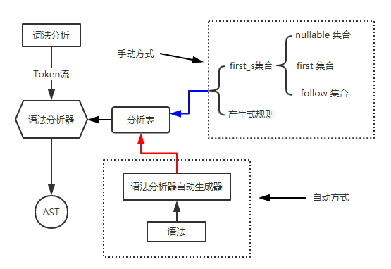
  分析表可以通过手动和自动两种方式来创建

  左递归（left recursive） 是指形如 A -> A u 这样的规则，右递归（right recursive） 则是指形如 A -> u A 这样的规则。
  需要注意的是，LL (1) 文法不能拥有左递归，否则会导致递归到死，所以如果使用 LL (1) 文法则需要 消除左递归。为避免回溯，不宜将自顶向下分析法应用于含左递归的语法 ，这是由此方法的分析顺序决定的。
  LL(1) 分析法的优点是不需要回溯，构造方法较简单，且分析速度非常快，每读到第一个符号就可以预测出整个产生式来。`缺点是对语法的限制太强`，它要求同一个非终结符的不同产生式的首字符集合互不相交，能满足此要求的语法相当少，而将一个不满足此要求的语法改写到满足要求也相当不容易。因此， LL(1) 分析法目前已经应用的比较少了，下一章将开始介绍`目前广泛使用的自底向上的 LR 分析法。`

- `自底向上分析算法`
  **LR (0) 、SLR(1)、LALR(1)、 LR (1) 算法**，无二义性
  自底向上分析的顺序和自顶向下分析的顺序刚好相反，从给定的句子开始，不断的挑选出合适的产生式，将中间句子中的子串折叠为非终结符，最终折叠到起始符号。
  根据句子的 Token，使用产生式来自右向左进行分析，即把右侧的内容 “收缩” 为左侧的非终结符，这种行为我们称为规约（reduce）。
  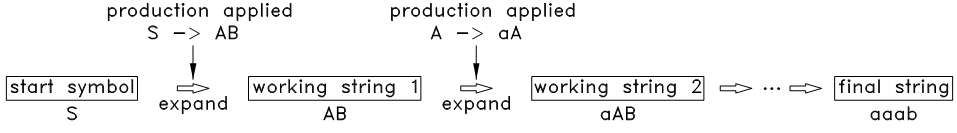
  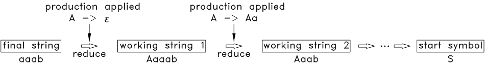

  `终极分析法 —— LR(1) 分析法。`
  `优化的 LR(1) 分析法： LALR(1)`

分析树和抽象语法树（Abstract Syntax Tree, AST）：
S => AB => aAB => aaAB => aaB => aab，这个推导过程可以用下面的（语法）分析树来表示：
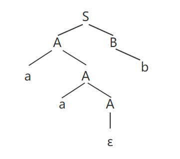
可以去掉此分析树中一些多余的节点，并进一步浓缩，得到抽象语法树（Abstract Syntax Tree, AST）：
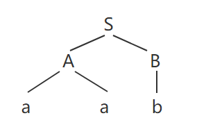
需要注意的是，CFG 是可能存在二义性的（歧义），例如下面这个例子。
E -> num | E + E | E \* E
上面这个 CFG，对于句子 1 + 2 \* 3，它可以生成以下两种 AST：
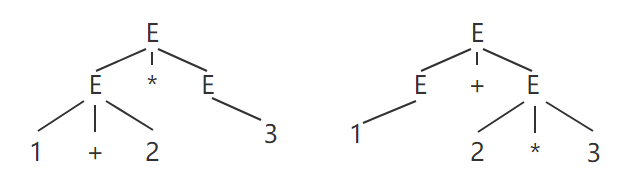
CFG 的二义性将导致同一个程序有多个不同的含义，使得程序的运行结果不唯一。
**解决二义性的方法就是对文法进行重写，例如把上面的文法改写成如下形式即可。**
E -> E + T | T
T -> T \* num | num

# 聊聊编译原理（三） - 语义分析

已经得到了一棵 AST，在语义分析中我们将遍历这棵树并且生成指令列表。我们使用递归的方式来遍历整棵树，在遍历的过程中我们把访问到的每个节点都创建为一条指令，然后把这条指令添加到指令列表中。
指令分为两类，一类是数值指令，一类是计算指令。所有的叶子节点都是数值指令，所有的内部节点都是计算指令。

符号表

# 有限状态自动机（FA）

https://www.nosuchfield.com/2016/02/05/finite-state-automaton/
可以用形式化的方式来描述这个 FA：M=(Q, Σ, δ, q0, F)

1. Q 表示的是该状态机**所有的状态(点)**，即该 FA 所有的存在的状态都包含在此集合中
2. Σ 表示的是所有的**输入状态(边 id)**的集合，即所有可能的输入都包含在之中
3. δ 描述的函数关系式，即从**某一个状态转移到另一个状态时(邻接矩阵)**所遵循的规则
4. q1 是**起始状态**，即该 FA 最开始的时候的状态
5. F 是**接受状态**，或者也称为**最终状态**，无论一个状态机经过了怎样的变换，最后的一部转移必须转移到接受状态，否则就是非法的。**符合这种转移要求的语言是可以被此台 FA 识别的，被称为正则语言。**

确定型有穷自动机（DFA）：每个状态对于字母表中的每一个符号总是恰好有一个转移箭头射出
非确定型有穷自动机（NFA）：一个状态对于字母表中的每一个符号可能有 0 个、1 个或多个箭头，NFA 中还可以存在有带有标号 ε 的箭头

- 每一台 NFA 都可以转换成一台等价的 DFA，而构造 NFA 有时比直接构造 DFA 容易
- 如果两台机器识别同样的语言，则称他们是等价的；每一台非确定型有穷自动机都等价于某一台确定型有穷自动机

---

dfa 最小化的一种实现
https://shanlunjiajian.github.io/2023/05/21/dfa-tech/
