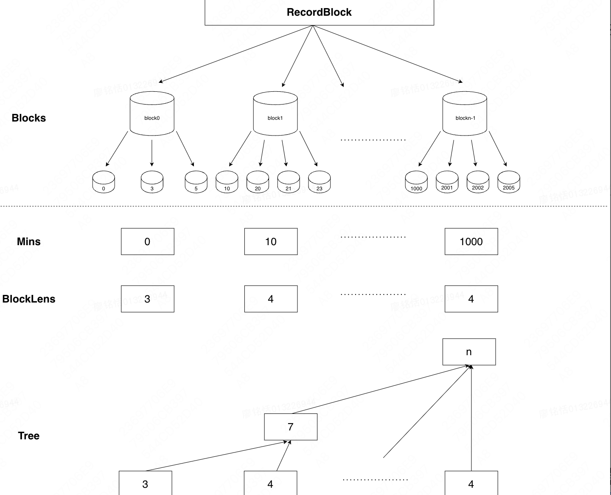

https://leetcode.cn/circle/discuss/LLJ0oX/view/Vvwa9T/


# SortedList 源码简析 (python)

总结：SortedList = 分块 + 树状数组 + 定期重构

[toc]

---

原文地址：https://github.com/981377660LMT/ts/issues/267
添加注释后的源码：
https://github.com/981377660LMT/python-sortedcontainers

随手写的一些笔记，~存在大量翻译腔~，希望对理解 SortedList 源码有所帮助

## 前言：S 代表着什么？新一代有序容器 SortedList

与基于树的实现相比，使用列表具有一些基于内存使用情况的优势。

- 大多数插入/删除不需要分配或释放内存。
- 指向元素的指针密集排列。这有利于硬件的内存架构，并更有效地利用缓存。

## 代码整体关系

SortedList 根据传不传 key 分为 SortedList、SortedKeyList，不传 key 时降低了函数调用的开销。这里 [`__new__`](https://github.com/grantjenks/python-sortedcontainers/blob/92ef500158f87f7684023823d689cfd7bef892a1/src/sortedcontainers/sortedlist.py#L174) 为工厂函数。
SortedDict 和 SortedSet 基于 SortedList 封装实现。

## 出发点：短列表的快速插入删除

传统的基于树的设计具有更好的理论复杂度，但这忽略了当今软件和硬件的现实。
python 的 list 很快，有利于 memory management 和 random access.
bisect.insort 很快.(其实 js 的 Array.prototype.splice 也很快).
在不太长(1000 到 2000)的 list 上做插入删除操作，常数极小.
在硬件和软件方面，现代处理器已经花费了大量时间来优化类似 mem-cpy/mem-move 的操作。
`因此，在这里把插入删除当作了 O(1)`
但是长度达到阈值，例如超过 1e4 时，bisect.insort 插入会很慢。
因此需要分块。
插入或删除最常在短的 list 中执行。很少需要添加或删除新列表。

## 实现细节 1:分块+线段树

1. 两种查询：

   - getRankByValue -> 查询块内最大值 -> `_maxes`
   - getValueByRank -> 查询位置 -> `_index+_offset`.维护这个更难一些.
     也可以不要求 O(logn)，而是将块的 size 设置大一点，查找 pos 时直接遍历.(现在 js 第一版的 SortedList 就是这样的;但是不用维护线段树，占用空间少一些.)

2. 三个关键：`_maxes`, `_lists`, `_index`+`_offset`

   - `_lists` 是每个块内部的元素(有序)
   - `_maxes` 是每个块的最大值(用于二分定位).其实是冗余信息，可以通过 `_lists[i][-1]` 得到.这样做的好处是避免二级访问，降低 access 的开销.

   - `_index` 一颗线段树，叶子结点维护每个块的长度.
     这个信息对于插入和删除操作非常有用，因为它提供了一种快速定位某个位置在整个有序列表中的准确位置，加速定位操作。
     作者把块的索引统一命名为`pos`，把块内的索引统一命名为`idx`。
     `_loc(pos,idx)->int`: 树上二分，根据(块的索引，块内的索引)返回元素在整个列表中的索引
     `_pos(idx)->Tuple[int,int]`: 树上二分，返回 idx 对应的(块的索引，块内的索引)
     https://github.com/grantjenks/python-sortedcontainers/blob/92ef500158f87f7684023823d689cfd7bef892a1/src/sortedcontainers/sortedlist.py#L520C19-L520C19
     `_offset` 是第叶子节点的起始索引

3. Q&A:

- Q:为什么不用前缀和+二分来定位
  A:因为是动态的，更新前缀和需要整个更新 O(n)，而更新线段树只需要 O(logn)
- Q:为什么不用树状数组+二分来定位
  ~~A:类似的原因，更新复杂度太大，难以做到 O(logn) 维护~~
  A:理论上可行，可能作者觉得线段树上二分比树状数组上二分更简单一些

## 实现细节 2：动态扩容与收缩策略

`_expand`函数与`_delete`函数
https://github.com/grantjenks/python-sortedcontainers/blob/92ef500158f87f7684023823d689cfd7bef892a1/src/sortedcontainers/sortedlist.py#L289
https://github.com/grantjenks/python-sortedcontainers/blob/92ef500158f87f7684023823d689cfd7bef892a1/src/sortedcontainers/sortedlist.py#L465
增加和删除元素时还需要根据负载调整`_lists` 的子列表
如果子列表的长度超过负载`(DEFAULT_LOAD_FACTOR)`的两倍，则将其一分为二
如果减少到负载的一半，则与邻居合并
系数为 1000 时，可以支持到 1e7 到 1e8 级别的数据.
作者建议设置立方根级别.

> See :doc:`implementation` and :doc:`performance-scale` for more information.

Q：线段树是怎么处理插入删除的？块分裂时需要在序列中插入一个新的块，合并时则需要删除块，这两个操作用线段树似乎不好处理。
A：是一个(懒的)$O(sqrt)$的暴力重构

## 源码中的技巧

- 缓存类变量/类方法来减少属性查找的开销(大量使用)

```python
_lists = self._lists
_maxes = self._maxes
_add = self.add
```

- update 批量添加元素的处理

如果添加的元素太多`if len(values) * 4 >= self._len:`,
全部重构一遍，否则直接添加到`_lists`中.
这里的 4 可能是指线段树最坏时需要的 4 倍空间.

```python
values = sorted(iterable)

if _maxes:
    if len(values) * 4 >= self._len:
        _lists.append(values)
        values = reduce(iadd, _lists, [])
        values.sort()
        self._clear()
    else:
        _add = self.add
        for val in values:
            _add(val)
        return
```

- 重写 list 的几个 方法，抛出错误

```python
    def append(self, value):
    """Raise not-implemented error.

    Implemented to override `MutableSequence.append` which provides an
    erroneous default implementation.

    :raises NotImplementedError: use ``sl.add(value)`` instead

    """
    raise NotImplementedError("use ``sl.add(value)`` instead")
```

- `__getitem__`和`pop` 方法对删除开头和删除结尾做了特殊判断的优化,这两种场合是 O(1)的

- 对边界和负索引的处理

  ```python
  def index(self, value, start=None, stop=None):
     ...

     if start is None:
         start = 0
     if start < 0:
         start += _len
     if start < 0:
         start = 0

     if stop is None:
         stop = _len
     if stop < 0:
         stop += _len
     if stop > _len:
         stop = _len

     if stop <= start:
         raise ValueError("{0!r} is not in list".format(value))
  ```

- View 利用 proxy 实现了延迟求值.

```python

class SortedItemsView(ItemsView, Sequence):
   """Sorted items view is a dynamic view of the sorted dict's items.
   When the sorted dict's items change, the view reflects those changes.
   The items view implements the set and sequence abstract base classes.
   """
   __slots__ = ()

   @classmethod
   def _from_iterable(cls, it):
       return SortedSet(it)


   def __getitem__(self, index):
       _mapping = self._mapping
       _mapping_list = _mapping._list

       if isinstance(index, slice):
           keys = _mapping_list[index]
           return [(key, _mapping[key]) for key in keys]

       key = _mapping_list[index]
       return key, _mapping[key]


   __delitem__ = _view_delitem
```

## 结尾

看到这里，不由感叹 SortedList 的作者 [Grant Jenks](https://github.com/grantjenks) 大叔功力之深厚，创作出了这么优秀的模板。
最后，我想以日本著名游戏制作人加藤·惠（1998 ~) 的一句名言结束本文：
{:style="width:200px":align=center}

## 参考

https://www.zhihu.com/question/593450942/answer/2966795898
https://grantjenks.com/docs/sortedcontainers/implementation.html

---

F&Q

1. 以前写过一个 js 版本的 SortedList，但是只用了分块，没有维护块的长度之和，查询某个位置的元素用的是直接遍历块的方法，不过已经足够快了，比平衡树快上很多。之后打算再写一个真 O(log n)的 js 版本（如果实际场景需要用到的话），到时候可能会写一个更加详细的源码解析 :）
2. C++ multiset 因为是平衡树，删除添加查找操作显然都是 logn 的，SortedList 的增删查也都是 logn 的吗，如何证明呢？
   一个大的前提是，短列表中插入删除元素常数很小，而 Sortedlist 根据负载因子自适应调整块的大小，每个块的长度被控制在了一定范围内。增删改查的瓶颈就变成了如何查找元素。根据元素大小查询排名（bisect_left 等），只需要二分每个块的最大值，找到块后在块上二分。根据排名查询元素（pop 等），需要通过\_offset 定位线段树的叶子节点，然后在\_indexes 线段树上二分找到排名对应第几个块，进而定位到块内的具体元素。这两种二分都是 O(logn)的，所以整体复杂度是 O(logn)
3. 这里线段树是怎么处理插入删除的？块分裂时需要在序列中插入一个新的块，合并时则需要删除块，这两个操作用线段树似乎不好处理。
   **是一个(懒的)暴力重构**

   插入: [\_expand 函数](https://github.com/grantjenks/python-sortedcontainers/blob/92ef500158f87f7684023823d689cfd7bef892a1/src/sortedcontainers/sortedlist.py#L289)

   ```python
   def _expand(self, pos):
       _load = self._load
       _lists = self._lists
       _index = self._index
       if len(_lists[pos]) > (_load << 1):  # 如果子列表长度大于两倍的负载因子：分割子列表
           _maxes = self._maxes

           _lists_pos = _lists[pos]
           half = _lists_pos[_load:]
           del _lists_pos[_load:]
           _maxes[pos] = _lists_pos[-1]

           _lists.insert(pos + 1, half)
           _maxes.insert(pos + 1, half[-1])

            # (懒)重构线段树，调用`_build_index`时构建.
            # 只有__delitem__/__getitem__/pop三个方法需要索引来进行查找，触发树的重构
           del _index[:]
       else:
           # 更新索引中对应节点的计数值，表示增加了一个元素
           # seg.update(pos,1)
           if _index:
               child = self._offset + pos
               while child:
                   _index[child] += 1
                   child = (child - 1) >> 1
               _index[0] += 1
   ```

   删除: [\_delete 函数](https://github.com/grantjenks/python-sortedcontainers/blob/92ef500158f87f7684023823d689cfd7bef892a1/src/sortedcontainers/sortedlist.py#L465)

   ```python

   def _delete(self, pos, idx):
       """收缩重构."""
        _lists = self._lists
        _maxes = self._maxes
        _index = self._index

        _lists_pos = _lists[pos]

        del _lists_pos[idx]
        self._len -= 1

        len_lists_pos = len(_lists_pos)

        if len_lists_pos > (self._load >> 1):  # 如果子列表长度大于负载因子的一半，只需要更新
            _maxes[pos] = _lists_pos[-1]
            # !seg.update(pos,-1)
            if _index:
                child = self._offset + pos
                while child > 0:
                    _index[child] -= 1
                    child = (child - 1) >> 1
                _index[0] -= 1
        elif len(_lists) > 1:  # 如果子列表长度小于负载因子的一半，且不是唯一的子列表，需要与prev合并
            if not pos:
                pos += 1

            prev = pos - 1
            _lists[prev].extend(_lists[pos])
            _maxes[prev] = _lists[prev][-1]

            del _lists[pos]
            del _maxes[pos]
            del _index[:]  # 重新构建索引

            self._expand(prev)
        elif len_lists_pos:
            _maxes[pos] = _lists_pos[-1]
        else:
            del _lists[pos]
            del _maxes[pos]
            del _index[:]

   ```

   单次重构的复杂度为 $O(sqrt(n))$

   ```python
   def _build_index(self):
         """建树.

         Indexes are represented as binary trees in a dense array notation
         similar to a binary heap.

         For example, given a lists representation storing integers::

             0: [1, 2, 3]
             1: [4, 5]
             2: [6, 7, 8, 9]
             3: [10, 11, 12, 13, 14]

         The first transformation maps the sub-lists by their length. The
         first row of the index is the length of the sub-lists::

             0: [3, 2, 4, 5]

         Each row after that is the sum of consecutive pairs of the previous
         row::

             1: [5, 9]
             2: [14]

         Finally, the index is built by concatenating these lists together::

             _index = [14, 5, 9, 3, 2, 4, 5]

         An offset storing the start of the first row is also stored::

             _offset = 3

         When built, the index can be used for efficient indexing into the list.
         See the comment and notes on ``SortedList._pos`` for details.

         """
         row0 = list(map(len, self._lists))

         if len(row0) == 1:
             self._index[:] = row0
             self._offset = 0
             return

         head = iter(row0)
         tail = iter(head)
         row1 = list(starmap(add, zip(head, tail)))

         if len(row0) & 1:
             row1.append(row0[-1])

         if len(row1) == 1:
             self._index[:] = row1 + row0
             self._offset = 1
             return

         size = 2 ** (int(log(len(row1) - 1, 2)) + 1)
         row1.extend(repeat(0, size - len(row1)))
         tree = [row0, row1]

         while len(tree[-1]) > 1:
             head = iter(tree[-1])
             tail = iter(head)
             row = list(starmap(add, zip(head, tail)))
             tree.append(row)

         reduce(iadd, reversed(tree), self._index)
         self._offset = size * 2 - 1

   ```
