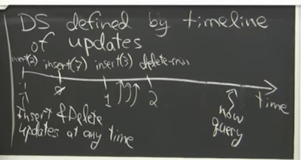
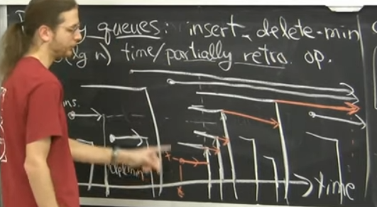

# Retroactive_Data_Structures(可追溯化数据结构)

Time Travel

https://wavwing.site/2019/01/26/2019.1.25%20trainingWeek/Retroactive_Data_Structures.pdf

https://noshi91.github.io/Library/data_structure/partially_retroactive_queue.cpp

---

https://www.youtube.com/watch?v=WqCWghETNDc

回到过去,对现在的`干预`(side effects)

> retroactive data structures allow operations to be inserted or deleted at any point in the past.

大写表示追溯操作,小写表示正常操作
Insert(time, update)
Delete(time)
Query(time，query)

三种可追溯化等级

1. partial retroactive
2. full retroactive

   - 线段树解决历史区间最值问题 将修改放到 logn 个结点中???
   - 优先队列的 insert 和 deleteMin 操作
     
     寻找桥???
   - queue/deque/unionfind/pq

3. nonoblivious retroactive
   一旦出现错误，就会从错误的地方开始追溯
   - pq : 维护最早出现错误的时间???
     `Delete that deletion`
