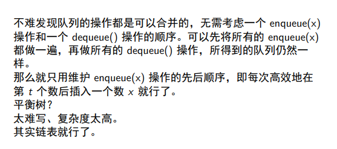
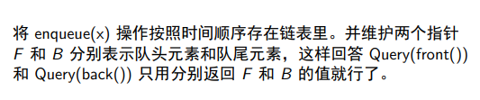
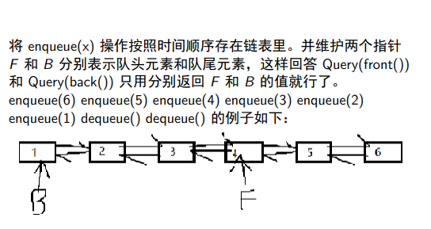
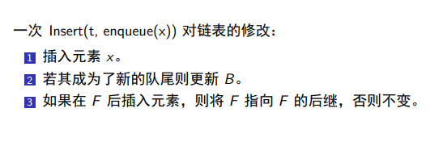
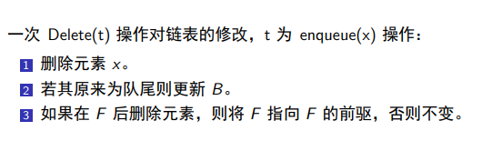
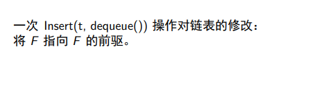

# Retroactive_Data_Structures(可追溯化数据结构)

Time Travel
与只允许在当前执行操作的普通数据结构不同，追溯数据结构允许在过去的任何时间点插入或删除操作。

https://github.com/csvoss/retroactive
https://wavwing.site/2019/01/26/2019.1.25%20trainingWeek/Retroactive_Data_Structures.pdf
https://noshi91.github.io/Library/data_structure/partially_retroactive_queue.cpp
https://erikdemaine.org/papers/Retroactive_TALG/paper.pdf
https://python-retroactive-data-structures.readthedocs.io/en/latest/specifics/

---

https://www.youtube.com/watch?v=WqCWghETNDc
回到过去,对现在的`干预`(side effects)

> retroactive data structures allow operations to be inserted or deleted at any point in the past.

大写表示追溯操作,小写表示正常操作
Insert(time, update)
Delete(time)
Query(time，query)

三种可追溯化等级

1. partial retroactive
   partial retroactive : 可以更新过去所有版本，但是只能查询最新版本的变化
2. full retroactive
   fully retroactive : 可以更新过去所有版本，也可以查询过去所有版本的变化

   - 线段树解决历史区间最值问题 将修改放到 logn 个结点中???
   - 优先队列的 insert 和 deleteMin 操作
     
     寻找桥???
   - queue/deque/unionfind/pq

3. nonoblivious retroactive
   一旦出现错误，就会从错误的地方开始追溯
   - pq : 维护最早出现错误的时间???
     `Delete that deletion`

---

RDS 和持久化的区别

持久化是将数据结构的历史版本保存下来，以便在未来的某个时间点进行查询或者修改。它的主要目的是支持时间旅行，也就是回溯到某个历史状态来查看数据。持久化的实现方式可以是通过快照（snapshot）或者日志（log）来记录历史版本。

而 RDS 则是实时地支持在任意时间点修改数据结构，并且能够快速地回答对于历史版本的查询。它的主要目的是支持动态修改数据结构。RDS 的实现方式通常涉及到增量维护（incremental maintenance）和版本化（versioning）等技术。

因此，持久化和 RDS 虽然都涉及到数据结构的历史版本，但是它们的实现方法和目的略有不同，需要根据不同的需求进行选择。

- 队列
  当我们将一个队列进行持久化时，我们会在每次修改队列时创建一个新的版本，旧版本的队列也会被保留。这样一来，我们可以在任意时刻回到任意历史版本的队列。
  而在 Retroactive Data Structures 中，我们会将队列的修改操作转换为一系列时间戳和事件，并在这些事件上进行操作，从而允许我们“重放”历史事件，而无需保存所有历史版本的队列。因此，RDS 可以使用更少的存储空间来支持类似于持久化的功能。
- 并查集
  在持久化并查集中，每次合并两个集合时，我们将两个根节点连接起来，然后对新的根节点进行复制，得到一个新的版本，并将原始版本中所有与被修改的部分相关的节点都进行复制，得到新的版本，最终更新所有相关的节点，使它们指向新的版本。
  而在 RDS 并查集中，我们将每次操作转化为一系列差分操作，其中每个差分操作都是对应一个版本的修改，这些版本构成了一棵时间线。当我们需要查询某个时间点的数据时，只需要在这个时间点对应的版本上执行查询操作即可。而当我们需要更新某个时间点之后的数据时，只需要对这个时间点之后的所有版本进行更新操作。
  因此，持久化并查集在更新操作时需要复制大量的节点，并生成大量的新版本，而 RDS 并查集只需要进行少量的差分操作，并生成少量的新版本。这使得 RDS 并查集在更新操作时更加高效，并且可以在常数时间内执行查询操作。

---

部分可追溯化队列

部分可追溯化优先队列
引入桥的概念
完全可追溯化优先队列
`有一个通用的方法`可以将 full 的复杂度做到 partial 的复杂度乘上 O(√m) 。

`General transformation from partial to full retroactivity`
https://python-retroactive-data-structures.readthedocs.io/en/latest/general/
可以参考 SqrtArray 的实现, 记录操作+分块复制版本
