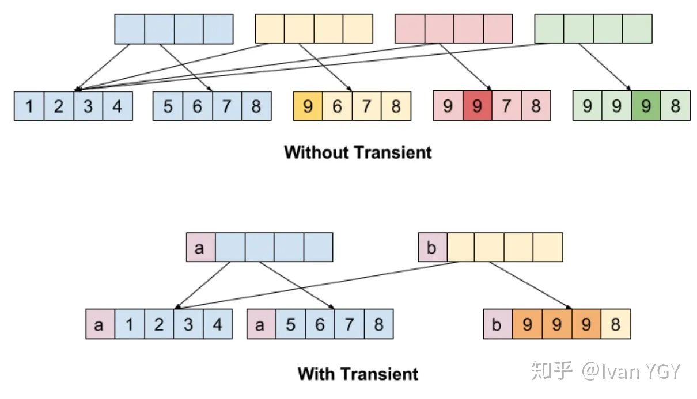
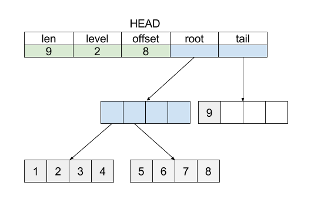

Vector trie 是一种理想的用于实现持久化的数据结构

- List 由 Persistent Vector Trie 实现
- Map 由 hash + Persistent Vector Trie 实现

https://hypirion.com/musings/understanding-persistent-vector-pt-1
https://zhuanlan.zhihu.com/p/44571842
https://io-meter.com/2016/09/15/functional-go-implement-vector-trie/
https://codeantenna.com/a/TnD52j14or

1. Transients
   https://io-meter.com/2016/10/01/Functional-Go-Transient-and-Persistent/
   通过允许持久数据结构在必须高效的代码中“可变”来消除内存分配开销 (immutable.js 的 withMutations/asMutable)
   什么时候可以修改？只有这个节点的 owner 是当前数据结构时，才可以修改 (immutable.js 的 `__ownerID`)
   我们可以将其分为两个步骤(有且仅有)：

   - Check whether a node was created by the vector we’re mutating.
     检查节点是否由我们正在变异的向量创建。(isEditable)
   - Ensure that no other vector has already been created out of this one.
     确保没有其他向量已从此向量中创建。(new OwnerId() 的唯一性，就是用 JS 的对象地址去作为 ID)

   

2. tail 优化
   参考链表的尾指针的思想，我们容易想到可以直接保留一个指向 Trie 树最末尾元素节点的引用，这样每次对尾部进行操作就不需要进行耗时的 Trie 树查询操作了。
   Tail 优化技巧的应用思路如下：

   PushBack 和 RemoveBack 操作直接作用于 tail 指针所指向的 trieNode
   PushBack 之前如果当前的 tail 已满，则将 tail 放回到 Trie 树上再创建一个新的
   RemoveBack 之后，如果当前 tail 已空，则释放当前 tail，并将 Trie 树的最后一个 trieNode 取出作为新的 tail
   我们总是保持 tail 段非空，也就是说 tail 要么是 nil，代表整个 List 当中没有储存任何元素， 要么至少包含一个元素。这样的设计可以简化 RemoveBack 的实现，也可以提高未来可能会提供的 GetLast 等方法的操作性能。
   

---

那么 Vector trie 的时间和空间效率如何？根据 Persistent Vector Performance 这篇博客的介绍， 对于 Get，Set 等操作，Vector trie 确实跟一般宣传的相似，相比简单的 Array 只有一个接近常数级别的放大。 而如果利用 Transient 优化，在 PushBack 等操作上甚至有超越 Array 的趋势。
更进一步，经过 Benchmark 所选择的 32 这个分支系数，也让 Vector trie 可以在常见 CPU 结构的 Cache 系统中表现出优异的顺序访问性能。另一方面，在空间使用上 Vector trie 平均有一个接近甚至超过 90% 的空间效率，令人十分印象深刻。由此可见 Vector trie 是一种理想的用于实现持久化的数据结构。

实际上，包括 Clojure、Scala 在内的多种编程语言都选择了这种数据结构作为持久化数组的实现。
同样， Vector trie 的索引结构也很接近一些文件系统对文件的索引结构，因此也就可以方便的被应用于实现文件系统的 Snapshot 和 Copy on Write 功能。

Vector trie 和普通的 Array 一样，在 Insert、Splice 等操作上时间效率很低，这是它主要的问题之一。

---

Vector Trie 主要采用了以下几种设计：

将 ArrayList 连续的地址空间切分成一段一段定长的数组
使用 Trie 树结构将这些分段组织起来
读取和写入的时候，利用 Trie 树检索的方法查找目标元素所在的位置
