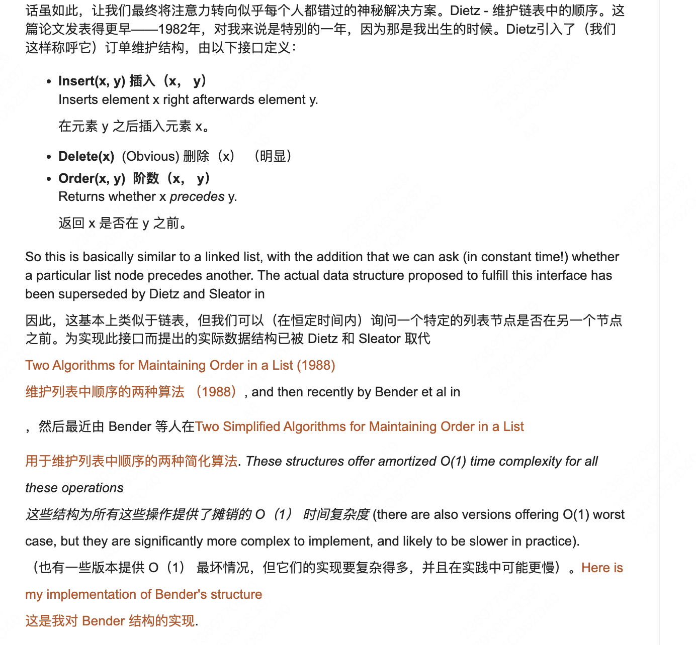

1. https://link.springer.com/chapter/10.1007/3-540-51542-9_5
   Theta(log n/log log n) per operation 的
   paper 叫 dynamic list indexing 啥啥啥的

---

https://cs.stackexchange.com/questions/14708/maintaining-an-efficient-ordering-where-you-can-insert-elements-in-between-any
https://stackoverflow.com/questions/32839578/order-maintenance-data-structure-in-c

---

https://courses.csail.mit.edu/6.851/spring12/lectures/L08.html

关键词：ordered-file maintenance, list labeling，Order-maintenance problem
