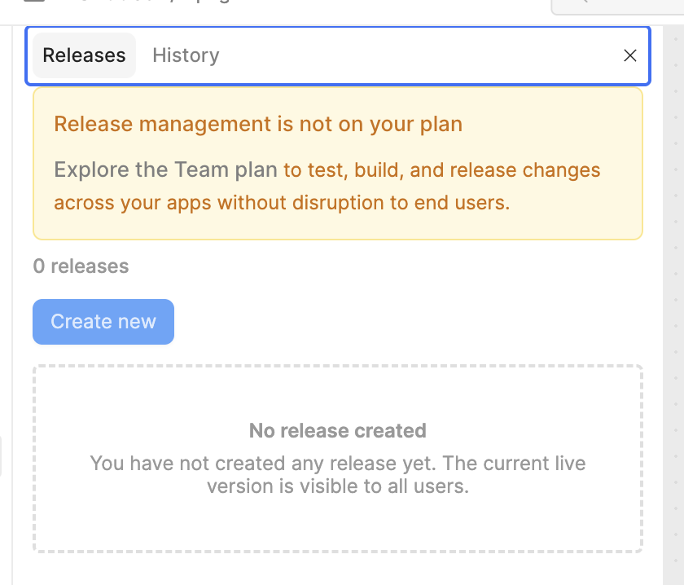

# Retool 左下角的 producation(环境)、main(分支)、latest(发布与历史记录)

## 环境：Create unlimited custom environments

https://docs.retool.com/org-users/guides/configuration/environments

## Git 多分支：Secure collaboration with Source Control

https://docs.retool.com/source-control/

## 发布、版本、历史：Releases

**这里的版本指的是线性的分支**

Version release & history

## Retool 左下角的 producation、main、latest

这是一个极好的切入点。很多初期接触 Retool 的人（甚至是经验丰富的开发者）都会在这里感到困惑，因为 "Releases"（发布）、"History"（历史）和 "Branching"（多分支）看起来都在做同一件事：**保存代码的状态**。

如果把这三者混为一谈，你的团队协作一定会陷入混乱。要梳理清楚它们的关系，我们需要从**“受众”**和**“生命周期”**两个维度来剖析。

我们把 Retool 的版本管理能力想象成一本书的出版过程，这三个功能分别对应了三个不可或缺的环节：

---

### 第一象限：Releases & History (单线叙事/草稿纸)

**关键词：线性、简单、无 Git**

这两个功能是 Retool 自带的“原生版本控制”，**即使你不开启 Git 同步（Source Control），它们也是默认存在的。** 它们俩的关系非常紧密，通常是一体的。

#### 1. History (历史记录) = 自动存档/打草稿

- **什么是它**：Retool 每隔几分钟，或者每次你点“部署”前，都会自动保存一个快照。
- **给谁用**：**只有正在编辑的开发者自己**。
- **场景**：你刚刚手滑把写好的 SQL 查询删了，赶紧点开 History 回退到 5 分钟前。
- **本质**：它是**极为细碎的、线性的时间切片**。它不管逻辑通不通，只管像录像机一样记录。

#### 2. Releases (发布) = 定版印刷

- **什么是它**：你从 History 的那堆碎快照里，挑出一个来，手动给它贴个标签 `v1.0.0`，并点击“Publish”。
- **给谁用**：**所有的最终用户**。
- **场景**：你的 History 里可能有 100 次修改，中间有 50 次是报错的。用户是这 100 次过程都不可见，他们只能看到你最后定版的那一次 `v1.0.0`。
- **本质**：它是**经过人工确认的、具备商业价值的交付物**。

---

### 第二象限：多分支/Source Control (平行宇宙)

**关键词：分叉、协作、Git 驱动**

这是企业版才有的高级功能。**它引入了“多分支”概念，彻底改变了游戏的规则。**

- **什么是它**：它允许你离开主线（main），去创建一个独立的平行空间（feature-branch）进行开发。
- **给谁用**：**工程团队（多人协作）**。
- **场景**：你要做一个耗时两周的大功能，而同事每天都在发版修小 Bug。如果你没有分支，你的“半成品”代码会和同事的修补代码混在一起，导致你们谁都不敢发布（Release）。有了分支，你可以安静地在自己的分支里折腾两周，完全不影响主线。
- **本质**：它是**代码层面的物理隔离**。

---

### 第三象限：环境 (Environments)

**关键词：数据隔离**

这个功能与上述两者完全不在一个维度。

- **什么是它**：它不存代码，它管理的是**所有 API 和数据库的连接字符串**。
- **给谁用**：**运维/安全/测试**。
- **场景**：你在开发分支里写了一个 `DELETE FROM Users`。如果你连的是生产环境数据库，即便你在分支里，数据也没了！Environmental 确保你在 `Staging` 环境下执行这句话时，删的是测试库里的假数据。
- **本质**：它是**运行时的数据隔离**。

---

### 核心混淆点澄清：Releases, History 与 多分支 为什么不是一个东西？

你可能会问：_“我在分支里做完工作，合并回主干，不就是一次 Release 吗？”_

**不完全是。** 它们的关系如下：

1.  **Branching (分支)** 是**“厨房”**。

    - 厨师 A 在做川菜（分支 A），厨师 B 在做粤菜（分支 B）。厨房里乱七八糟，盘子还没摆好。这里发生的是**“并行开发”**。

2.  **History (历史)** 是**“监控录像”**。

    - 记录了刚才厨师切到了手，或者撒错了盐。如果做坏了，可以倒回去重做。

3.  **Releases (发布)** 是**“上菜”**。
    - 只有当川菜做好了（代码写完了），并且经过主厨品尝确认没问题（Code Review & Merge），这道菜才会被端出去（Publish Release）。食客（用户）**只能吃到端出来的菜，进不了厨房**。

#### 关键区别图谱

| 特性                 | History / Releases                         | Source Control (Branching)                           |
| :------------------- | :----------------------------------------- | :--------------------------------------------------- |
| **拓扑结构**         | **线性 (Line)** 只能一条道走到黑        | **树状 (Tree)** 可以分叉、并行、再合并            |
| **主要解决什么痛点** | **防丢失、即时交付** “我不小心删了东西” | **防冲突、多人协作** “别动我的代码，我在改大功能” |
| **底层存储**         | Retool 数据库 (JSON)                       | 你的 Git 仓库 (YAML)                                 |
| **必须性**           | 所有人都会默认使用                         | 只有复杂团队才需要                                   |

### 终极工作流：把它们串起来

一个标准的企业级 Retool 工作流应该是这样的：

1.  **(Branching)**: 开发者 A 创建分支 `feature/new-dashboard`。
2.  **(Environment)**: 切换环境到 `Staging`，确保乱改数据没事。
3.  **(History)**: 在开发过程中，利用 History 频繁地做小回滚（比如刚调的样式丑了，撤销一下）。
4.  **(Branching)**: 开发完成，发起 Pull Request，合并回 `main` 分支。
5.  **(Releases)**: 在 `main` 分支上，将这一周所有的合并内容打包，标记为 `v2.0` 并发布。只有此时，也就是动作做完的**最后一刻**，业务人员才真正看到了新功能。

**一句话总结：**
**分支是多人并行的工作间，环境是防止炸库的保险丝，Release 是最终端给客户的那盘菜。**
