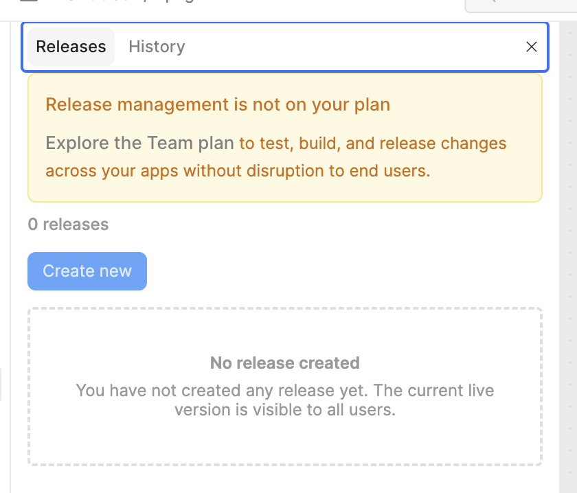
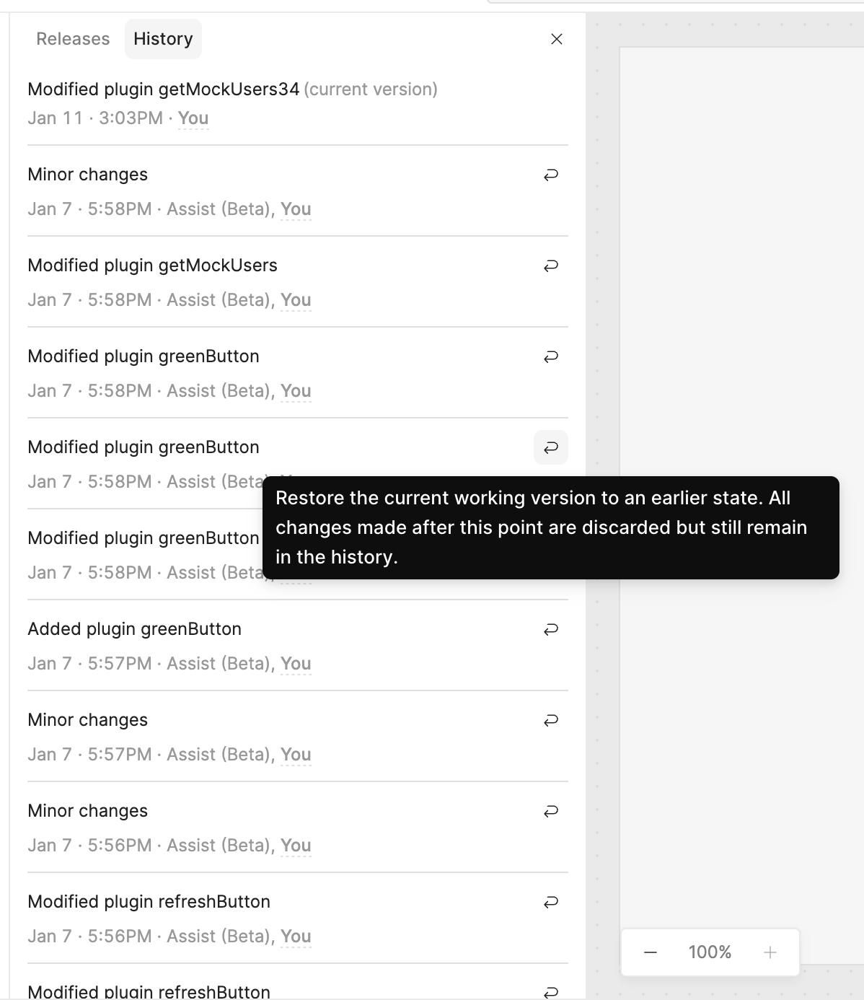

# Retool 左下角的 producation(环境)、main(分支)、latest(发布与历史记录)

## 环境：Create unlimited custom environments

https://docs.retool.com/org-users/guides/configuration/environments

## Git 多分支：Secure collaboration with Source Control

https://docs.retool.com/source-control/

## 发布、版本、历史：Releases

**这里的版本指的是线性的分支**

Version release & history




## Retool 左下角的 producation、main、latest

这是一个极好的切入点。很多初期接触 Retool 的人（甚至是经验丰富的开发者）都会在这里感到困惑，因为 "Releases"（发布）、"History"（历史）和 "Branching"（多分支）看起来都在做同一件事：**保存代码的状态**。

如果把这三者混为一谈，你的团队协作一定会陷入混乱。要梳理清楚它们的关系，我们需要从**“受众”**和**“生命周期”**两个维度来剖析。

我们把 Retool 的版本管理能力想象成一本书的出版过程，这三个功能分别对应了三个不可或缺的环节：

---

### 第一象限：Releases & History (单线叙事/草稿纸)

**关键词：线性、简单、无 Git**

这两个功能是 Retool 自带的“原生版本控制”，**即使你不开启 Git 同步（Source Control），它们也是默认存在的。** 它们俩的关系非常紧密，通常是一体的。

#### 1. History (历史记录) = 自动存档/打草稿

- **什么是它**：Retool 每隔几分钟，或者每次你点“部署”前，都会自动保存一个快照。
- **给谁用**：**只有正在编辑的开发者自己**。
- **场景**：你刚刚手滑把写好的 SQL 查询删了，赶紧点开 History 回退到 5 分钟前。
- **本质**：它是**极为细碎的、线性的时间切片**。它不管逻辑通不通，只管像录像机一样记录。

#### 2. Releases (发布) = 定版印刷

- **什么是它**：你从 History 的那堆碎快照里，挑出一个来，手动给它贴个标签 `v1.0.0`，并点击“Publish”。
- **给谁用**：**所有的最终用户**。
- **场景**：你的 History 里可能有 100 次修改，中间有 50 次是报错的。用户是这 100 次过程都不可见，他们只能看到你最后定版的那一次 `v1.0.0`。
- **本质**：它是**经过人工确认的、具备商业价值的交付物**。

---

### 第二象限：多分支/Source Control (平行宇宙)

**关键词：分叉、协作、Git 驱动**

这是企业版才有的高级功能。**它引入了“多分支”概念，彻底改变了游戏的规则。**

- **什么是它**：它允许你离开主线（main），去创建一个独立的平行空间（feature-branch）进行开发。
- **给谁用**：**工程团队（多人协作）**。
- **场景**：你要做一个耗时两周的大功能，而同事每天都在发版修小 Bug。如果你没有分支，你的“半成品”代码会和同事的修补代码混在一起，导致你们谁都不敢发布（Release）。有了分支，你可以安静地在自己的分支里折腾两周，完全不影响主线。
- **本质**：它是**代码层面的物理隔离**。

---

### 第三象限：环境 (Environments)

**关键词：数据隔离**

这个功能与上述两者完全不在一个维度。

- **什么是它**：它不存代码，它管理的是**所有 API 和数据库的连接字符串**。
- **给谁用**：**运维/安全/测试**。
- **场景**：你在开发分支里写了一个 `DELETE FROM Users`。如果你连的是生产环境数据库，即便你在分支里，数据也没了！Environmental 确保你在 `Staging` 环境下执行这句话时，删的是测试库里的假数据。
- **本质**：它是**运行时的数据隔离**。

---

### 核心混淆点澄清：Releases, History 与 多分支 为什么不是一个东西？

你可能会问：_“我在分支里做完工作，合并回主干，不就是一次 Release 吗？”_

**不完全是。** 它们的关系如下：

1.  **Branching (分支)** 是**“厨房”**。
    - 厨师 A 在做川菜（分支 A），厨师 B 在做粤菜（分支 B）。厨房里乱七八糟，盘子还没摆好。这里发生的是**“并行开发”**。

2.  **History (历史)** 是**“监控录像”**。
    - 记录了刚才厨师切到了手，或者撒错了盐。如果做坏了，可以倒回去重做。

3.  **Releases (发布)** 是**“上菜”**。
    - 只有当川菜做好了（代码写完了），并且经过主厨品尝确认没问题（Code Review & Merge），这道菜才会被端出去（Publish Release）。食客（用户）**只能吃到端出来的菜，进不了厨房**。

#### 关键区别图谱

| 特性                 | History / Releases                         | Source Control (Branching)                           |
| :------------------- | :----------------------------------------- | :--------------------------------------------------- |
| **拓扑结构**         | **线性 (Line)**<br>只能一条道走到黑        | **树状 (Tree)**<br>可以分叉、并行、再合并            |
| **主要解决什么痛点** | **防丢失、即时交付**<br>“我不小心删了东西” | **防冲突、多人协作**<br>“别动我的代码，我在改大功能” |
| **底层存储**         | Retool 数据库 (JSON)                       | 你的 Git 仓库 (YAML)                                 |
| **必须性**           | 所有人都会默认使用                         | 只有复杂团队才需要                                   |

### 终极工作流：把它们串起来

一个标准的企业级 Retool 工作流应该是这样的：

1.  **(Branching)**: 开发者 A 创建分支 `feature/new-dashboard`。
2.  **(Environment)**: 切换环境到 `Staging`，确保乱改数据没事。
3.  **(History)**: 在开发过程中，利用 History 频繁地做小回滚（比如刚调的样式丑了，撤销一下）。
4.  **(Branching)**: 开发完成，发起 Pull Request，合并回 `main` 分支。
5.  **(Releases)**: 在 `main` 分支上，将这一周所有的合并内容打包，标记为 `v2.0` 并发布。只有此时，也就是动作做完的**最后一刻**，业务人员才真正看到了新功能。

**一句话总结：**
**分支是多人并行的工作间，环境是防止炸库的保险丝，Release 是最终端给客户的那盘菜。**

---

# Retool 左下角三维模型：Environment × Branch × Release

Retool 编辑器左下角的这三个概念构成了一个**三维坐标系**，理解它们的正交关系是关键。

---

## 一、三个维度各自解决什么问题

| 维度                    | 回答的问题                               | 类比                                |
| ----------------------- | ---------------------------------------- | ----------------------------------- |
| **Environment**（环境） | 这个 app 连接的是**哪套数据/配置**？     | `.env.production` vs `.env.staging` |
| **Branch**（分支）      | 这个 app 的**代码/定义**在哪条开发线上？ | `git branch`                        |
| **Release**（发布）     | 用户实际看到的是**哪个版本**？           | `git tag v1.2.3` + deploy           |

---

## 二、为什么需要三个维度而不是一个或两个

### 如果只有 Release（最简模型）

```
v1 → v2 → v3(latest)
            ↑ 用户看到这个
```

问题：无法安全地开发和测试。改动直接影响线上。

### 如果有 Branch + Release（加入开发隔离）

```
main:    v1 ─── v2 ─── v3(latest)  ← 用户看到
feature: v1 ─── v2'               ← 开发者看到
```

问题：开发时连接的依然是生产数据库。一个错误的 SQL query 就可能删掉生产数据。

### 三维模型（完整方案）

```
                    staging环境          production环境
                    (测试DB)              (生产DB)
                        │                     │
main分支:    ──v1───v2──┼──v3(latest)────────v3──→ 用户
                        │
feature分支: ──v1───v2'─┘  ← 开发者在staging上测试
```

三个维度彼此正交，各自独立变化：

- 切换 **Environment**：同一份 app 代码，连接不同的数据源
- 切换 **Branch**：同一个环境下，查看不同的 app 定义版本
- 切换 **Release**：同一个分支上，回溯到不同的发布快照

---

## 三、每个维度的深入理解

### 1. Environment（环境）= 配置空间

**本质：不是代码的分支，而是运行时配置的命名空间。**

```
Environment "staging":
  ├── DB_HOST = staging-db.internal
  ├── API_KEY = sk-test-xxx
  └── FEATURE_FLAG_X = true

Environment "production":
  ├── DB_HOST = prod-db.internal
  ├── API_KEY = sk-live-xxx
  └── FEATURE_FLAG_X = false
```

- 环境数量无限（`staging`, `production`, `uat`, `demo`, `customer-a`...）
- 环境改变的是 **Resource 绑定**（同一个 "database" 资源名，指向不同实际连接）
- App 代码**完全不变**，只有注入的配置不同
- 这就是**依赖注入**原则在低代码平台的体现

### 2. Branch（分支）= 开发空间

**本质：app JSON 定义的 Git 分支，是 DAG。**

Retool 的 Source Control 背后就是 Git：

- App 的 UI 组件树、query 定义、事件绑定等序列化为 JSON
- 这个 JSON 文件托管在 Git 仓库中
- 创建分支 = `git checkout -b feature-x`
- 合并 = `git merge` / PR review

为什么是 DAG 而不是线性？因为**多人同时修改同一个 app**：

```
main:    A ── B ── C ── F(merge)
              ↘         ↗
feature:       D ── E
```

分支解决的核心矛盾：**开发者需要自由修改，但不能打扰其他开发者和线上用户。**

### 3. Release（发布）= 部署空间

**本质：分支上某个时刻的不可变快照 + "哪个快照对用户可见"的指针。**

```
main分支时间线:  C₁ ── C₂ ── C₃ ── C₄ ── C₅
                 ↑           ↑           ↑
              Release v1  Release v2  Release v3(latest)
                                        ↑
                              production指向这里
```

关键设计：

- `latest` 是一个**移动指针**，自动指向最新 release
- 你也可以让 production 环境**锁定**在某个特定版本（如 v2），而不跟随 latest
- 每个 release 是**不可变的**（immutable snapshot），支持瞬间回滚
- 历史记录让你能审计"谁在什么时候发布了什么"

---

## 四、三维交互矩阵

将三个维度组合，你在 Retool 中的每一次"查看 app"实际上是在三维空间中选了一个点：

```
你看到的 app = f(branch, release, environment)

示例：
  (main, latest, production)   → 用户看到的线上版本
  (main, v2, staging)          → 在测试环境回顾旧版本
  (feature-x, -, staging)      → 在测试环境开发新功能（未发布，无 release）
```

| 角色     | 典型坐标                                        |
| -------- | ----------------------------------------------- |
| 终端用户 | `(main, latest, production)`                    |
| QA 测试  | `(main, latest, staging)`                       |
| 开发者 A | `(feature-a, -, staging)`                       |
| 开发者 B | `(feature-b, -, staging)`                       |
| 事故回滚 | `(main, v2, production)` — 降级到之前的 release |

---

## 五、与其他产品的对比

| 产品          | Environment           | Branch                 | Release                 |
| ------------- | --------------------- | ---------------------- | ----------------------- |
| **Retool**    | ✅ 多环境             | ✅ Git DAG             | ✅ 命名快照             |
| **Vercel**    | ✅ preview/production | ✅ Git 分支 → 自动部署 | ✅ 每次部署是 immutable |
| **Figma**     | ❌                    | ✅ 分支（可合并）      | ❌（只有自动保存历史）  |
| **Notion**    | ❌                    | ❌                     | ❌（只有编辑历史）      |
| **WordPress** | ❌（靠插件）          | ❌                     | ✅ Draft → Published    |
| **Terraform** | ✅ workspace          | ✅ Git 分支            | ✅ state 版本           |

---

## 六、一句话总结

`编辑器、运行时、发布`

> **Environment 是运行时的"在哪"，Branch 是开发时的"谁在改"，Release 是部署时的"用哪版"。** 三者正交组合，让一个低代码 app 能同时支持多人并行开发、多环境安全测试、和带回滚能力的可控发布——这本质上就是把传统软件工程的 **CI/CD 流水线**（dev → staging → production + branching + versioned deploy）内化到了平台 UI 中。
