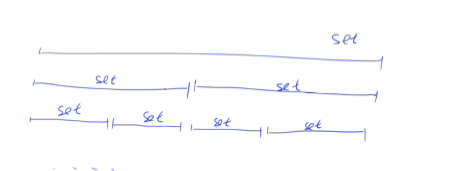

1. splay 伸展树
   每次操作选定一个子序列 [l,r]，并将该子序列中的所有数字进行翻转。
   求出经过 m 次操作后的序列。
   1e5 量级
   `区间翻转问题`
2. 树套树(思想)
   外层：线段树/树状数组
   内层：平衡树/线段树
   

   `区间动态查询(静态可以只用持久化线段树)`

   二分 查询区间 [l,r] 内排名为 k 的值 `O(logn^3)`
   查询整数 x 在区间 [l,r] 内的排名 `O(logn)^2`
   查询整数 x 在区间 [l,r] 内的前驱/后继 `O(logn^2)`

3. 分块
   主要思想
   分成若干个段(一般是 sqrt(n))，那么任意一个区间都可以由`不超过sqrt(n)个完整段+2个不完整段组成`
   完整段采用`懒标记/预处理`的算法，不完整段直接`暴力求解`
   查询/修改时间复杂度 O(sqrt(n))
4. 分块链表
   文本编辑器
5. 莫队算法(离线查询分块的优化)
   莫队算法主要是用于`离线解决` 通常不带修改`只有查`询的一类`区间问题`
   用于求区间种类数(离线查询也可以主席树/树状数组)

   如果我们已知一个区间[1,r]的情况，我们可以在 O(1)的时间内确定[1,r+1]的情况
   (只需开一个数组记录每一个数出现的次数，然后将 ar+1]的出现次数加一即可)。
   这样我们可以在 O(N2)的时间内完成对所有区间的扫描。
   接着我们发现，我们不仅可以确定[1,r ＋ 1]，还可以确定[1 ＋ 1,r]，[1,r ―1]和[1-1,r]。这个时候，就可以用到莫队算法啦。
   莫队的精髓就在于，离线得到了一堆需要处理的区间后，`合理的安排这些区间计算的次序`以得到一个较优的复杂度。
   我们先对序列分块，然后以询问`左端点所在的分块的序号`为第一关键字，`右端点的大小`为第二关键字进行排序，按照排序好的顺序计算，复杂度就会大大降低。
   **类似于双指针，让右指针单调移动，左指针分块**

   - 分块相同时，右端点递增是 O(N)的，分块共有 O(VN)个，复杂度为 O(N1.5)
   - 分块转移时，右端点最多变化 N，分块共有 O(√N)个，复杂度为 O(N1.5)
   - 分块相同时，左端点最多变化、N，分块转移时，左端点最多变化 2√N，共有 N 个询问，复杂度为 O(N1.5)

   - 基础莫队：离线静态查询区间种类数 https://www.acwing.com/problem/content/2494/
   - 带修改的莫队：离线动态查询区间种类数 https://www.acwing.com/problem/content/2523/
   - 树上莫队：树上查询路径上点权种类数 https://www.acwing.com/problem/content/2536/

6. 树链剖分[树链剖分](%E6%A0%91%E9%93%BE%E5%89%96%E5%88%86)

7. DLX 舞蹈链

   - 精准覆盖问题(dfs) 16×16 的数独
   - 重复覆盖问题

8. 点分治 点分治适合处理大规模的树上路径信息问题
9. CDQ 分治 解决三维偏序问题
10. 替罪羊树的暴力重构
    https://github.com/EndlessCheng/codeforces-go/blob/master/copypasta/scapegoat_tree.go
    https://tjkendev.github.io/procon-library/python/binary_search_tree/scapegoat-tree.html
    !替罪羊树会在插入、删除操作时，检测途经的节点，若发现失衡，则将以该节点为根的子树重构。
