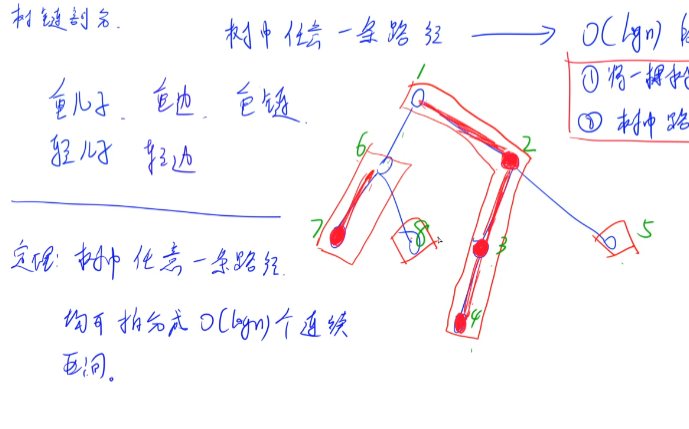

<!-- 树链剖分解决路径问题 -->

https://www.acwing.com/solution/content/62664/
思想：
**把树转化成一个序列，这样树中 任意一条路径 就可以对应到 O(logn) 段的 连续区间**
然后各种 维护区间信息 的 数据结构 就可以上了

1. 重/轻儿子：当前节点的子节点中`子树最大的子结点称为该节点的 重儿子`，其余都为 轻儿子
2. 重/轻边：当前节点到 重儿子 的边称为 重边，到 轻儿子 的边称为 轻边
3. 重链：由 重边 构成的 极大路径

定理：树中任意一条路径均可拆分成 O(logn) 个 连续区间 / 条 重链

如何将一条路径转化成需要的 logn 个区间？
类似于求 LCA
通过 重链 向上爬，找到 最近公共重链，最后加上在 相同重链 里的区间部分，如下图所示:
每个询问最多 `O(logn^2)`常数比较小

时间复杂度`nlogn^2`
