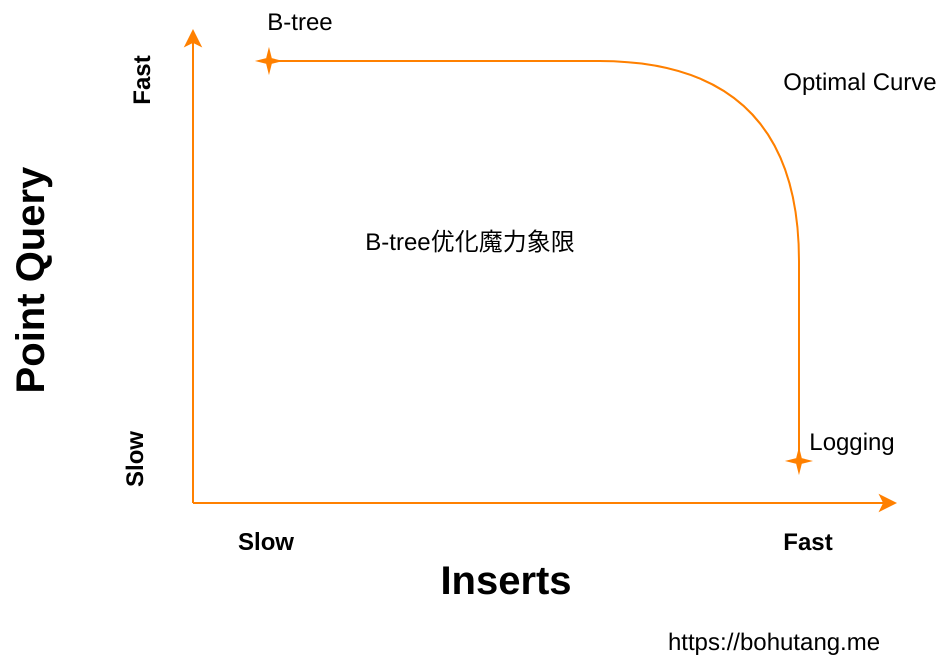

https://bohutang.me/2020/06/20/clickhouse-and-friends-merge-tree-algo/

横坐标是写性能，纵坐标是读性能，B-tree 和 Logging 数据结构分布在曲线的两个极端。
B-tree 的读性能非常好，但是写性能差。
Logging 的写性能非常好，但是读性能差(想想我们每次写都把数据追加到文件末尾，是不是很快？但是读…)。
