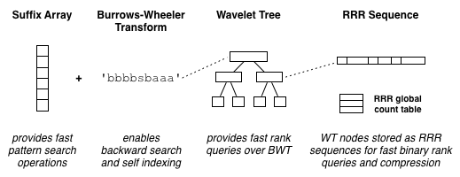

https://www.alexbowe.com/author/alexbowe/

1. [RRR: A Succinct Rank/Select Index for Bit Vectors](https://www.alexbowe.com/rrr/)
   RRR：一种用于位向量的简洁排名/选择索引
2. [FM-Indexes and Backwards Search](https://www.alexbowe.com/fm-index/)
   FM-索引和反向搜索
   
