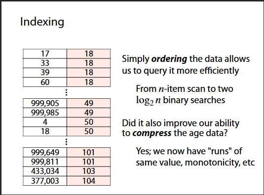
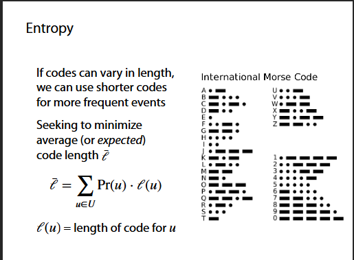
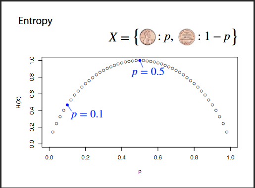
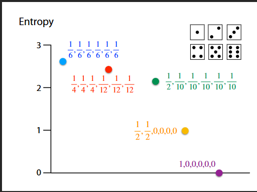
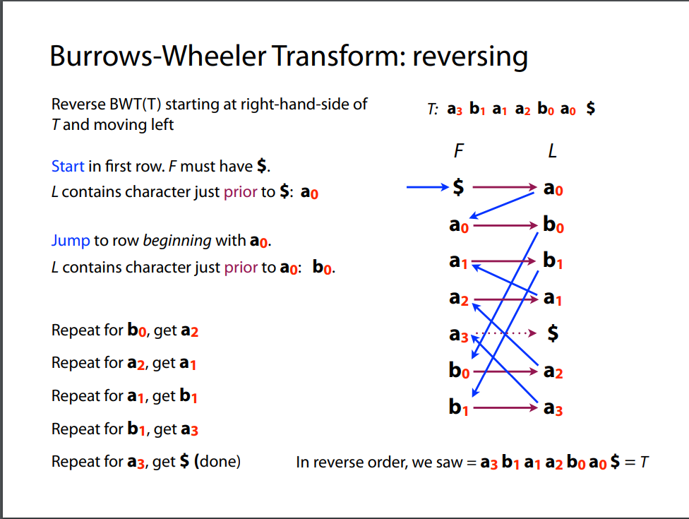
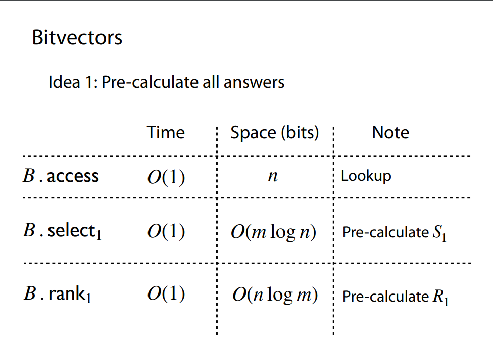
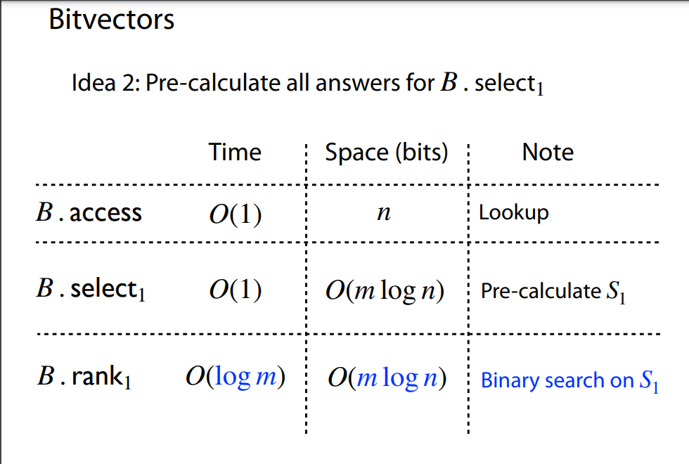
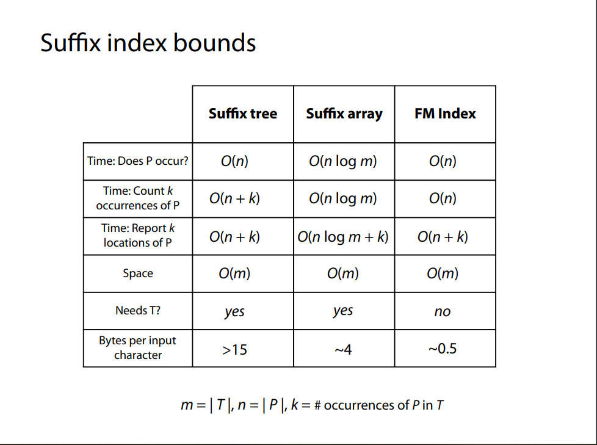

https://www.youtube.com/watch?v=5G2Db41pSHE&list=PL2mpR0RYFQsADmYpW2YWBrXJZ_6EL_3nu

## 1. Intro: Indexing

https://www.cs.jhu.edu/~langmea/resources/lecture_notes/bwt/205_intro_indexing.pdf



一种辅助数据结构或映射关系，用来在大量数据中更快地查找特定信息。

两个原则：

1. Grouping
2. Ordering

## 2. Entropy & coding

https://www.cs.jhu.edu/~langmea/resources/lecture_notes/bwt/210_entropy_coding.pdf




熵 (Entropy) 是信息论中衡量随机变量不确定性和信息量的核心指标，为任何无损压缩设定了理论下界。

- 香农熵：

```math
H(X) = -\sum_{x \in X} p(x) \log_2 p(x)
```

当所有概率相同时，熵最大，此时为 worst-case entropy 。

```math
H(X) = \log_2 |X|
```

- Huffman 编码
  - 如何解码
    1. 已知哈夫曼树的解码
       不断读入编码比特；
       每读到能到达树叶，就解出一个符号；
       循环直至整条编码流被解完
    2. 仅知道「符号 ↔ 编码」映射的解码
       因为哈夫曼编码是前缀码 (Prefix-free code)，不存在“某个编码是另一个编码前缀”的情况，所以可以使用前缀匹配来解码。一旦能匹配上一个编码，就知道它对应的符号是什么。
  - 性质
    1. 前缀码 (Prefix-free code)
    2. 最优码 (Optimal code)
       在单符号无记忆场景（每个符号独立出现且频率不随时间变化）下，哈夫曼算法能构造出平均码长 最优 的前缀码
       近似熵界
       ```math
         H(X) \leq \bar{L} < H(X) + 1
       ```
       其中， \(\bar{L}\) 是平均码长，\(H(X)\) 是熵。哈夫曼码保证其平均码长与熵之差至多 1 比特。
       一般情况下，哈夫曼算法是构建“熵编码”中最常见、效果较佳的选择

## 3. High order empirical entropy

https://www.cs.jhu.edu/~langmea/resources/lecture_notes/215_high_order_ent_pub.pdf

- Zero order empirical entropy seems insufficient when context matters

  在信息论和文本压缩等领域，当我们从一段实际数据（如字符串）来“估计”某个模型的熵时，最简单的做法就是“零阶”假设：认为每个符号独立且分布一致，`用符号频率来估计符号出现的概率，然后计算该伯努利/多项式分布的香农熵，这就是“零阶经验熵（zero-order empirical entropy）”`。

  然而，真实序列往往有上下文相关性：一个符号出现的概率会依赖前面出现的一些符号（例如自然语言中的 n-gram 模型）。如果我们想在经验层面捕捉这些相关性，就需要用高阶经验熵（high-order empirical entropy）的概念，通常也称k 阶经验熵（k-th order empirical entropy）。

  在实际数据压缩与统计语言模型中，“高阶经验熵”常用来衡量可压缩程度或语言可预测性，指导我们设计合适的 Markov / n-gram 级别的编码器或语言模型。

## 4. BWT

https://www.cs.jhu.edu/~langmea/resources/lecture_notes/10_bwt_and_fm_index_v2.pdf


## 5. Bitvectors and RSA queries

https://www.cs.jhu.edu/~langmea/resources/lecture_notes/230_bitvectors_rsa_pub.pdf

如何查询 Bitvectors?

- RSA 接口:

  - Rank
  - Select
  - Access

- 第一种实现：预处理(打表)
  
- 第二种实现：预处理+二分
  
- 第三种实现：Jacobson's rank + Clark's select

## 6. Jacobson's rank

https://www.cs.jhu.edu/~langmea/resources/lecture_notes/235_jacobsons_rank_pub.pdf

关键点：

1. 大块 (superblock) + 小块 (block) + 余位计数 (popcount或者2^b查表)
   三段求和，时间复杂度O(1)；空间复杂度O(n)

## 7. Clark's select

## 10. FMIndex


