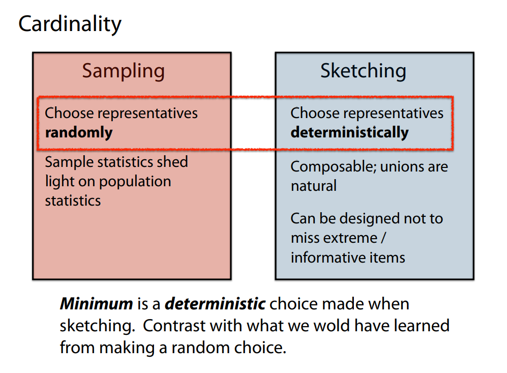

# Sampling vs Sketching

**Sampling**（随机抽样）与**Sketching**（概要/摘要）的思路差异，以及在“随机选择代表”与“确定性选择代表”之间所体现的核心区别。文中也会提到为什么“最小值”这样的确定性选择在很多 Sketch 算法中显得十分重要，以及它与随机抽样所能获得的信息有何不同。

---

## 1. 核心背景与目标

1. **Sampling（随机抽样）**

   - 通过**随机地**选择一定比例或一定数量的样本来代表整体数据分布；
   - 期望这些样本在**统计意义**上能“反映”整体情况，比如平均值、分布形状、distinct count 的近似等；
   - 常见方法：简单随机抽样、分层抽样、留存一小部分概率等。

2. **Sketching（概要/摘要）**
   - 一类更为广义的概念：通过**小空间**保留数据的“摘要信息”（不是存全量，也不只是随机抽）来完成特定统计或查询。
   - 例如：CountMin Sketch、Count Sketch、HyperLogLog、KMV 等。
   - 与抽样相比，很多 Sketch 算法往往“确定性”地选择或更新某些结构（如保留最小哈希值、最大哈希值、某些位图信息），而并不使用随机选择代表。

---

## 2. “随机选择代表” vs. “确定性选择代表”

### 2.1 随机选择（Sampling）

- **做法**：从大数据集中，用某个概率（比如 1%）或固定样本量（k 个）**随机**选出代表元素。
- **优点**：
  1. **统计推断**：可以用抽样理论（如中心极限定理、Hoeffding bound 等）来推断总体均值、distinct count 等；
  2. **容易实现**：只要随机函数靠谱，就能得到不带偏差的样本（理论上）。
- **不足**：
  1. **极值或稀有项** 容易漏掉：如果数据中“极端情况”特别重要，纯随机抽样可能把它们“抽不进来”；
  2. **结果可变**：抽样本身带有随机性，不同抽样可能差异不小，需要更大样本才能降低方差。

### 2.2 确定性选择（Sketching 中常见）

- **做法**：算法按照某个确定规则（如：始终保留哈希值最小的 k 个元素、或保留每个桶中的最大值、最右 1 的位置等）来选代表，而非用随机概率选。
- **优点**：
  1. **可控**：对某些场景，能保证一定不会漏掉最重要/最极端的元素；
  2. **可组合**：很多 Sketch（如 k-min、HyperLogLog）在做并集操作时，“自然”地合并其结构就得到新结构，不需要再做随机抽样；
  3. **稳定**：给定同样的数据和同样的哈希函数，结果是确定的，无需再多次抽样来减少方差。
- **不足**：
  1. **可能的偏差**：若哈希不够随机或数据分布特殊，确定保留最小值也有风险；
  2. **无法直接提供对整体分布的丰富统计**（不像随机抽样能估计平均值、方差、分位数等），除非专门设计相应的结构。

---

## 3. Sampling vs. Sketching 的典型用语比较

下表总结了在一些文献/课程笔记里常见的对比：

| 概念                          | 随机抽样 (Sampling)                                        | Sketching (确定性选择)                               |
| ----------------------------- | ---------------------------------------------------------- | ---------------------------------------------------- |
| **选择代表方式**              | 随机挑选部分元素，概率固定或样本量固定                     | 按某种 **确定规则**（如最小哈希值）保留              |
| **示例算法**                  | 随机采样、保留 1% 用户、Reservoir Sampling                 | KMV (k-min), HyperLogLog, CountMin Sketch 等         |
| **合并（Composable）**        | 不总是“自然可合并” —— 随机样本的并集未必等价于全局随机样本 | 多数 Sketch 可以“可并” （自然合并汇总）              |
| **统计视角**                  | 样本统计→推断总体；看似简洁，但容易漏掉稀有/极值           | 针对某些特征做最小/最大/尾部保留；有时能保证不漏极值 |
| **与极值/稀有项**             | 可能漏掉，需额外补偿策略                                   | 可以专门设计“永不漏掉重要元素/最小哈希值”等          |
| **对 cardinality (distinct)** | 通过抽样比率 + 去重得到估计                                | 通常使用哈希并保留最小哈希值（k-min）或相关结构      |

---

## 4. “Minimum is a deterministic choice” 的含义

在很多基数估计算法（如 KMV, MinHash）中，会出现这样一句话：

> “我们取所有元素哈希值后，始终保留**最小**的那几个哈希值（或最右边 0 的位置），这是一个确定性操作。”

1. **为什么说它是“确定性选择”？**

   - 一旦哈希函数选定，对同一批输入元素，其哈希值也是固定的；
   - 按照“谁最小就保留谁”这个规则，就能得出唯一的保留集合（无随机性）。
   - 不依赖“抽到它的概率是多少”，而是**算法**直接认定：只要你的哈希值够小，就被选入。

2. **对比如果用随机抽样**：

   - 假如想保留 k 个代表，需要先给每个元素一个随机优先级，再选优先级最高（或最低）的 k 个——这其实跟“取最小哈希”挺像，但多了一层“随机给优先级”步骤。
   - 纯随机抽样不一定保证最小哈希值就被选进来，而是看抽样时抽中了它就进，没抽中就出。

3. **总结**：
   - 这种“取最小值”的方法，本质是**用哈希值做一个排名**并保留排名最靠前的 k 个元素；
   - 整个过程**对同样的数据集是完全确定的**（只要哈希函数给定），因此在某些文献里，就把它称作“确定性选择”的一种 Sketch 方式。

---

## 5. 各自适用的场景

1. **Sampling**：

   - 若你想对**很多统计量**（均值、方差、分位数、回归分析等）都做估计，随机样本是非常通用的手段；
   - 也适合人手做数据分析（可看分布形状、画图等等）。

2. **Sketching**（确定性保留极值/最小值）

   - 针对特定目标（如 distinct count、某些频率统计等）能做到极低空间占用与可并行合并；
   - 适合流式算法、分布式系统，需要不断合并子结果的场景；
   - 可针对极端/重要元素做特殊保留（不漏掉重大异常值），避免随机抽样可能把它丢失。

3. **Cardinality 估计**：
   - 若只关心 distinct count（多少不重复元素），则保留**最小哈希值**（k-min 或 HyperLogLog）非常流行。
   - Random sampling 也能估计 distinct count，但往往需要较大的样本才能保持误差在合理范围内。

---

## 6. “Composable; unions are natural” 与 “Sample statistics shed light on population statistics”

1. **Sample statistics → population**

   - 这是在说明随机抽样最典型的用途：从少量样本估计整体分布参数（均值、方差、相关性、distinct count 等），是**统计学**的主力工具。
   - 但要注意，在多节点/多批数据合并时，把两份随机样本简单合并不一定得到“对并集的随机样本”。

2. **Composable**
   - 许多 Sketch（如 k-min、Bloom Filter、CountMin、HyperLogLog）都具有**“可并性”**。
   - 举例：k-min 将两台机器各自存的 k 个最小哈希值合并成 2k，再取 k 个最小即是并集的摘要；HyperLogLog 的桶可以按位取最大值合并…… 这些都是在随机抽样难以实现的“自然合并”。

---

## 7. 小结

- **Cardinality** 需求驱动：我们在大规模数据中关心“有多少不重复元素”，或者想快速合并分布式的结果。
- **Sampling vs. Sketching**：
  - **抽样**本质是“随机选代表”，用于广泛的统计推断；
  - **Sketch**常常是“按某种确定性规则”选或更新一组小摘要，专门针对某些统计（distinct count、频率、最大值等）表现优异，并容易合并。
- **不漏极值 / 最小哈希**：
  - 抽样可能漏掉重要的“极值/极端项”；
  - 确定性选择能设计成对极端或最小哈希值“必留”，适合在某些应用下不希望丢失这些信息。
- **理论与实践差异**：
  - 抽样符合统计理论，可做更多通用分析；
  - Sketch 的确定性结构更适合流式、分布式与大规模查询优化场景。

因此，当我们谈到 **“Minimum is a deterministic choice made when sketching”** 时，其含义就在于：**Sketch**（如 k-min）对于要保留哪些元素是按一个特定的、与哈希值排序相关的确定性规则来选——对同样的输入数据集，这个选择是固定的；而若我们用随机抽样，可能会抽掉或保留一些与最小哈希值无关的元素，得到不同的信息、带来更通用但也更不稳定（方差大、可能漏掉极值）的一种统计近似。

整体而言：**抽样**与**Sketch**就像两条平行且时有交集的技术路径，服务于“如何用少量空间+数据”去近似推断大规模数据。它们的主要区别在于**是否使用随机抽取**还是**确定性保留**，以及对后续合并、极值保留、用途多样性的支持度。
