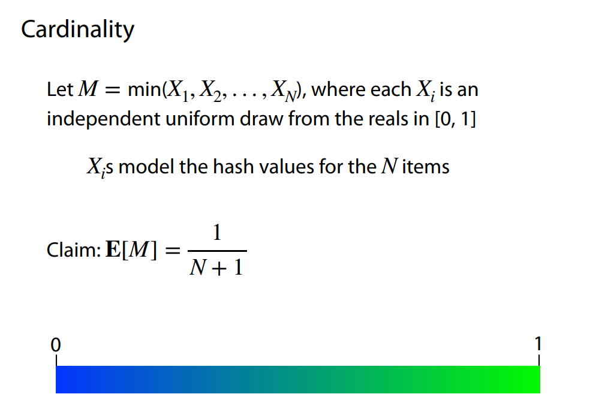
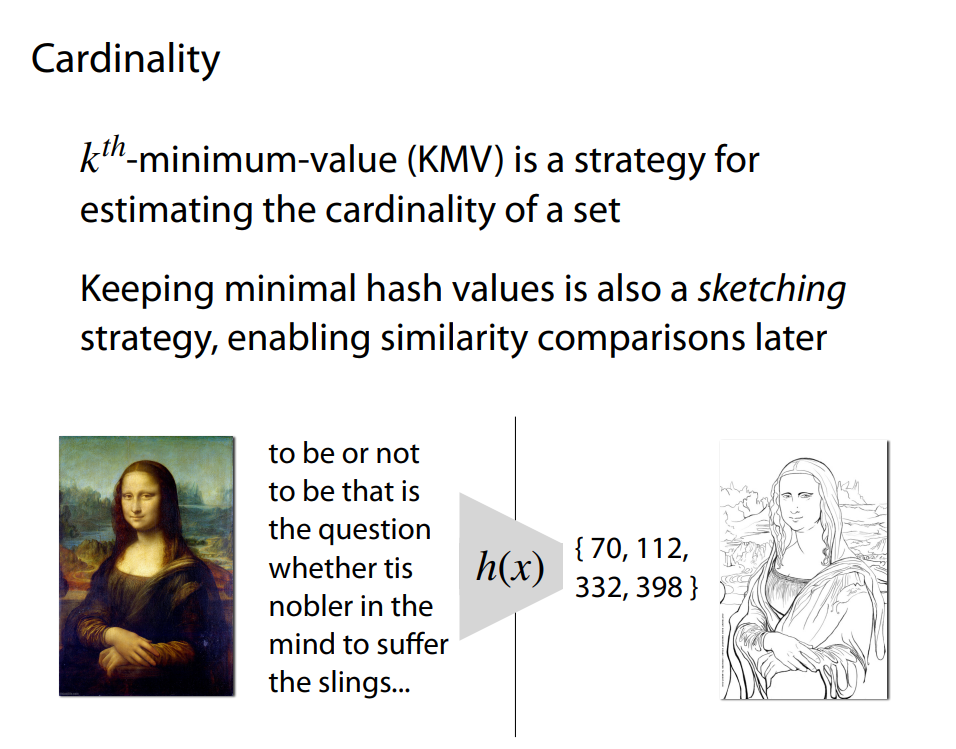

# Sketching and randomized data structures

https://www.youtube.com/watch?v=HH1Hakswsus&list=PL2mpR0RYFQsAR5RyB54FyEE9vUiGtCSZM

快速过

## 1. Hash tables & probability

## 2. Hashes & randomness

https://www.cs.jhu.edu/~langmea/resources/lecture_notes/110_randomization_pub.pdf

良好的哈希函数在数据结构和算法中起着至关重要的作用，特别是在哈希表、布隆过滤器、计数Sketch等随机化数据结构中。一个优秀的哈希函数应具备以下几个关键特性和要求：

1. 均匀分布（Uniform Distribution）

**要求**：哈希函数应尽可能将输入键均匀地分布到哈希表的所有桶（slots）中。

**原因**：均匀分布能够最大程度地减少哈希冲突（不同键映射到相同桶的情况），从而保持哈希表操作（如插入、查找、删除）的期望时间复杂度为 \(O(1)\)。

2. 确定性（Deterministic）

**要求**：对于相同的输入键，哈希函数每次都应产生相同的哈希值。

**原因**：确定性确保了哈希表的一致性和可靠性，避免了同一个键在不同时间或不同操作中产生不同的哈希值，从而导致无法正确查找或删除元素。

3. 高效性（Efficiency）

**要求**：哈希函数应具备快速计算的能力，避免成为整个哈希表操作的瓶颈。

**原因**：哈希函数在哈希表的每次操作中都会被频繁调用，特别是在处理大规模数据时，高效的哈希函数能够显著提升整体性能。

4. 低冲突率（Low Collision Rate）

**要求**：不同的输入键尽可能产生不同的哈希值，减少冲突的发生。

**原因**：低冲突率能够降低链式哈希或开放地址法中链长或探测次数，保持哈希表操作的高效性。

5. 独立性（Independence）

**要求**：哈希函数的输出应独立于输入键的分布，特别是在使用随机化算法时。

**原因**：独立性有助于在概率分析中提供更严格的性能保证，如通用哈希（Universal Hashing）中的独立性假设可以确保对任意两个不同键的碰撞概率可控。

6. 雨崩效应（Avalanche Effect）

**要求**：输入键的微小变化应导致哈希值的显著变化。

**原因**：雨崩效应能够确保输入键的微小差异不会导致哈希值的局部集中，进一步促进均匀分布，减少冲突。

7. 避免模式（Pattern Avoidance）

**要求**：哈希函数应避免对特定模式或输入分布产生偏见，尤其是在面对攻击性输入时。

**原因**：某些应用场景（如安全性要求高的系统）需要哈希函数具备抗碰撞攻击的能力，防止恶意构造输入导致大量冲突，进而影响系统性能或安全。

8. 可扩展性（Scalability）

**要求**：哈希函数应能够适应不同规模的数据集，保持性能稳定。

**原因**：在处理动态变化的数据集（如动态扩展的哈希表）时，哈希函数需要在各种规模下都能保持良好的分布特性和计算效率。

9. 可重现性（Reproducibility）

**要求**：在非随机哈希函数中，哈希结果应在不同运行或不同环境中保持一致。

**原因**：可重现性对于调试、测试和某些需要一致性哈希结果的应用场景至关重要。

常见的良好哈希函数设计方法

1. **乘法哈希法（Multiplicative Hashing）**：
   \[
   h(k) = \lfloor m (k A \mod 1) \rfloor
   \]
   其中，\(A\) 是一个无理数，\(m\) 是哈希表的大小。

2. **除法哈希法（Division Hashing）**：
   \[
   h(k) = k \mod m
   \]
   选择合适的 \(m\)（通常为素数）可以减少冲突。

3. **线性探测哈希函数（Linear Probing Hash Function）**：
   适用于开放地址法，通过线性探测解决冲突。

4. **字符串哈希函数**：
   如多项式滚动哈希（Polynomial Rolling Hash），常用于字符串匹配和哈希表。

5. **通用哈希函数（Universal Hashing）**：
   通过选择随机参数，使得对任意两个不同键，碰撞的概率不超过某个上界。

6. **MurMurHash、CityHash、SHA系列**：
   这些是经过广泛测试和优化的高效哈希函数，适用于通用用途和特定需求。

## 3. Coupon collector and more Bloom filters

https://www.cs.jhu.edu/~langmea/resources/lecture_notes/120_bloom_and_coupon_pub.pdf

### m 个球独立随机放入 n 个盒子问题


- 空、非空 => Coupon Collector's Problem (赠券收集问题)
- 碰撞 => Birthday Problem (生日问题)
- 局部 => Binomial & Poisson Random Variables (二项分布与泊松分布)
- 全局 => Markov & Union Lemma (M&U 引理)

## 5. Universal hashing (全域哈希)

## 6. Universal hashing with a prime field

## 7. Cardinality part 1: the hat problem

https://www.cs.jhu.edu/~langmea/resources/lecture_notes/135_cardinality_pub.pdf

Cardinality(基数): the number of distinct elements in a set.

> 卡蒂娜莉缇




## 8. Cardinality part 2: proof & kth minimum value (KMV)

- 存储最小的几个哈希值来估计整个集合的基数（distinct count）
  

- MinHash 做近似集合相似度计算
  
  MinHash（最小哈希）是一种近似算法，用于高效估计两个集合的 Jaccard 相似度。它通过将集合映射为固定长度的签名（签名矩阵），从而在极小的空间和较快的计算时间内实现相似度的近似计算。

  1. 定义哈希函数：选择多个独立的哈希函数。
  2. 生成签名：为每个集合生成一个签名向量，记录每个哈希函数的`最小哈希值`。
  3. 计算相似度：通过比较两个签名向量中相同位置的最小哈希值的比例，估计 Jaccard 相似度。

  > Jaccard 相似度：两个集合的交集大小除以并集大小。
  > (|A| + |B| - |A U B| / |A ∪ B|)

## 9. Similarity & MinHash

https://www.cs.jhu.edu/~langmea/resources/lecture_notes/140_similarity_pub.pdf


## 10. Markov's inequality (马尔可夫不等式)

Markov 不等式（马尔可夫不等式）是一个用于估计随机变量取大值的“尾部概率”上界的重要工具。它最常见的形式适用于非负随机变量，并能给出一个极其简洁的上界。

```math
P(X \ge a) \le \frac{E[X]}{a}
```

其含义为，对于任意非负随机变量 \(X\) 和任意 \(a > 0\)，随机变量取值大于等于 \(a\) 的概率不会超过其期望值与 \(a\) 的比值。

## 11. CountMin sketch
