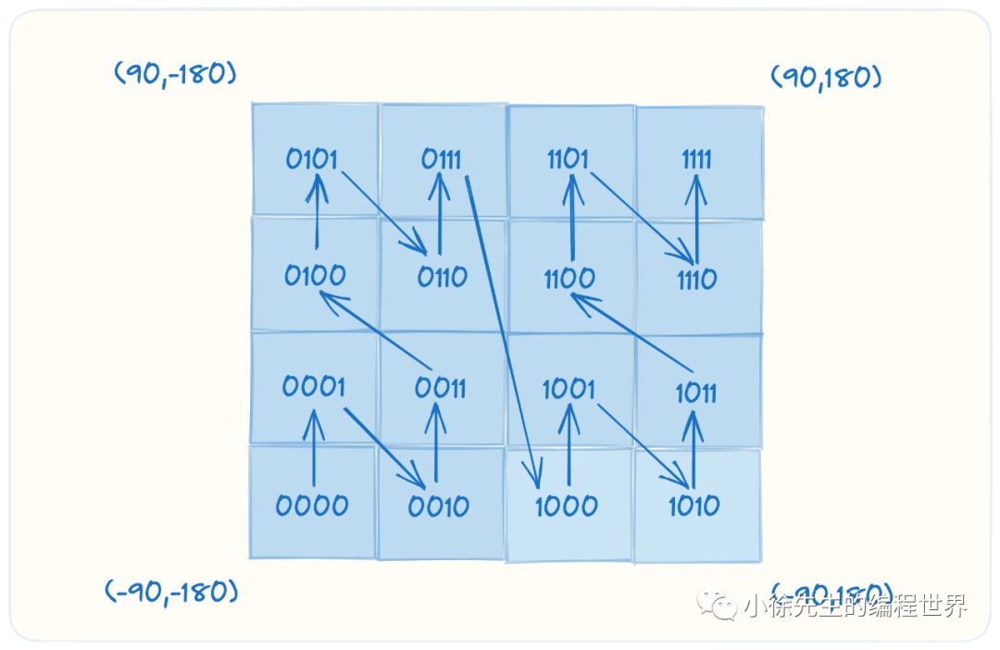
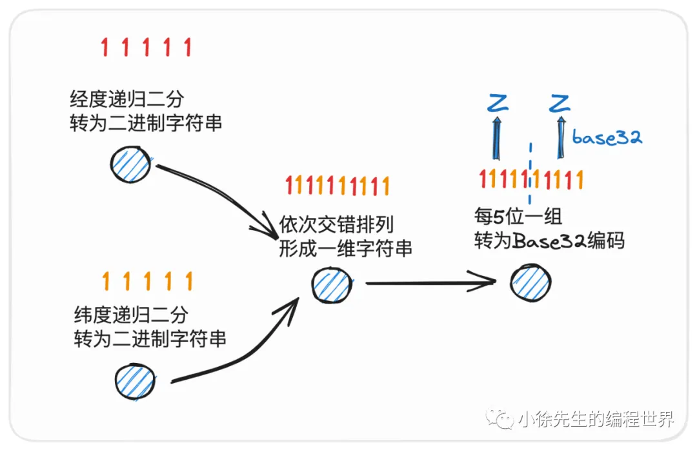
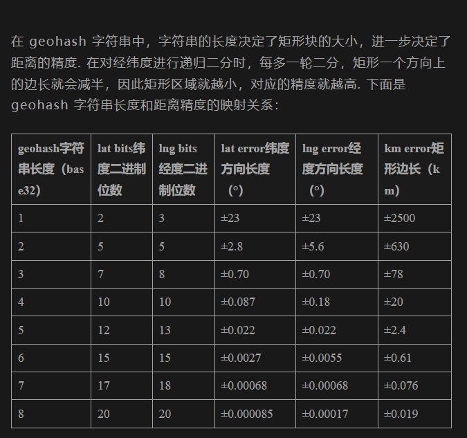
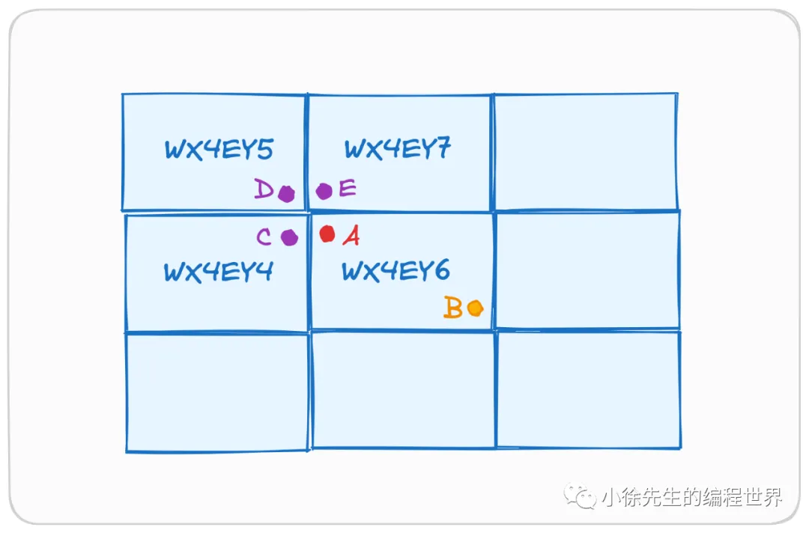
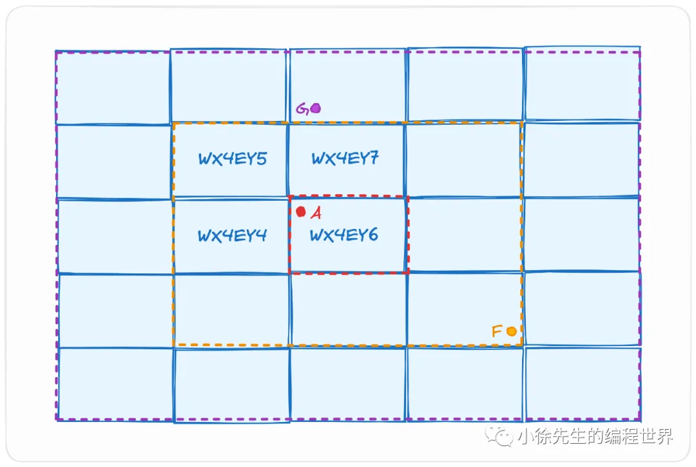
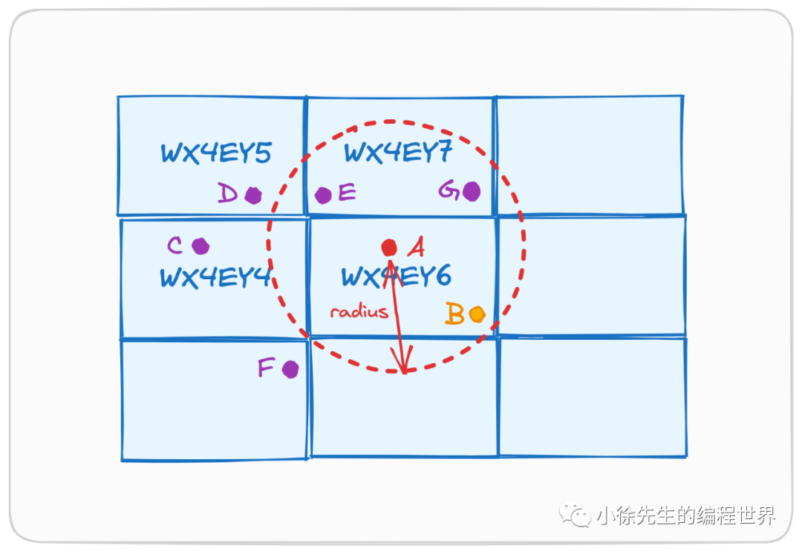
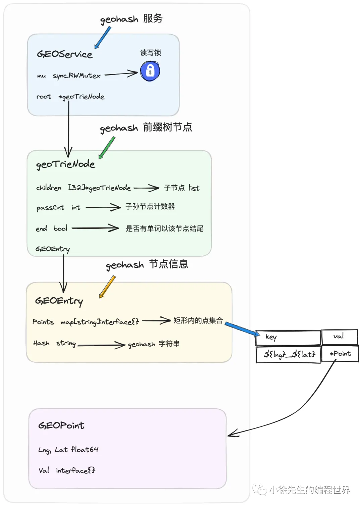

https://mp.weixin.qq.com/s?__biz=MzkxMjQzMjA0OQ==&mid=2247484507&idx=1&sn=ba2c821a75660b7aa6ec9e150b93f06e

## 1. geohash 应用背景

在地图 app 中，如何对指定范围内的餐馆信息进行精确推送和展示呢？

`索引法`
在 geohash 技术实现中，`能在很大程度上保证`，两个 geohash 字符串公共前缀的长度越长，对应的两个区域距离就越接近，并且其间的相对距离范围是可以通过公共前缀的长度估算出具体量级的.

## 2. geohash 实现原理

1. 将地球的球形表面“展开”成一张矩形平面，每个位置对应的(lon,lat) 坐标都可以很方便的在矩形平面上进行定位；
2. 二分；将矩形平面划分成两个矩形，分别对应 0 和 1 两个二进制数；
3. 我们按照经度字符串+纬度字符串依次交错排列的形式，将其组织在一起，最终形成一个一维字符串；
4. Base32编码：进一步节省空间，geohash 采用 Base32 编码替代了原始的二进制字符串。
   Base32 编码主要是以 10 个数字字符 ‘0’-‘9’ 加上 26 个英文字母 ‘A’-‘Z’ 组成，并在其中把几个容易产生混淆的字符 `'I' 'L' 'O' 以及字母 'A' 去掉了`，最终总计保留下来 32 个字符.

## 3. geohash 实现

## 4. geohash 问题讨论

1. 边缘性问题
   

   解决方法：将周围 8 个矩形块范围内的点也同时检索出来，再根据实际的相对距离进行过滤

2. 最短距离问题
   
   倘若我们想要借助 geohash 技术，找到距离点 A 最近的目标点.
   基于“回”字形的拓扑结构向外逐层向外拓宽，`在遇到首个目标点后，额外向外扩展几圈`，直到保证扩展范围边界与点 A 的相对距离已经长于首个目标点后才能停止扩展流程.
3. 范围检索(report)
   
   应用 geohash 技术的一类场景是：给定一个指定位置作为中心点，想要检索出指定半径范围内的所有点集合.
   基于回字形向外逐层拓宽，直到能保证拓展范围一定能完全包含以中心点为圆心、指定距离为半径的圆。

## 5. geohash 具体实现

1. trie 存储 geohash 字符串
   复用前缀
2. 核心类
   

## 6. redis geohash

redis geohash 本质上使用通过有序集合 zset 实现的。`以 point 对应的 geohash 字符串的十进制数值作为 score`，以此来组织排序。

1. GEOADD key longitude latitude member [longitude latitude member ...]
   添加一个 point 到 geohash key 当中
2. GEOHASH key member [member ...]
   传入一个 point 对应的名称，查看 point 的信息
3. GEORADIUS key longitude latitude radius m|km|ft|mi [WITHCOORD] [WITHDIST] [WITHHASH] [COUNT count] [ASC|DESC] [STORE key] [STOREDIST key]
   传入一个 point 的经纬度，查找半径范围内的 point
