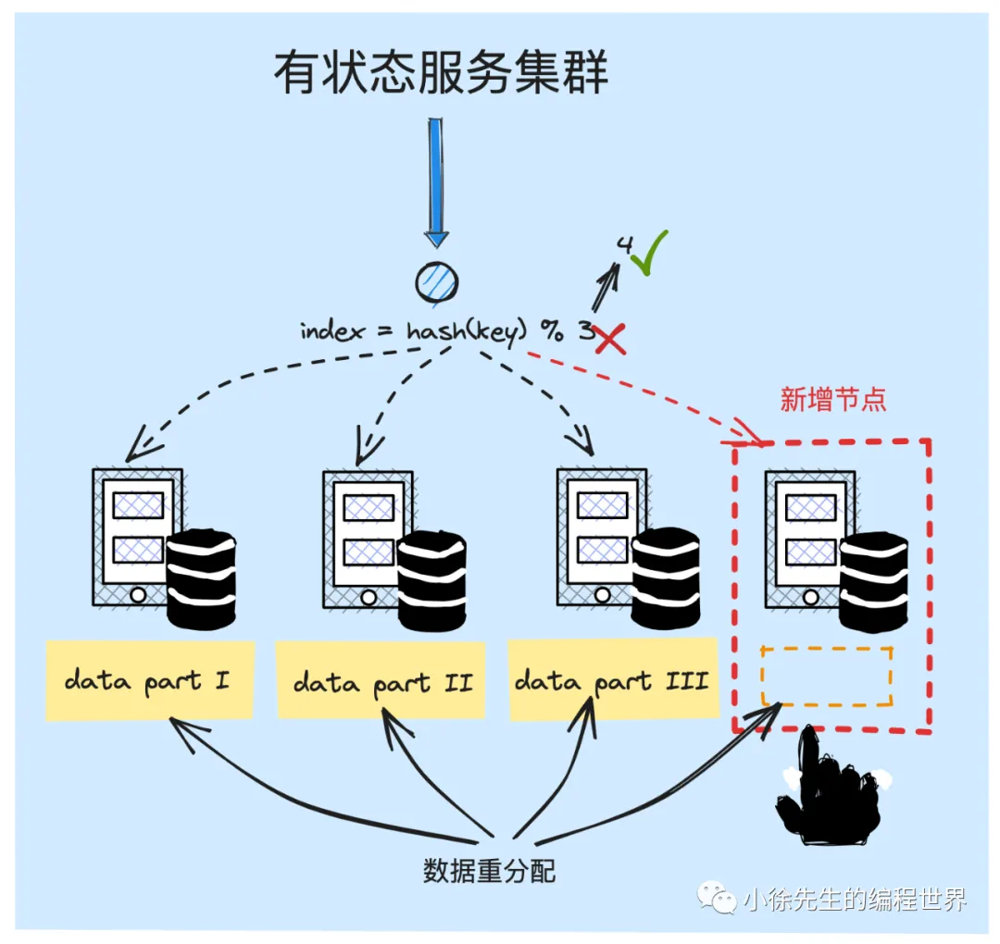
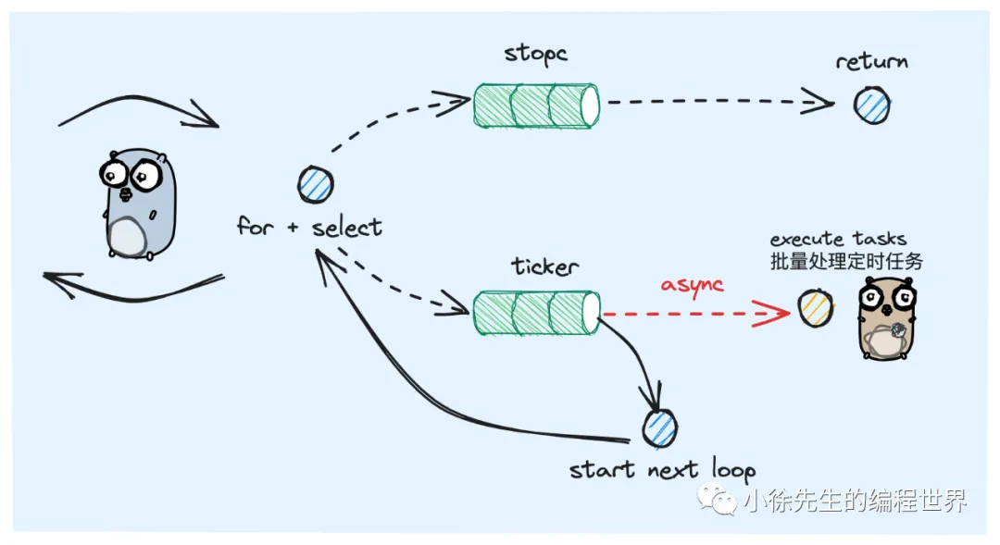
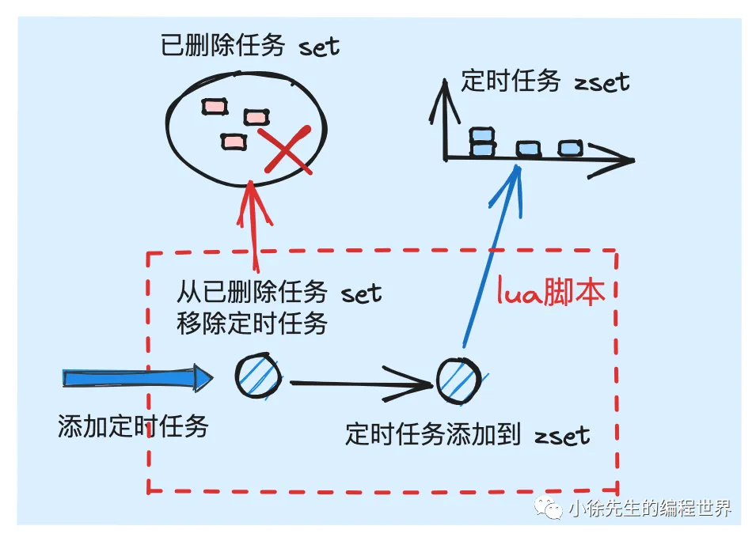
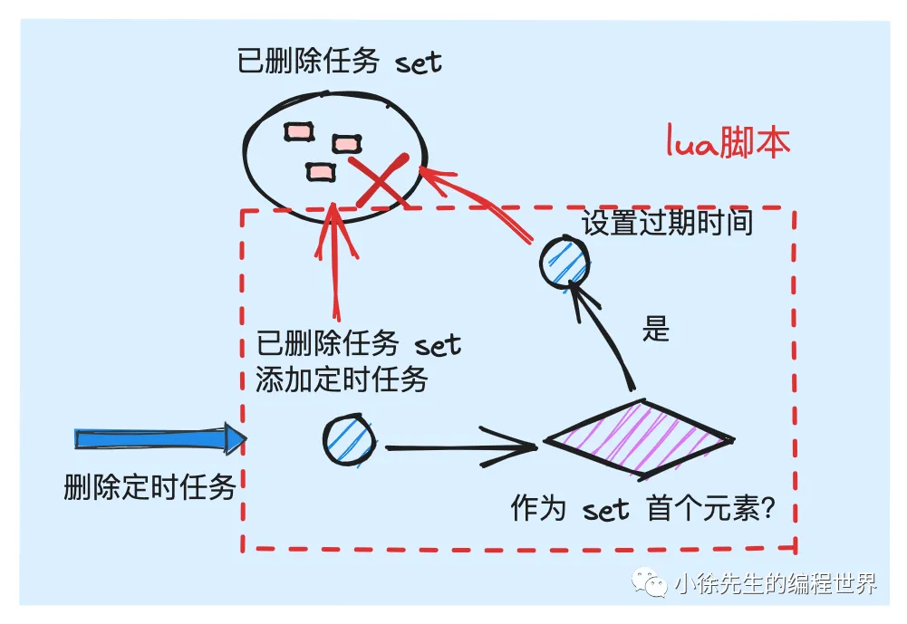
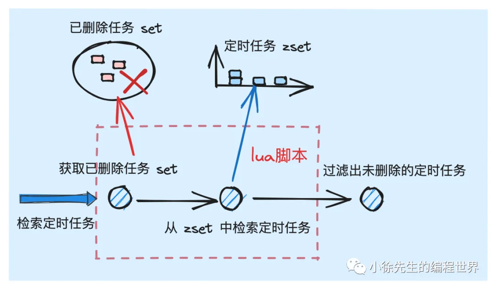

# 时间轮

## 时间轮原理

### 时间轮概念

- 时间轮是定时任务调度系统中常用到的一种经典的算法模型.
- 时间是一维、单向的。我们可以用一条一维的时间轴将其具象化。我们对时间轴进行`刻度拆分`，每个刻度对应一个时间范围，那么刻度拆分得越细，则表示的时间范围越精确。
- 采用首尾衔接的环状结构来替代无穷长度的一维时间轴。
  

### 多级时间轮

采用`分桶`思路提高定时任务的插入、删除和检索效率。

- 时间轮中的等级制度
  
  涉及多维坐标 encode 和 decode(ArrayIndex)
- 日常使用的时间表达式正是采用了这样一种多级时间轮的等级制度，比如当前的时刻为：2023-09-23 15:50:00. 这本质上是一种通过 {year}-{month}-{date}-{hour}-{minute}-{second} 组成的 6 级时间轮等级结构

## 单机版时间轮

### 核心类数据结构

1. 时间轮
2. 定时任务

### 构造器

### 启动与停止(生命周期)

通过 for 循环结合 select 多路复用的方式运行


一个常驻 goroutine 完成，不存在并发访问的情况。

### 创建任务


### 删除任务


### 执行定时任务

tick

## redis 版分布式时间轮

https://github.com/981377660LMT/timewheel

### 核心类数据结构

### redis lua 使用事项

lua 脚本是 redis 的高级功能，能够保证针在单个 redis 节点内执行的一系列指令具备原子性，中途不会被其他操作者打断.
尤其需要注意的点是，`只有操作的数据属于单个 redis 节点时，才能保证其原子性.`
然而在生产环境中，redis 通常采用纵向分治的集群模式，这使得 key 不同的数据可能被分发在不同的 redis 节点上，此时 lua 脚本的性质就无法保证.

针对这个问题，本项目采取的是定制的分区策略，来保证指定的 key 一定被分发到相同的 redis 节点上. 此处使用的方式是`通过 "{}" 进行 hash_tag 的标识，所有拥有相同 hash_tag 的 key 都一定会被分发到相同的节点上.`

```go
const (
	YYYY_MM_DD_HH_MM = "2006-01-02-15:04"
)

func GetTimeMinuteStr(t time.Time) string {
	return t.Format(YYYY_MM_DD_HH_MM)
}

// 通过以分钟级表达式作为 {hash_tag} 的方式，确保 minuteSlice 和 deleteSet 一定会分发到相同的 redis 节点之上，进一步保证 lua 脚本的原子性能够生效
func (r *RTimeWheel) getMinuteSlice(executeAt time.Time) string {
	return fmt.Sprintf("xiaoxu_timewheel_task_{%s}", GetTimeMinuteStr(executeAt))
}

func (r *RTimeWheel) getDeleteSetKey(executeAt time.Time) string {
	return fmt.Sprintf("xiaoxu_timewheel_delset_{%s}", GetTimeMinuteStr(executeAt))
}
```

### 构造器

### 启动与停止(生命周期)



### 创建任务



### 删除任务



注意设置自动过期时间：确保在没有新的删除任务添加时，这个集合不会永久存在于 Redis 中，避免内存被无用数据占用

### 执行定时任务

1. getExecutableTasks 方法批量获取到满足执行条件的定时任务 list，然后并发调用 execute 方法完成定时任务的回调执行
2. 并发控制，保证 30 s 之内完成该批次全量任务的执行，及时回收 goroutine，避免发生 goroutine 泄漏

```go
tctx, cancel := context.WithTimeout(context.Background(), time.Second*30)
defer cancel()
```

### 检索定时任务

- 每次检索时，首先根据当前时刻，推算出所从属的分钟级时间片
- 然后获得当前的秒级时间戳，作为 zrange 指令检索的 score 范围
- 调用 lua 脚本，同时获取到已删除任务 set 以及 score 范围内的定时任务 list.
- 通过 set 过滤掉被删除的任务，然后返回满足执行条件的定时任务



### 应用

基于 redis zset 时间轮的模型实现了一个分布式定时任务调度系统 xtimer

