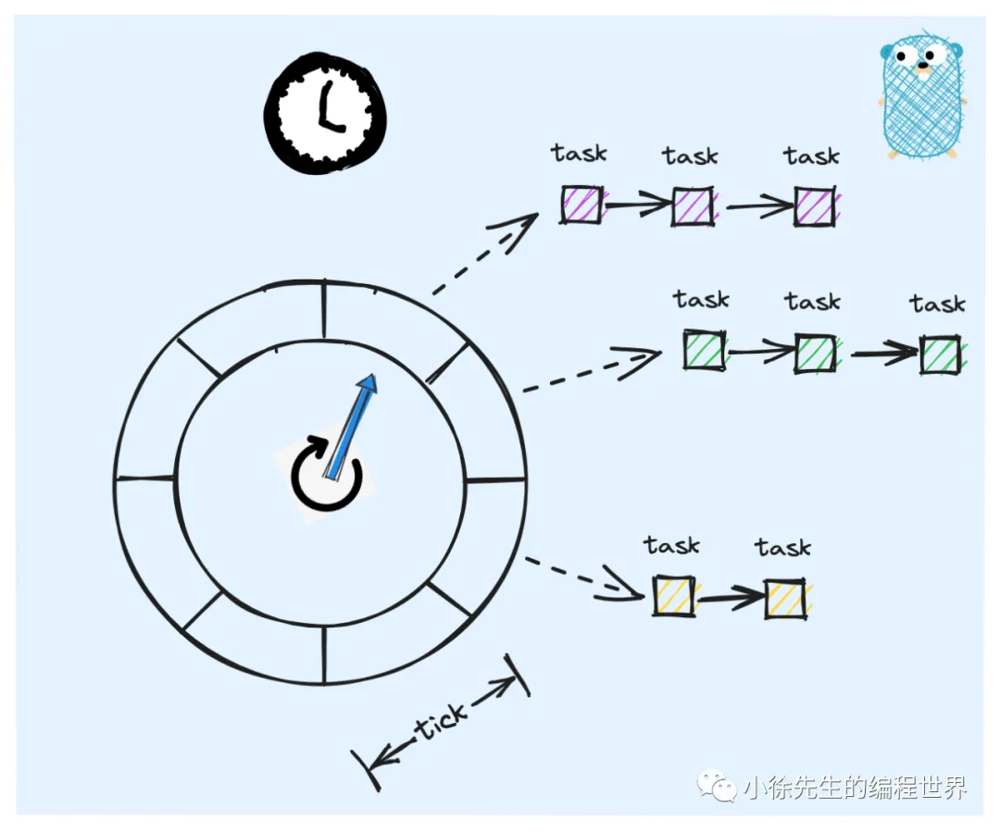
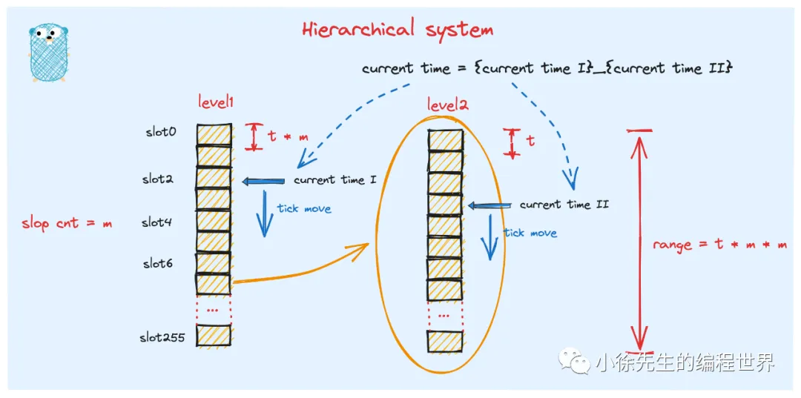
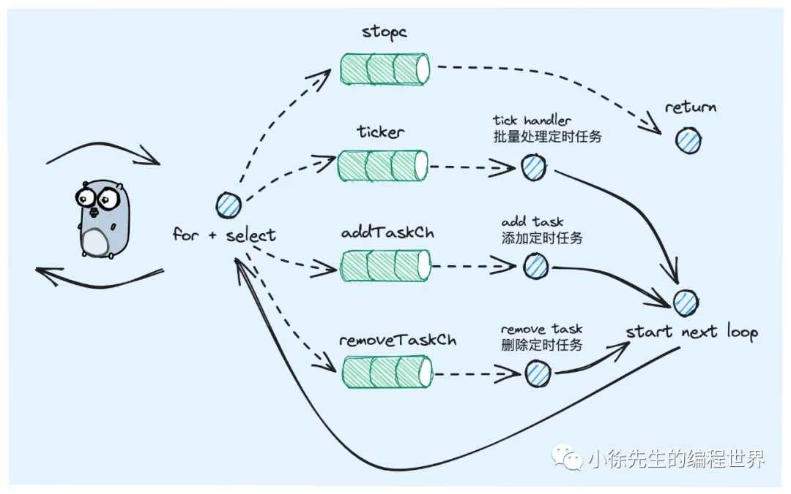
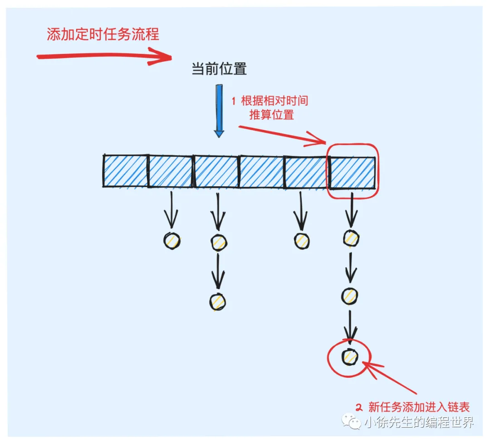
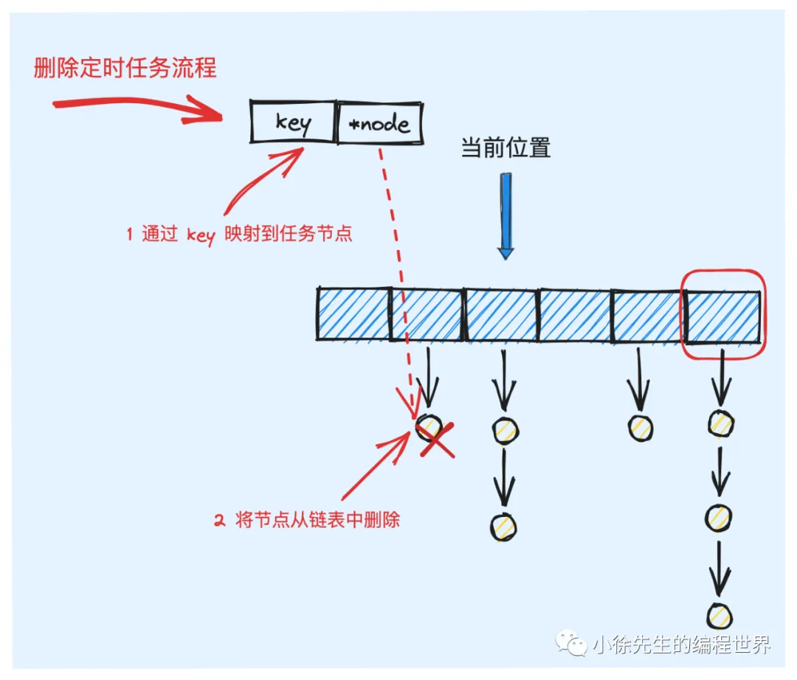
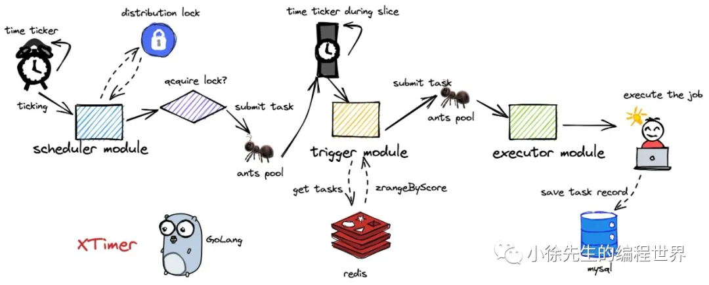

# 时间轮

## 时间轮原理

### 时间轮概念

- 时间轮是定时任务调度系统中常用到的一种经典的算法模型.
- 时间是一维、单向的。我们可以用一条一维的时间轴将其具象化。我们对时间轴进行`刻度拆分`，每个刻度对应一个时间范围，那么刻度拆分得越细，则表示的时间范围越精确。
- 采用首尾衔接的环状结构来替代无穷长度的一维时间轴。
  

### 多级时间轮

采用`分桶`思路提高定时任务的插入、删除和检索效率。

- 时间轮中的等级制度
  
  涉及多维坐标encode和decode(ArrayIndex)
- 日常使用的时间表达式正是采用了这样一种多级时间轮的等级制度，比如当前的时刻为：2023-09-23 15:50:00. 这本质上是一种通过 {year}-{month}-{date}-{hour}-{minute}-{second} 组成的 6 级时间轮等级结构

## 单机版时间轮

### 核心类数据结构

1. 时间轮
2. 定时任务

### 构造器

### 启动与停止(生命周期)

通过 for 循环结合 select 多路复用的方式运行

一个常驻 goroutine 完成，不存在并发访问的情况。

### 创建任务

### 删除任务

### 执行定时任务

tick

## redis版分布式时间轮

### 核心类数据结构

### 构造器

### 启动与停止(生命周期)

### 创建任务

### 删除任务

### 执行定时任务

### 应用

基于 redis zset 时间轮的模型实现了一个分布式定时任务调度系统 xtimer

