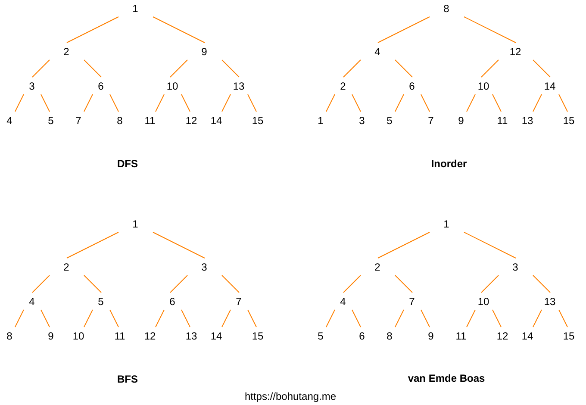

# qs

1. 详细讲解 `Gap Buffer`、`Piece Table`、`PieceTree`、`Rope` + `SumTree`
   https://github.com/rebornix/PieceTree
2. 详细讲解 Rope

3. 详细讲解 CRDT (Conflict-Free Replicated Data Types)
   https://github.com/neurodrone/crdt
4. 详细讲解 Locality-Sensitive Hashing (LSH)
   https://github.com/ekzhu/lsh

5. 详细讲解 Cycling/Cyclic Redundancy Check (CRC) Trie / TrieHash
6. 详细讲解 M-Tree / Slim-Tree
7. 详细讲解 sppHash / Dynamic Perfect Hashing / Minimal Perfect Hashing
   https://github.com/alecthomas/mph
8. 详细讲解 **Eytzinger Layout / Cache-Friendly Layout** 对搜索树的优化

   https://curiouscoding.nl/posts/static-search-tree/
   

9. ZDD
10. golang compress
11. 空间搜索
    https://www.shenyanchao.cn/blog/2020/01/16/geo_google_s2/
12. MIT 6.851 Advanced Data Structures
    https://courses.csail.mit.edu/6.851/spring21/
    ai 辅助啃
