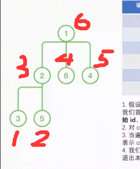

#LCP 02 分式化简
简单
`后序dfs`

#LCP 04 覆盖
困难
`二分图最大匹配`

#LCP 05 发 LeetCoin
困难
`树状数组范围更新需要借助差分数组`
`dfs序将管理和他管理的人映射到一个区间(这部分很巧妙)[a,b] b表示自身的id`
`begin[2] = 1, end[2] = 3，表示编号为 2 的人所管理的团队映射到的区间是 [1, 3]，本身映射到 3`


```JS
  let id = 1
  function dfs(cur: number): void {
    start[cur] = id
    for (const next of adjList[cur]) {
      dfs(next)
    }
    // id在dfs过程中被改变了
    end[cur] = id
    id++
  }
```

#LCP 07 传递信息
简单
`k层bfs`

#LCP 08 剧情触发时间
中等
`最左二分，取三种最大值`

#LCP 09 最小跳跃次数
困难
`bfs+剪枝:更新看过的最大位置 剪枝`

#LCP 10 二叉树任务调度
困难
`后序dfs;[minTime: number, subtreeSum: number]`

#LCP 17 速算机器人
简单
`关注整体`

#LCP 18 早餐组合
简单
`排序+头尾双指针`

#LCP 20 快速公交
困难
`dfs(pos: number)`

#LCP 22 黑白方格画
简单
`枚举边长`

#LCP 24 数字游戏
困难
`求把g的所有元素变成同一个值的最小代价，那么显然这个值应该是g的中位数`
`使用双堆维护中位数以及中位数两边的数据累加和，便于快速累加差值。`
`1703. 得到连续 K 个 1 的最少相邻交换次数`
`nums[i] - i来平移`

#LCP 28 采购方案
简单
`暴力comb的优化:排序+双指针`

#LCP 30 魔塔游戏
中等
`事后诸葛;当不行了时候，把pq的最小的负数扔到最后`

#LCP 33 蓄水
简单
`枚举蓄水次数`=>`不确定的参数，考虑直接枚举`

#LCP 34 二叉树染色
中等
`树上dp(后序dfs返回一个数组，表示连着i个蓝色结点的最大值)`

#LCP 35 电动车游城市
困难
`带限制的dijk=>visited数组多维`

#LCP 40 心算挑战
简单
长为 k 的最大偶数和子序列
`倒序；奇偶前缀和`
`枚举所有组合中奇数的个数 k（k必须是偶数） 和 cnt - k（需判断是否足够）个偶数，它们都取最大则该轮组合结果最大`

#LCP 45 自行车炫技赛场
中等
`bfs，你好强大`

#LCS 01 下载插件
简单
`疯狂加速`
