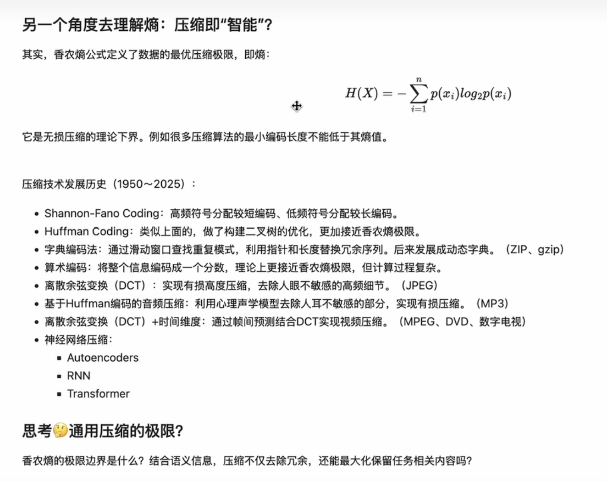

https://www.waylandz.com/blog/information-theory-and-llm/

https://www.bilibili.com/video/BV12XZMYQE8C

大语言模型所做的一切——预测下一个 token、从数据中学习、将知识压缩到权重中——都可以追溯到 Claude Shannon 在 1948 年发表的一篇论文。

一个事件的信息含量与其概率成反比。
事件越罕见，它发生时你学到的就越多。

熵是所有可能结果的预期信息含量。这个单一公式定义了无损压缩的理论极限、编码消息所需的最小平均比特数，以及——事实证明——每个现代语言模型的训练目标。

---

以下是对提供的文章《信息论是你理解 LLMs 所需的全部》的深入逻辑分析。文章一针见血地指出：**大语言模型（LLM）的本质并非黑盒魔法，而是 1948 年提出的一套严密的数学理论——香农信息论。**

以下是逐层剖析：

### 1. 核心基石：信息含量与熵 (Information Content and Entropy)

- **逻辑拆解**：获取信息的过程，本质上是“消除不确定性”的过程。
- **数学映射**：事件的信息量与其发生的概率成反比（$I(x) = -\log_2(p(x))$）。越罕见（概率越低）的词组出现，其携带的“信息”就越大。
- **熵的意义**：香农熵 $H(X)$ 代表了所有可能结果的预期信息量。对于语言而言，它定义了语言规律的内在无序度，同时也界定了无损压缩的理论极限。

### 2. 训练机制的本质：交叉熵与 KL散度 (Cross-Entropy Loss)

- **逻辑拆解**：为什么所有的大模型都在使用“交叉熵（Cross-Entropy）”作为损失函数？这不是工程学上的随机尝试，而是信息论的直接推论。
- **数学映射**：交叉熵可以分解为真实分布的熵 $H(P)$ 和两者间的 KL散度 $D_{KL}(P||Q)$。
  - 公式：$H(P,Q) = H(P) + D_{KL}(P||Q)$
- **一针见血**：由于人类语言的真实熵 $H(P)$ 是一个客观的固定常数，因此**最小化交叉熵，等价于最小化 KL散度**。这使得模型的预测分布 $Q$ 被不断逼近现实语言的真实分布 $P$。

### 3. 注意力机制的操作化：近似互信息 (Attention as Mutual Information)

- **逻辑拆解**：Transformer 架构成功的核心在于“自注意力（Self-Attention）”，这一机制实际上在模拟信息论中的“互信息（Mutual Information）”。
- **理论关联**：互信息 $I(X;Y) = H(X) - H(X|Y)$ 衡量了已知变量 Y 能多大程度减少变量 X 的不确定性。
- **一针见血**：注意力机制中的点积和 Softmax 权重，正是在计算类似条件分布的东西——即当前 Token $j$ 能为推断出其他 Token $i$ 提供多少信息。注意力机制在参数化互信息的依赖结构，让模型找准“词与词之间到底谁依赖谁”。

### 4. 无法跨越的壁垒：热力学界与数据质量 (The Thermodynamic Bound)

- **逻辑拆解**：信息论中，信息不能凭空产生。
- **一针见血**：没有任何模型（无论是 Transformer, Mamba 还是未来的架构）能提取出超出数据集本身蕴藏的信息。训练数据不仅是地基，也是模型的“天花板上限”。这就解释了：
  - 为什么算力扩展到一定规模后，**数据质量远远比模型大小更重要**。
  - 为什么单纯用**合成数据**训练模型会陷入自举陷阱（Bootstrap problem），因为合成数据无法创造原生数据不存在的新信息。

### 5. 智能的标准：压缩即智能 (Compression Is Intelligence)

- **逻辑拆解**：预测准 = 压缩率高。
- **一针见血**：语言是有规律和冗余的。如果你能完美预测下一个词，说明你已经完全掌握了规律，那么你就可以用极其精简的代码将其进行压缩（消除冗余）。AI 界古老的 Hutter Prize（维基百科压缩挑战）的优胜者永远是语言模型，这绝非巧合，因为**最好的预测器就是最好的压缩器，压缩率本质上就是对模型智能的客观度量**。

### 6. 从理论到现实的延伸：V-信息 (V-Information)

- **逻辑拆解**：经典香农信息论预设了“无限计算资源”，这是不现实的。而 V-信息论加入了“算力（计算能力）限制”这一现实前提。
- **一针见血**：V-信息回答了“为什么同样的语料库，Transformer 学得比词袋模型好？”的问题。这并不是因为语料变了，而是因为 Transformer 面对相同的源数据时，拥有更强的**有效信息提取能力**。

### 总结

整篇文章建立在清晰的因果链条上：
因为**语言本身就是信息（概率的集合）** $\rightarrow$ 所以需要用**熵极限去压缩（交叉熵目标）** $\rightarrow$ 为了更强地提取结构信息，采用了**互信息机制（自注意力）** $\rightarrow$ 但是受到**物理与信息定律的约束（数据热力学天线）**和**算力的约束（V-信息）**。

LLM 并没有创造魔法，它只是将海量计算力作为引擎，把香农 1948 年的信息论数学硬扛到了极致。

---

这份深度分析讲解了**信息论（Information Theory）**如何作为底层数学逻辑，支撑着当代**大语言模型（LLM）**的建模与训练。以下是针对视频内容的逻辑梳理与核心知识点总结：

### 1. 信息的本质：减少不确定性

信息论创始人香农（Claude Shannon）将“信息”定义为**消除不确定性的量**。

- **自信息（Self-information）**: $I(x) = -\log_2 P(x)$。
  - 概率越小的事件（如“狗咬人” vs “人咬狗”），发生时提供的信息量越大。
  - 底数为 2 时单位是 **bit**，底数为 $e$ 时单位是 **nat**。
- **熵（Entropy）**: 离散事件的平均信息量。$H(X) = -\sum P(x) \log P(x)$。它代表了一个系统的混乱度或不可预测性。

### 2. 互信息（Mutual Information, MI）与 LLM 的关联

这是视频的核心观点。互信息 $I(X; Y)$ 衡量通过观察 $X$ 能够获取多少关于 $Y$ 的信息。

- **公式理解**: $I(X; Y) = H(X) + H(Y) - H(X, Y)$。
  - 即：$X$ 的不确定性 + $Y$ 的不确定性 - 它们联合发生的不确定性 = 它们相互关联的确定性。
- **在 LLM 中的体现**:
  - **Token 预测**: 自回归模型预测下一个 Token $y$，其实是在给定前文 $x$ 的条件下，寻找互信息最大的 $y$。
  - **Attention 机制**: Transformer 中的 Self-Attention（$Q \times K$）本质上是在计算序列中任意两个位置之间的“关联程度”，这可以类比为一种**互信息的矩阵化并行计算**。

### 3. 交叉熵损失（Cross Entropy Loss）的真相

在模型训练中，我们最小化交叉熵损失。

- **物理意义**: 最小化预测分布与真实分布之间的差异（即最小化 **KL 散度**）。
- **目标**: 训练过程实际上是在**最小化条件熵** $H(Y|X)$。当模型预测越来越准，条件熵就越来越小，意味着前文 $X$ 对预测 $Y$ 消除的不确定性越来越多，即互信息 $I(X, Y)$ 在增大。

### 4. “压缩即智能”（Compression is Intelligence）

视频深入探讨了 OpenAI 科学家 Ilya Sutskever 提出的这一著名论断：

- **压缩上限**: 香农熵是无损压缩的理论极限。
- **神经网络作为压缩器**:
  - 传统的压缩（JPEG, MP3）利用数学变换捕捉重复模式。
  - LLM 将海量的互联网文本通过神经网络权重（Weights）进行高维压缩。
  - **逻辑**: 如果一个模型能用极小的空间（如 500G 的模型文件）精准还原/预测极大的语料数据，说明它深刻抓住了数据背后的**逻辑规律（Pattern）**。这种捕捉规律的能力展现出来的就是“智能”。

### 5. 其他关键概念

- **条件熵 (Conditional Entropy)**: $H(Y|X)$，已知 $X$ 时 $Y$ 的不确定性。
- **知识蒸馏 (Distillation) 与 LoRA**:
  - 可以理解为**互信息的高效提取与迁移**。
  - 蒸馏是把教师模型中捕捉到的高价值互信息传递给学生；LoRA 是在低秩空间内近似保留这些核心互信息。
- **脑洞启发**: 视频提到了量子力学中的“观察改变状态”与大脑采样 Token 的类比，探讨了智能是否源于某种高效的“观察路径优化”。

### 总结

大语言模型不仅仅是概率统计的产物，更是**信息论在超大规模计算下的工程实现**。训练模型的过程，本质上是构建一个复杂的非线性系统，去**最大化 Token 间的互信息，并逼近该语言系统的熵极限**。

这就解释了为什么模型越大、压缩率越高，其表现出的推理和理解能力就越强——因为它掌握了更深层的、能消除不确定性的规则。
