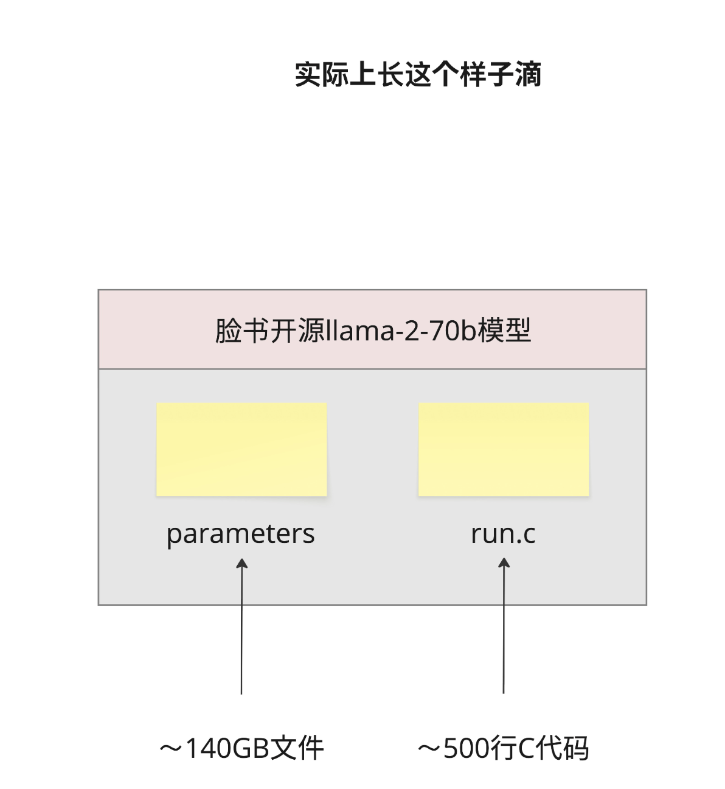

1. Andrej Karpathy 说过一句很经典的话："大模型就是两个文件"。
   一个存参数，一个跑推理
   
   - 祛魅：AI 不是魔法，是数学和工程
   - 理解部署：部署大模型就是把参数文件加载到 GPU 上，然后运行推理代码
   - 理解量化：所谓"量化"就是把 140GB 的参数文件压缩成 40GB 甚至更小
   - 理解微调：所谓"微调"就是在原有参数基础上，修改一小部分参数

2. 为什么要这么麻烦？为什么不能直接输出完整的句子？
   原因很简单：语言太复杂了。
   这种"一步一步来"的生成方式，有个专业术语叫 Autoregressive（自回归）。"Auto"是自己的意思，"regressive"是回归、返回的意思——模型不断地把自己刚生成的内容作为输入，来预测下一个输出。
3. 用一个神经网络来"压缩"这些统计规律。
4. 想要更大的模型怎么办？

   一种方案是 MoE（Mixture of Experts，混合专家） 架构。
   基本思路是：不是训练一个超大的模型，而是训练多个"专家"子模型，每个专家负责不同类型的任务。推理时，根据输入内容选择性地激活部分专家。

5. LLaMA-2-70B 训练数据
   参数量 700 亿
   参数文件大小 ~140GB
   训练数据 ~10TB
   训练 GPU 6,000 张 A100
   训练时间 12 天
   训练成本 ~200 万美元
