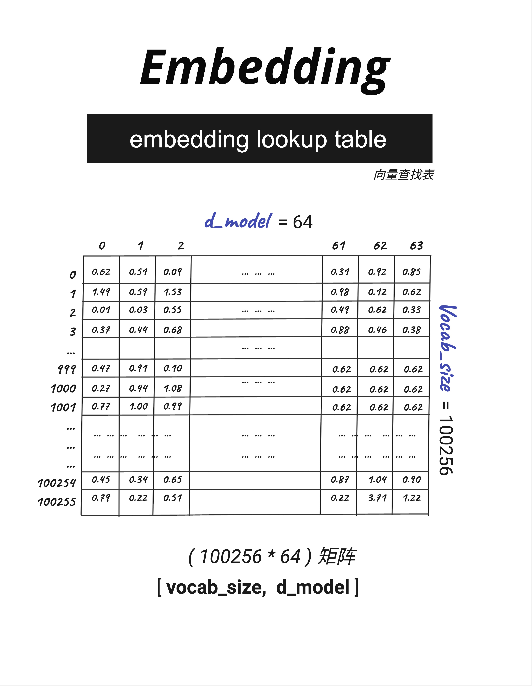

- GPT 使用的是一种更聪明的方法，叫做 BPE（Byte Pair Encoding，字节对编码）。

OpenAI 的实现叫做 tiktoken，它的特点是：

子词分割：不是按字分割，而是按"子词"分割
更大的词表：vocab_size = 100256（GPT-4）
更高效：常见词组用一个 token 表示

tiktoken 是基于字节级别的编码，对于不常见的汉字，会拆分成多个字节来表示。

- Embedding Lookup Table
  
  整个表有 100256 × 64 ≈ 640 万个数字。这些数字就是模型的参数，是在训练过程中学习得到的。

---

Tokenization 分词/编码 把文字切分成 token 并转换成数字
Token - 分词后的基本单元
Vocab Size 词表大小 字典中有多少个不同的 token
Embedding 嵌入 把 Token ID 转换成向量
d_model 模型维度 每个 token 的向量维度
Context Length 上下文长度 一次能处理的最大 token 数
